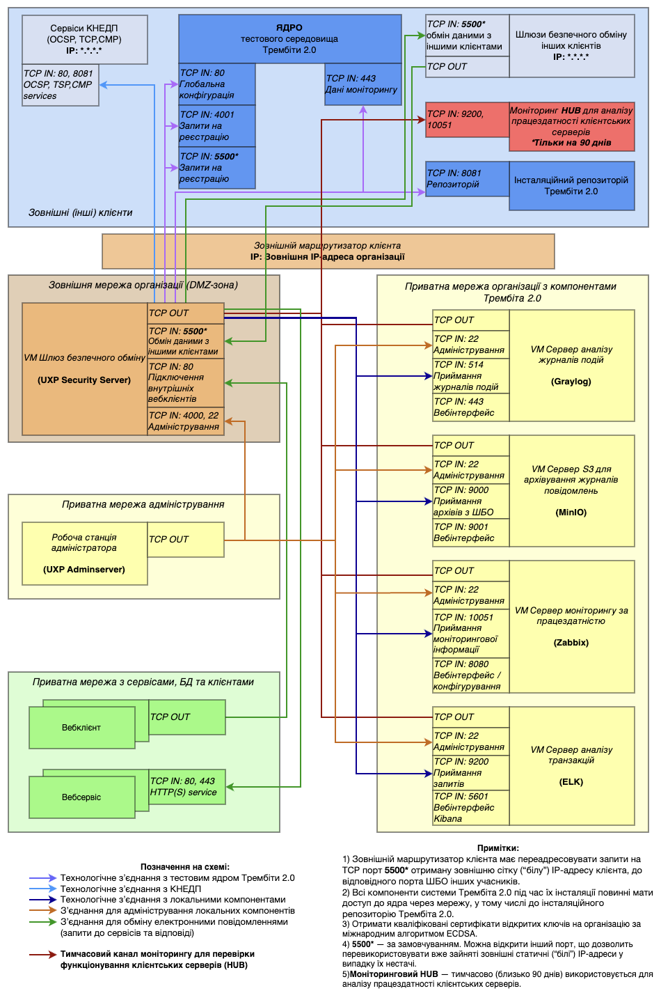

# Мережева схема підключення до тестового середовища СЕВДЕІР під час пілотування

> ℹ️ **Примітка.** Для роботи з Локальним компонентом підсистеми моніторингу доступу до персональних даних (далі - ЛК ПМДПД) скористайтесь відповідними інструкціями:
> - [Інструкція з інсталяції Локального компоненту ПМДПД](https://portal.trembita.gov.ua/media/website-media/LK_PMDPD.pdf)
> - [Інструкція адміністратора Локального компоненту ПМДПД](https://portal.trembita.gov.ua/media/website-media/%D0%86%D0%BD%D1%81%D1%82%D1%80%D1%83%D0%BA%D1%86%D1%96%D1%8F_%D0%90%D0%B4%D0%BC%D1%96%D0%BD%D1%96%D1%81%D1%82%D1%80%D0%B0%D1%82%D0%BE%D1%80%D0%B0_%D0%9B%D0%BE%D0%BA%D0%B0%D0%BB%D1%8C%D0%BD%D0%BE%D0%B3%D0%BE_%D0%BA%D0%BE%D0%BC%D0%BF%D0%BE%D0%BD%D0%B5%D0%BD%D1%82%D1%83_%D0%9F%D0%9C%D0%94%D0%9F%D0%94.pdf)
> - [Інструкція відповідального за захист персональних даних](https://portal.trembita.gov.ua/media/website-media/%D0%86%D0%BD%D1%81%D1%82%D1%80%D1%83%D0%BA%D1%86%D1%96%D1%8F_%D0%92%D1%96%D0%B4%D0%BF%D0%BE%D0%B2%D1%96%D0%B4%D0%B0%D0%BB%D1%8C%D0%BD%D0%BE%D0%B3%D0%BE_%D0%B7%D0%B0_%D0%B7%D0%B0%D1%85%D0%B8%D1%81%D1%82_%D0%BF%D0%B5%D1%80%D1%81%D0%BE%D0%BD%D0%B0%D0%BB%D1%8C%D0%BD%D0%B8%D1%85_%D0%B4%D0%B0%D0%BD%D0%B8%D1%85.pdf)
