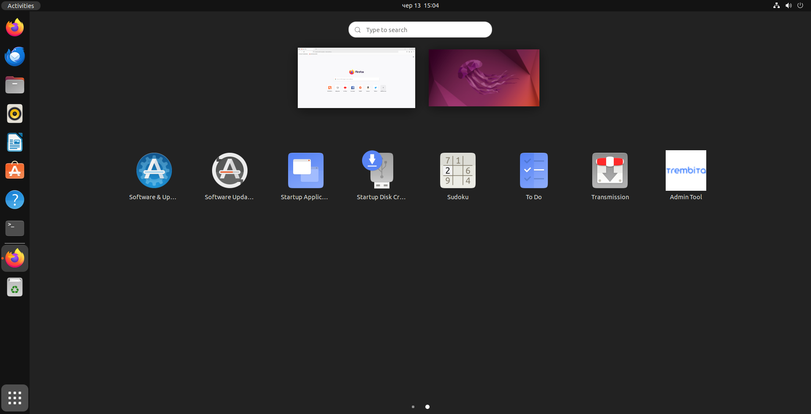
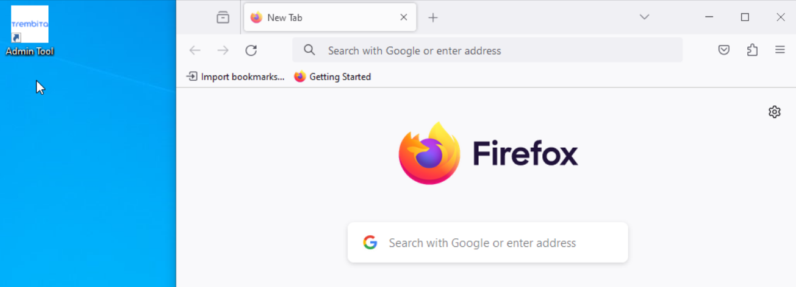

# Т2.0 AdminTools інсталяція
Засіб адміністрування UXP (Administration Tool) необхідний для віддаленого керування компонентами UXP.

# Ubuntu Робоча станція адміністратора (Administration Tool)

## **Підготувати операційну систему.**

Засіб адміністрування працює на операційній системі Ubuntu Desktop 22.04 LTS

## **Крок 1: Налаштування репозиторію**

1. Закоментувати репозиторії

```bash
sudo sed -i 's/^[A-Za-z0-9]/#&/' /etc/apt/sources.list
```

2. Додати GPG-ключ для репозиторію

```bash
wget -O - https://project-repo.trembita.gov.ua:8081/public-keys/public.key.txt | sudo apt-key add -
```

3. Додати репозиторій

```bash
echo 'https://project-repo.trembita.gov.ua:8081/repository/tr-2-pre-final/ jammy main' | sudo tee -a /etc/apt/sources.list
```

4. Оновлюємо списки пакетів з репозиторіїв

```bash
sudo apt update
```

## **Крок 2: Встановлення**

1. Встановлюємо Засіб адміністрування:

```bash
sudo apt install uxp-integrity-admintool uxp-admintool-ubuntu
```

В розділі: **Postfix Configuration**

Вибираємо: **No configuration**

6\. Після встановлення, ви можете знайти у меню "**Показати програми**" нову програму "**Admin Tool**" з іконкою Трембіти.
Тож, щоб відкрити Засіб адміністрування, запустіть цю програму.



# Windows Робоча станція адміністратора (Administration Tool)

## **Підготувати операційну систему.**

Засіб адміністрування працює на операційній системі Windows 10

## Встановлення

1. Завантажити по посиланню:

<span style="color:red;">https://</span>

2. Запустіть файл **ide_install.exe** з правами Адміністратора.

3. Щоб відкрити Засіб адміністрування, запустіть його через ярлик **Admin Tool** на Робочому столі.

   