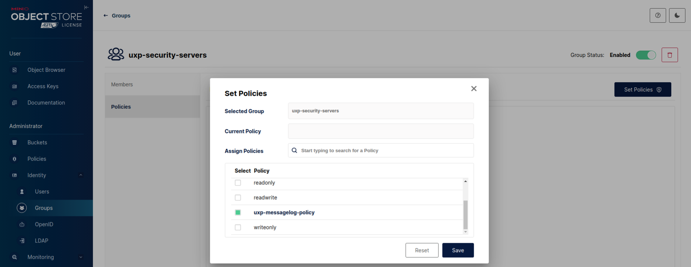
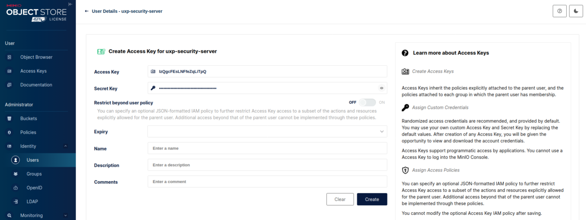

# Т2.0 MinIO інсталяція
Сховище S3 (MinIO) використовується для архівування журналів повідомлень серверу безпеки системи UXP.

# Підготовка:

## **Сховище**

— Використовуйте накопичувачі, форматовані як XFS, оскільки XFS є високопродуктивною, журнальованою файловою системою, спроектованою для масштабування та ефективного опрацювання великих об’ємів даних.

— Налаштуйте послідовне приєднання накопичувачів. MinIO використовує нотацію розширення Go {x...y} для позначення послідовної серії накопичувачів при розгортанні нової системи, коли усі вузли середовища мають однакові налаштування накопичувачів. Налаштуйте шляхи монтування накопичувачів у вигляді послідовної серії, щоб забезпечити оптимальну підтримку такої нотації.
Наприклад, монтуйте ваші накопичувачі, використовуючи шаблон /mnt/drive-n, де n починається з 1 та покроково збільшується на 1 для кожного наступного накопичувача.

— Використовуйте /etc/fstab, щоб забезпечити уніфікацію найменування точок монтування накопичувачів під час перезавантаження вузлів системи.

> MinIO потребує монопольного доступу до накопичувачів або розділів, визначених для зберігання об’єктів. Жодний інший процес, програмне забезпечення, скрипти чи фізичні особи не повинні виконувати ніякі дії безпосередньо із розділом або накопичувачем, наданим у розпорядження MinIO, або із об’єктами чи файлами, які MinIO зберігає там.

> MinIO резервує 10% об’єму сховища для підтримки свого функціонування (що включає потребу внутрішніх ресурсів для підтримки стабільності, фонові процеси на зразок відновлення, тощо). Цей об’єм резервується понад встановлені квоти для індивідуальних bucket-ів.

## **Встановити операційну систему**

Виконати встановлення операційної системи на основі дистрибутиву: Ubuntu Server 22.04 LTS

## **Необхідні для вхідних з’єднань MinIO порти**

| Порт (TCP) | Призначення | Область мережі |
| --- | --- | --- |
| 9000 | Доступ до стандартного порту API серверу MinIO | ПРИВАТНА |
| 9001 | Доступ до стандартної вебконсолі MinIO | ПРИВАТНА |

Область мережі визначає чи буде порт видимий лише у ПРИВАТНІЙ мережі (наприклад, у межах вашої організації), чи порти будуть видимі у ВІДКРИТІЙ мережі (Інтернет). Приховування портів, які використовуються лише для з’єднань у приватній мережі вашої організації знижує ризик нападів на безпеку з відкритої мережі.

# **Крок 1: Налаштування репозиторію**

1. Закоментувати репозиторії:

```bash
sudo sed -i 's/^[A-Za-z0-9]/#&/' /etc/apt/sources.list
```

2. Додати GPG-ключ для репозиторію:

```bash
wget -O - https://project-repo.trembita.gov.ua:8081/public-keys/public.key.txt | sudo apt-key add -
```

3. Додати репозиторій:

```bash
echo 'deb https://project-repo.trembita.gov.ua:8081/repository/tr-2-pre-final/ jammy main' | sudo tee -a /etc/apt/sources.list
```

4. Оновлюємо списки пакетів з репозиторіїв:

```bash
sudo apt update
```

# **Крок 2 : Встановлення** MinIO

1. Встановіть сервер MinIO та утиліту MinIO certgen для генерування самопідписаного TLS сертифікату:

   > Якщо маєте намір замість самопідписаного TLS сертифікату використовувати TLS сертифікат виданий центром сертифікації (CA), утиліту MinIO certgen встановлювати не потрібно.

```bash
sudo apt install minio certgen
```

2. Стандартно, сервіс minio.service працює для користувача і групи із назвою minio-user. Тому, створіть необхідну групу:

```bash
sudo groupadd -r minio-user
```

Та користувача:

```bash
sudo useradd -m -r -g minio-user minio-user
```

3. Налаштуйте коректного власника та привілеї для накопичувачів/шляхів сховища, визначених для використання в MinIO, наприклад, /mnt/disk1, /mnt/disk2, /mnt/disk3, /mnt/disk4:

Змінюємо власника:

```bash
sudo chown minio-user:minio-user /mnt/data
```

та привілеї:

```bash
sudo chmod 770 /mnt/data
```

4. Створіть файл для змінних середовища сервісу /etc/default/minio:

```bash
sudo nano /etc/default/minio
```

***із змістом на зразок такого:***
\# Де задаємо адмін доступ до веб-консолі
MINIO_ROOT_USER
MINIO_ROOT_PASSWORD

```bash
# MINIO_ROOT_USER and MINIO_ROOT_PASSWORD sets the root account for the MinIO server.
# This user has unrestricted permissions to perform S3 and administrative API
# operations on any resource in the deployment.
MINIO_ROOT_USER=minio
MINIO_ROOT_PASSWORD=********

# MINIO_VOLUMES sets the storage volumes or paths to use for the MinIO server.
# The specified path uses MinIO expansion notation to denote a sequential series
# of drives between 1 and 4, inclusive.
# All drives or paths included in the expanded drive list must exist *and* be empty
# or freshly formatted for MinIO to start successfully.
#
# Examples:
#
# Single drive.
# MINIO_VOLUMES="/mnt/data"
#
# 4 sequential series of drives between 1 and 4, inclusive.
# MINIO_VOLUMES="/mnt/data-{1...4}"
MINIO_VOLUMES="/mnt/data"

# MINIO_OPTS sets any additional command-line options to pass to the MinIO server.
# For example, `--console-address :9001` sets the MinIO Console listen port.
MINIO_OPTS="--console-address :9001"
```

5. Налаштуйте відповідного власника та привілеї для щойно створеного файлу /etc/default/minio, запустивши такі команди:

Змінюємо власника

```bash
sudo chown root:minio-user /etc/default/minio
```

та привілеї

```bash
sudo chmod 660 /etc/default/minio
```

6. Після виявлення чинного сертифікату x.509 (public.crt) та відповідного приватного ключа (private.key) у каталозі MinIO ${HOME}/.minio/certs, MinIO автоматично вмикає TLS 1.3.
   Отримайте чинний TLS сертифікат для серверу MinIO. Ви можете використовувати TLS сертифікати від загальновідомих центрів сертифікації (CA), внутрішнього або приватного CA, або самопідписані сертифікати.

&nbsp;&nbsp;&nbsp;&nbsp;&nbsp;&nbsp;&nbsp;&nbsp;&nbsp;&nbsp;— Ви можете створити самопідписаний TLS сертифікат за допомогою утиліти MinIO certgen, запустивши команду, на зразок такої:

```bash
certgen -ecdsa-curve P256 -host "192.168.1.100, minio.server.dns.name" \
-duration 876000h -org-name "My Organization"
```

&nbsp;&nbsp;&nbsp;&nbsp;&nbsp;&nbsp;&nbsp;&nbsp;&nbsp;&nbsp;Згенерувавши ключ P256 еліптичної кривої (private.key) та сертифікат (public.crt) із чинністю протягом 876000 годин (тобто, приблизно 100 років).

&nbsp;&nbsp;&nbsp;&nbsp;&nbsp;&nbsp;&nbsp;&nbsp;&nbsp;&nbsp;**Змінюємо:**

&nbsp;&nbsp;&nbsp;&nbsp;&nbsp;&nbsp;&nbsp;&nbsp;&nbsp;&nbsp;<span style="color:darkgreen;">192.168.1.100, minio.server.dns.name</span> —  IP-адреса і повне DNS-ім’я
          <span style="color:darkgreen;">My Organization</span> — назва організації

7. Далі, створіть необхідний для сертифікатів каталог:

```bash
sudo -u minio-user mkdir -m 770 -p /home/minio-user/.minio/certs
```

8. <span style="background-color:palegreen;"></span>Скопіюйте у щойно створений каталог файли TLS сертифікату і приватного ключа із назвами public.crt та private.key, відповідно:

```bash
sudo cp public.crt private.key /home/minio-user/.minio/certs
```

9. Потім, налаштуйте коректного власника та привілеї для цих файлів:

Змінюємо власника:

```bash
sudo bash -c 'chown minio-user:minio-user /home/minio-user/.minio/certs/*'
```

та привілеї:

```bash
sudo bash -c 'chmod 640 /home/minio-user/.minio/certs/*'
```

10. Налаштуйте для сервісу minio коректне значення параметру umask:

a. Додайте в файл minio.service

```bash
sudo nano /lib/systemd/system/minio.service
```

Рядок у розділ [Service]:

```bash
UMask=027
```

b. Застосуйте зміни, перезавантаживши юніти systemd:

```bash
sudo systemctl daemon-reload
```

11. Ввімкніть і запустіть сервіс MinIO:

```bash
sudo systemctl enable --now minio
```

12. З’єднайтесь із сервісом MinIO через Консоль MinIO, перейшовши у вашому браузері за адресою виду: **https://\<MINIO-SERVER-ADDRESS\>:9001**
    Та авторизувавшись там, використовуючи раніше налаштовані облікові дані в /etc/default/minio:
    MINIO_ROOT_USER
    MINIO_ROOT_PASSWORD

# **Крок 3 :** Налаштування MinIO bucket

1. ### Створення нового bucket

   *MinIO використовує для організації об’єктів сутність bucket. Bucket подібний до каталогу файлової системи, де кожний bucket може зберігати довільну кількість об’єктів.*

   **Створіть bucket:**
   Перейдіть у **Administrator** → **Buckets** та натисніть **Create Bucket**.

{width=70%}

Вкажіть назву для bucket, наприклад: **uxp-messagelog**
та натисніть **Create Bucket**.

{width=70%}

2. ### Налаштування квоти для bucket

   *Під час створення bucket, ви можете встановити обмеження розміру bucket (квоту). Коли bucket із налаштованою квотою досягає визначеної межі, MinIO починає відхиляти подальші запити PUT до цього bucket.*

   **Встановіть жорстку квоту для bucket:**
   Перейдіть у **Administrator** → **Buckets** та натисніть на потрібному **bucket**.

{width=70%}

На вкладці **Summary**, натисніть на **Quota** (іконка редагування).

{width=70%}

— Ввімкніть перемикач у позицію **ON** та вкажіть необхідну **квоту**.
— Далі, натисніть Save.

{width=70%}

3. ### Налаштування правила життєвого циклу об’єкта

   *Керування життєвим циклом об’єктів у MinIO підтримує термін придатності об’єктів у bucket. Статус 'expiration' ініціює для об’єкта операцію DELETE. Наприклад, ви можете створити правило таке життєвого циклу, щоб протермінованими вважались усі об’єкти старші ніж 365 днів.*

   **Створіть правило життєвого циклу:**
   — Перейдіть у **Administrator** → **Buckets** та натисніть на потрібному **bucket**.
   — Натисніть на вкладку **Lifecycle**, а потім на **Add Lifecycle Rule**.

{width=70%}

— Вкажіть кількість днів, після яких дані мають вважатися протермінованими і видалятися.

{width=70%}

4. ### Налаштування політик bucket

   *MinIO використовує контроль доступу на основі політик (Policy-Based Access Control або PBAC), при якому кожна політика описує одне або більше правил, які окреслюють привілеї для користувача чи групи користувачів. При створенні політик, MinIO підтримує специфічні для S3 дії та умови. Стандартно, MinIO забороняє доступ до дій або ресурсів не описаних явно у призначених чи успадкованих політиках користувача.*
   **Створіть політику для bucket:**
   — Перейдіть у **Administrator** → **Policies** та натисніть **Create Policy**

{width=70%}

— Вкажіть назву для політики, наприклад: **uxp-messagelog-policy**

{width=70%}

— Опишіть політику для bucket (наприклад, uxp-messagelog) у вигляді на зразок такого:

```
{
  "Version": "2012-10-17",
  "Statement": [
    {
      "Effect": "Allow",
      "Action": ["s3:PutObject", "s3:GetObject"],
      "Resource": ["arn:aws:s3:::uxp-messagelog/*"]
    }
  ]
}
```

— Далі, натисніть **Save**.

{width=70%}

5. ### Налаштування сервісного облікового запису для MinIO

   *MinIO вимагає автентифікації клієнтів через протокол AWS Signature Version 4. Клієнт повинен мати чинний ключ доступу та секретний ключ (сервісний обліковий запис), щоб отримати доступ до будь-яких адміністративних API S3 або MinIO, зокрема, таких як операції PUT, GET чи DELETE.*

**Створіть сервісний обліковий запис для серверу безпеки:**
— Перейдіть у **Administrator** → **Identity** → **Groups** та натисніть **Create Group**.

{width=70%}

— Вкажіть назву для групи, наприклад: **uxp-security-servers**
та натисніть **Save**.

{width=70%}
— Натисніть на щойно створеній групі, потім перейдіть на вкладку **Policies** та натисніть **Set Policies**.

{width=70%}

— Оберіть раніше створену політику, наприклад, **uxp-messagelog-policy**, та натисніть **Save**.

{width=70%}

— Перейдіть у **Administrator** → **Identity** → **Users** та натисніть **Create User**.

{width=70%}

— Вкажіть ім’я для користувача, наприклад: **uxp-security-server**
\- **бажаний пароль**
\- потім оберіть **раніше створену групу** та натисніть **Save**.

{width=70%}

— Натисніть на щойно створеному користувачі, потім перейдіть на вкладку **Service Accounts** та натисніть **Create Access Key.**

{width=70%}

> <span style="color:red;">Запишіть</span><span style="color:red;"> щойно створений ключ доступу та секретний ключ</span>, оскільки це єдиний раз, коли буде показано їх код.

— Далі, натисніть **Create.**

{width=70%}

# **Крок 4 :** Налаштування Серверу безпеки UXP

1. ### Cкопіювати TLS сертифікат minio

Для налаштування потрібно скопіювати TLS сертифікат (/home/minio-user/.minio/certs/public.crt) на ШБО

> **Наприклад** скопіюємо за допомогою scp:
>
> ```bash
> scp 192.168.0.20:~/public.crt 192.168.0.10:~
> ```
>
> Перемістимо в відповідний каталог:
>
> ```bash
> sudo mv public.crt /etc/uxp/ssl/minio.crt
> ```

2. Змінюємо власника:

```bash
sudo chown uxp:uxp /etc/uxp/ssl/minio.crt
```

3. та привілеї:

```bash
sudo chmod 640 /etc/uxp/ssl/minio.crt
```

### Додавання параметрів у конфігурації (Для вже встановленого ШБО)

Якщо сервер безпеки вже встановлено то для налаштування ШБО із роботою minio виконуємо наступне.
Додавання параметрів у конфігурації (у розділі [message-log-s3] конфігураційного файлу /etc/uxp/conf.d/local.ini):

1. Спершу призупиніть роботу контролера цілісності:

```bash
sudo uxp-integrity pause
```

2. Відкрийте наступний файл

```bash
sudo nano /etc/uxp/conf.d/local.ini
```

І додайте такі параметри:

**address —** Використайте адресу https://\<MINIO-SERVER-ADDRESS\>:9000, де \<MINIO-SERVER-ADDRESS\> є DNS назвою або IP адресою серверу MinIO. Якщо ви під час встановлення ви змінили стандартний порт 9000 на інший, використайте натомість нове значення.

**bucket-name —** Використайте раніше створену назву bucket (наприклад, uxp-messagelog).

**access-key —** Використайте ключ доступу для раніше створеного сервісного облікового запису.

**secret-key —** Використайте секретний ключ для раніше створеного сервісного облікового запису.

**trusted-certificate —** Використайте довірений сертифікат з відповідного кроку встановлення, тобто самопідписаний TLS сертифікат (/home/minio-user/.minio/certs/public.crt) або TLS сертифікат виданий центром сертифікації (CA). Скопіюйте файл відповідного сертифікату на сервер безпеки.

```bash
[message-log-s3]
address = https://192.168.0.1:9000
bucket-name = uxp-messagelog
access-key = VbiHNrnKWXdazb2mxe4K
secret-key = jQfr1MqMexh9svOWHDJ8EprNriiE9lBgOL0zG0KV
trusted-certificate = /etc/uxp/ssl/minio.crt
```

3. Оновіть хеші для перевірки цілісності:

```bash
sudo uxp-integrity update
```