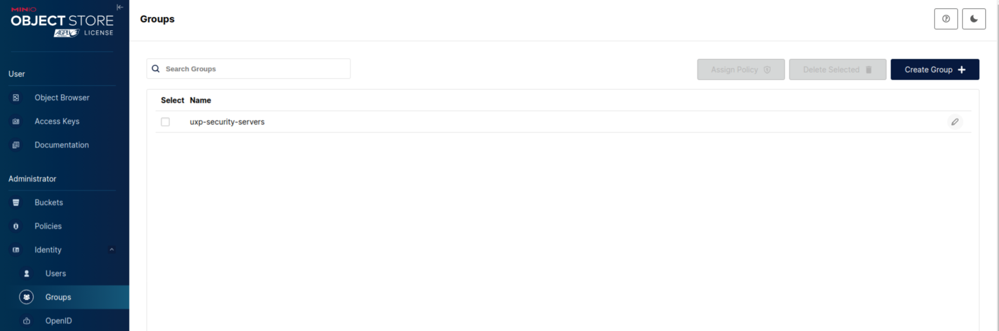

# Інсталяція та налаштування сховища S3 (MinIO) для архівування журналів повідомлень
MinIO — це об’єктне сховище, сумісне з API Amazon S3. Його можна розгорнути як у локальному середовищі, так і в хмарі. Сервер безпеки UXP підтримує з’єднання через S3 API, тому може архівувати журнали повідомлень у MinIO.


## 🔧 Підготовка сервера

### 📦 Сховище

- Накопичувачі з файловою системою `XFS`, оскільки XFS є високопродуктивною, журнальованою файловою системою, спроектованою для масштабування та ефективного опрацювання великих об’ємів даних.
- Послідовне монтування у вигляді `/mnt/drive-1`, `/mnt/drive-2`, ..., `/mnt/drive-n`. MinIO використовує нотацію розширення Go {x...y} для позначення послідовної серії накопичувачів при розгортанні нової системи, коли усі вузли середовища мають однакові налаштування накопичувачів. Налаштуйте шляхи монтування накопичувачів у вигляді послідовної серії, щоб забезпечити оптимальну підтримку такої нотації.
- Записи в `/etc/fstab`, щоб забезпечити уніфікацію найменування точок монтування накопичувачів під час перезавантаження вузлів системи.
- **⚠️** MinIO потребує монопольного доступу до дисків. Жодний інший процес, програмне забезпечення, скрипти чи фізичні особи не повинні виконувати ніякі дії безпосередньо із розділом або накопичувачем, наданим у розпорядження MinIO, або із об’єктами чи файлами, які MinIO зберігає там.
- 10% дискового простору резервується автоматично MinIO для забезпечення стабільної роботи сервісу (внутрішні процеси, обслуговування, відновлення). Цей обсяг не враховується у виділені квоти bucket-ів.

### 💻 Операційна система

- Ubuntu Server 22.04 LTS

### 🔐 Порти доступу

| Порт | Призначення | Область |
|------|-------------|---------|
| 9000 | API MinIO   | Приватна |
| 9001 | Web Console | Приватна |

> 🔒 **Примітка: ** Рекомендується відкривати порти лише у межах приватної мережі (наприклад, локальної мережі організації). Уникайте доступу до портів з відкритих мереж (Інтернету), якщо це не передбачено сценарієм використання. Це мінімізує ризики несанкціонованого доступу та потенційних атак.
---

## 🔹 Підготовка

1. Закоментуйте всі активні репозиторії:

```bash
sudo sed -i 's/^[A-Za-z0-9]/#&/' /etc/apt/sources.list
```
2. Додайте GPG-ключ для репозиторію:

```bash
wget -O - https://project-repo.trembita.gov.ua:8081/public-keys/public.key.txt | sudo apt-key add -
```
3. Додайте репозиторій:

```bash
echo 'deb https://project-repo.trembita.gov.ua:8081/repository/tr-2-pre-final/ jammy main' | sudo tee -a /etc/apt/sources.list
```
4. Оновіть список пакетів:

```bash
sudo apt update
```

## 🔹 Встановлення MinIO

1. Встановлення сервера MinIO та утиліту MinIO certgen для генерування самопідписаного TLS сертифікату:

> ℹ️ **Примітка:** Якщо маєте намір замість самопідписаного TLS сертифікату використовувати TLS сертифікат виданий центром сертифікації (CA), утиліту MinIO certgen встановлювати не потрібно.

```bash
sudo apt install minio certgen
```

2. Створіть групу користувачів з назвою ```minio-user``` та користувача:

```bash
sudo groupadd -r minio-user
```

```bash
sudo useradd -m -r -g minio-user minio-user
```

3. Задайте власника та права доступу для сховища (наприклад, ```/mnt/disk1, /mnt/disk2, /mnt/disk3, /mnt/disk4```):

Змінюємо власника:

```bash
sudo chown minio-user:minio-user /mnt/data
```

Змінюємо привілеї:

```bash
sudo chmod 770 /mnt/data
```

4. Створіть файл /etc/default/minio з параметрами середовища (user, password, volumes)

```bash
sudo nano /etc/default/minio
```

***зі змістом на зразок такого:***
> ℹ️ Де задаємо адмін доступ до веб-консолі ```MINIO_ROOT_USER``` ```MINIO_ROOT_PASSWORD```

```bash
# MINIO_ROOT_USER and MINIO_ROOT_PASSWORD sets the root account for the MinIO server.
# This user has unrestricted permissions to perform S3 and administrative API
# operations on any resource in the deployment.
MINIO_ROOT_USER=minio
MINIO_ROOT_PASSWORD=********

# MINIO_VOLUMES sets the storage volumes or paths to use for the MinIO server.
# The specified path uses MinIO expansion notation to denote a sequential series
# of drives between 1 and 4, inclusive.
# All drives or paths included in the expanded drive list must exist *and* be empty
# or freshly formatted for MinIO to start successfully.
#
# Examples:
#
# Single drive.
# MINIO_VOLUMES="/mnt/data"
#
# 4 sequential series of drives between 1 and 4, inclusive.
# MINIO_VOLUMES="/mnt/data-{1...4}"
MINIO_VOLUMES="/mnt/data"

# MINIO_OPTS sets any additional command-line options to pass to the MinIO server.
# For example, `--console-address :9001` sets the MinIO Console listen port.
MINIO_OPTS="--console-address :9001"
```

5. Налаштуйте власника та права на ```/etc/default/minio```

Змінюємо власника:

```bash
sudo chown root:minio-user /etc/default/minio
```

Змінюємо привілеї:

```bash
sudo chmod 660 /etc/default/minio
```
6. MinIO автоматично активує TLS 1.3 після виявлення чинного сертифіката public.crt і приватного ключа private.key у каталозі ${HOME}/.minio/certs.
Отримайте TLS-сертифікат одним із способів:
- від загальновизнаного центру сертифікації (CA),
- від внутрішнього або приватного CA,
- або створіть самопідписаний за допомогою утиліти certgen.

Створити самопідписаний TLS-сертифікат можна так:

```bash
certgen -ecdsa-curve P256 -host "192.168.1.100, minio.server.dns.name" \
-duration 876000h -org-name "My Organization"
```

> ℹ️ **Пояснення:**
> 
> **192.168.1.100, minio.server.dns.name** — IP-адреса та DNS-ім’я сервера MinIO <br>
> **My Organization** — назва вашої організації <br>
> **876000h** — термін дії сертифіката (~100 років)

7. Створіть каталог для TLS-сертифікатів:

```bash
sudo -u minio-user mkdir -m 770 -p /home/minio-user/.minio/certs
```

8. Скопіюйте сертифікат і приватний ключ у створений каталог:

```bash
sudo cp public.crt private.key /home/minio-user/.minio/certs
```

9. Налаштуйте права доступу до файлів:

Змінюємо власника:

```bash
sudo bash -c 'chown minio-user:minio-user /home/minio-user/.minio/certs/*'
```

Змінюємо привілеї:

```bash
sudo bash -c 'chmod 640 /home/minio-user/.minio/certs/*'
```
> 🔐 **Примітка:** Сертифікати повинні бути доступні лише користувачу minio-user. Це важливо для безпечної роботи TLS.

10. Додайте параметр ```UMask``` для коректної роботи прав доступу:

Відкрийте файл сервісу:

```bash
sudo nano /lib/systemd/system/minio.service
```

Додайте в секцію ```[Service]``` наступний рядок:

```bash
UMask=027
```

Перезавантажте юніти ```systemd```, щоб застосувати зміни:

```bash
sudo systemctl daemon-reload
```

11. Увімкніть і запустіть сервіс MinIO:

```bash
sudo systemctl enable --now minio
```

12. Після запуску сервісу, відкрийте браузер і перейдіть за адресою:

```bash
https://<MINIO-SERVER-ADDRESS>:9001
```

Увійдіть до MinIO Console, використовуючи логін і пароль, вказані у файлі:

```bash
/etc/default/minio

MINIO_ROOT_USER
MINIO_ROOT_PASSWORD
```

## 🔹 Налаштування MinIO bucket

*MinIO використовує сутність bucket для зберігання об’єктів. Один bucket може містити довільну кількість об’єктів.*

1. Створення нового bucket
Перейдіть у меню:

**```Administrator → Buckets → Create Bucket```**
<br>


У полі імені введіть назву bucket, наприклад:
**```uxp-messagelog```**
<br>
Натисніть **```Create Bucket```**.
<br>


2. Налаштування квоти bucket

*Під час створення bucket, ви можете встановити обмеження розміру bucket (квоту).*
> ℹ️ **Примітка:** Після досягнення налаштованої квоти MinIO починає автоматично відхиляти подальші запити PUT до цього bucket.

Для налаштування жорсткої квоти перейдіть у:

**```Administrator → Buckets → [ваш bucket]```**
<br>


На вкладці ```Summary``` натисніть ```Quota``` (іконка редагування).
<br>


Активуйте перемикач **(ON)**

Вкажіть необхідну квоту (наприклад, 100GiB)

Натисніть ```Save``` 
<br>


## 🔹 Налаштування життєвого циклу об’єктів

*MinIO дозволяє встановити правила видалення об’єктів після заданого часу.* <br>
*Статус ```'expiration'``` ініціює для об’єкта операцію ```DELETE```. Наприклад, ви можете створити таке правило життєвого циклу, щоб протермінованими вважались усі об’єкти старші ніж 365 днів.*

1. Перейдіть у:
**```Administrator → Buckets → [ваш bucket] → Lifecycle```**

2. Натисніть ```Add Lifecycle Rule```
<br>


3. Вкажіть кількість днів (наприклад, 365), після яких об’єкти будуть видалені
<br>


## 🔹 Налаштування політик доступу до bucket

*MinIO використовує Policy-Based Access Control (PBAC) — при якому кожна політика описує одне або більше правил, які окреслюють привілеї для користувача чи групи користувачів. При створенні політик, MinIO підтримує специфічні для S3 дії та умови. Стандартно, MinIO забороняє доступ до дій або ресурсів не описаних явно у призначених чи успадкованих політиках користувача.*

1. Перейдіть у:

**```Administrator → Policies → Create Policy```**
<br>


2. Введіть назву політики, наприклад:

**```uxp-messagelog-policy```**
<br>


3. У полі для JSON вставте політику на зразок:

```bash
{
  "Version": "2012-10-17",
  "Statement": [
    {
      "Effect": "Allow",
      "Action": ["s3:PutObject", "s3:GetObject"],
      "Resource": ["arn:aws:s3:::uxp-messagelog/*"]
    }
  ]
}
```

4. Натисніть ```Save```.
<br>


Після цього bucket готовий до використання для архівування журналів повідомлень. Якщо потрібно — призначте створену політику потрібному користувачу або сервісу.

## 🔹 Налаштування сервісного облікового запису для MinIO

*MinIO використовує автентифікацію клієнтів через AWS Signature Version 4. Для доступу до S3 API необхідно мати ключ доступу та секретний ключ (сервісний обліковий запис).*

1. Створення групи користувачів
Перейдіть:

**```Administrator → Identity → Groups → Create Group```**
<br>


Вкажіть назву групи, наприклад:

**```uxp-security-servers```**
<br>


Натисніть ```Save```
<br>



2. Призначення політики
Перейдіть у щойно створену групу → вкладка ```Policies``` → ```Set Policies```
<br>


Оберіть раніше створену політику, наприклад: 
```uxp-messagelog-policy```

Натисніть ```Save```
<br>


3. Створення користувача
Перейдіть:

**```Administrator → Identity → Users → Create User```**
<br>


Введіть ім’я користувача:

**```uxp-security-server```**

Задайте пароль

Оберіть створену раніше групу

Натисніть ```Save```
<br>


4. Створення ключів доступу
У меню користувача → вкладка ```Service Accounts``` → ```Create Access Key```
<br>


> ⚠️ **Примітка:** Запишіть ключ доступу та секретний ключ одразу. Вони більше не будуть відображені!

Натисніть ```Create```
<br>


## 🔹 Налаштування серверу безпеки UXP

1. Копіювання TLS сертифікату MinIO
Скопіюйте самопідписаний TLS сертифікат з сервера MinIO (/home/minio-user/.minio/certs/public.crt) на ШБО:

```bash
scp 192.168.0.20:~/public.crt 192.168.0.10:~
```

Перемістіть сертифікат до цільової директорії:

```bash
sudo mv public.crt /etc/uxp/ssl/minio.crt
```

2. Встановлення прав
Змінюємо власника:

```bash
sudo chown uxp:uxp /etc/uxp/ssl/minio.crt
```

Змінюємо привілеї:

```bash
sudo chmod 640 /etc/uxp/ssl/minio.crt
```

## 🔹 Налаштування конфігурації UXP (для вже встановленого ШБО)
Якщо сервер безпеки вже встановлено, внесіть параметри для інтеграції з MinIO у файл /etc/uxp/conf.d/local.ini

1. Призупиніть контроль цілісності:

```bash
sudo uxp-integrity pause
```

2. Відредагуйте файл:

```bash
sudo nano /etc/uxp/conf.d/local.ini
```

Додайте блок:

```bash
[message-log-s3]
address = https://192.168.0.1:9000
bucket-name = uxp-messagelog
access-key = VbiHNrnKWXdazb2mxe4K
secret-key = jQfr1MqMexh9svOWHDJ8EprNriiE9lBgOL0zG0KV
trusted-certificate = /etc/uxp/ssl/minio.crt
```

> ℹ️ **Пояснення:**
> 
> **address** — URL до MinIO (з портом 9000 або зміненим) <br>
> **bucket-name** — назва раніше створеного bucket (наприклад, uxp-messagelog) <br>
> **access-key / secret-key** — ключі раніше створеного сервісного користувача <br>
> **trusted-certificate** — шлях до TLS-сертифікату (наприклад /home/minio-user/.minio/certs/public.crt) Скопіюйте файл відповідного сертифікату на ШБО

3. Оновіть контрольні хеші для перевірки цілісності::

```bash
sudo uxp-integrity update
```
