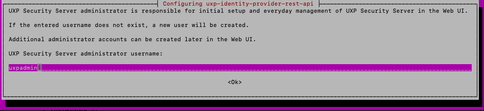
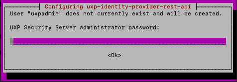
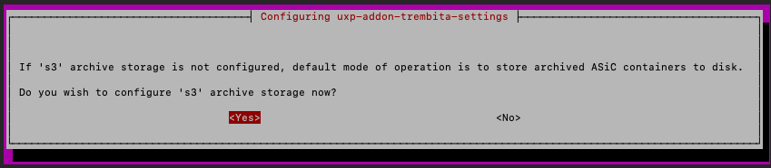
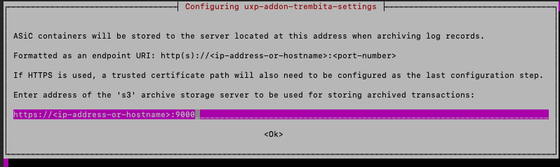
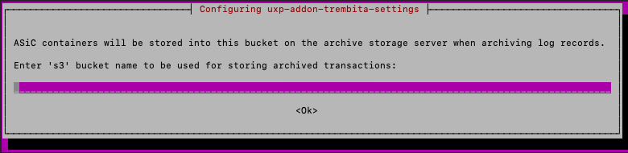
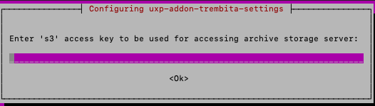
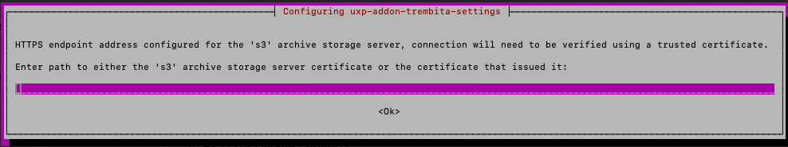
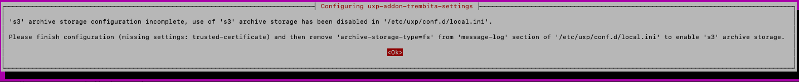
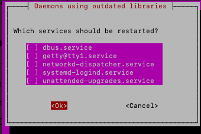

# Інсталяція пакета uxp-securityserver-ua та залежностей (ШБО)


## 🔧 Підготовка сервера

<span id="access-ports"></span>
### 🔐 Порти доступу


| **Вхідні порти (TCP)** | Призначення | Область мережі |
| --- | --- | --- |
| 4000 | Вебінтерфейс ШБО | ПРИВАТНА |
| 2082 | Статус кластера (необхідно лише у випадку використання внутрішнього балансувальника навантаження, щоб розподіляти запити між вузлами кластеру серверу безпеки) | ПРИВАТНА |
| 80 | HTTP з’єднання від інформаційних систем | ПРИВАТНА |
| 443 | HTTPS з’єднання від інформаційних систем | ПРИВАТНА |
| 5500 | Обмін повідомленнями між ШБО | ВІДКРИТА |
<br>

| **Вихідні порти (TCP)** | Призначення | Область мережі |
| --- | --- | --- |
| 80 | HTTP з’єднання до інформаційних систем; оновлення програмного забезпечення; глобальна конфігурація; інші додаткові сервіси | ВІДКРИТА |
| 443 | HTTPS з’єднання до інформаційних систем; інші додаткові сервіси | ВІДКРИТА |
| 514 | З’єднання Syslog із сервером журналювання | ПРИВАТНА |
| 9000 | З’єднання S3 із сервером архівування журналів повідомлень | ПРИВАТНА |
| 4400 | Сервісні запити до Конектора UXP (необхідно лише при використанні Конектора UXP) | ПРИВАТНА |
| 8080 | Віддалене налаштування серверу Zabbix (необхідно лише при використанні серверу Zabbix для локального моніторингу серверу безпеки | ПРИВАТНА |
| 10051 | Передача даних моніторингу на сервер Zabbix (необхідно лише при використанні серверу Zabbix для локального моніторингу серверу безпеки | ПРИВАТНА |
| 9200 | Передача даних операційного моніторингу на сервер Elasticsearch (RESTful API) (необхідно лише при використанні серверу Elasticsearch для локального моніторингу серверу безпеки | ПРИВАТНА |
| 5500 | Обмін повідомленнями між серверами безпеки | ВІДКРИТА |
| 4001 | Запити керування до сервера реєстрації | ВІДКРИТА |

---

## 🔹 Встановлення ШБО

1. Налаштуйте ```HOSTNAME```

```bash
hostname -A
sudo hostnamectl set-hostname <your-hostname>
```

> ℹ️ **Примітка:** Назва хоста повинна бути унікальною для кожного вузла. Вона використовується в конфігурації системи та при реєстрації.


2. Закоментуйте всі активні репозиторії:

```bash
sudo sed -i 's/^[A-Za-z0-9]/#&/' /etc/apt/sources.list
```
3. Додайте GPG-ключ для репозиторію:

```bash
wget -O - https://project-repo.trembita.gov.ua:8081/public-keys/public.key.txt | sudo apt-key add -
```
4. Додайте репозиторій:

```bash
echo 'deb https://project-repo.trembita.gov.ua:8081/repository/t2-stack-1.22.7/ jammy main' | sudo tee -a /etc/apt/sources.list
```
5. Оновіть список пакетів:

```bash
sudo apt update
```
6. Встановіть ШБО

```bash
sudo apt install uxp-securityserver-trembita
```
---

## 🔹 Налаштування під час встановлення ШБО

Після запуску ```sudo apt install uxp-securityserver-trembita``` виконайте такі дії у графічному інсталяторі:

1. Натисніть ```Y``` для підтвердження встановлення
2. Введіть логін/пароль для доступу до вебінтерфейсу:
<br>

 
<br>



3. На екрані параметрів MinIO:

3.1. Оберіть ```No```, якщо MinIO ще не встановлений. У цьому разі налаштування можна виконати пізніше в ```local.ini``` на ШБО
<br>



3.2. Якщо MinIO вже встановлений і налаштований, натисніть ```Yes``` і заповніть параметри:

- ```IP-адреса MinIO``` з портом ```9000```
<br>



- Шлях до папки для зберігання архівів
<br>



- ```Access Key``` користувача MinIO
<br>



- ```Secret Key```
<br>


Шлях до TLS-сертифікату, згенерованого для MinIO
<br>



Натисніть ```ОК```
<br>



Натисніть ```ОК``` ще двічі для завершення інсталяції
<br>



---

## 🔹 Контролер цілісності (AIDE)

1. Встановіть AIDE

```bash
sudo apt install uxp-integrity-securityserver
```

2. Поставте його на паузу:

```bash
sudo uxp-integrity pause
```

3. Додайте IP-адресу ```Адмін станції``` до списку дозволених:

```bash
sudo nano /etc/uxp/nginx/allowed_hosts.conf
```

4. Перевірте статус nginx:

```bash
sudo nginx -t
```

5. Якщо помилок немає — перезапустіть nginx:

```bash
sudo service nginx restart
```

6. Оновіть контрольні хеші:

```bash
sudo uxp-integrity update
```

7. Перевірте статус усіх сервісів ```UXP```:

```bash
sudo systemctl status uxp-*
```
---
<br>

> 💡 **Корисні команди контролера цілісності:**
>
> • Запуск перевірки цілісності (у разі помилки всі служби будуть зупинені):
> ```bash
> sudo uxp-integrity check
> ```
> • Створення/оновлення хешу баз(и) даних AIDE:
> ```bash
> sudo uxp-integrity update
> ```
>
> • Призупинення роботи Контролера цілісності на 30 хвилин (результати перевірки check будуть ігноруватися):
> ```bash
> sudo uxp-integrity pause
> ```
> 
> • Відображення статусу контрольованих сервісів:
> ```bash
> sudo uxp-integrity status
> ```
>
> • Запуск контрольованих сервісів після паузи:
> ```bash
> sudo uxp-integrity start
> ```
> 
> • Список контрольованих модулів і сервісів:
> ```bash
> sudo uxp-integrity list
> ```
>
> • Зупинка сервісів:
> ```bash
> sudo uxp-integrity stop
> ```

<br>

---

## 🔹 Перевірка встановлення

1. Перевірка статусу сервісів UXP
Скористайтесь командою:

```bash
systemctl list-units -t service "uxp-*"
```

| Сервіс                                   | Стан   | Активність | Статус       | Опис                            |
| ---------------------------------------- | ------ | ---------- | ------------ | ------------------------------- |
| `uxp-confclient.service`                 | loaded | active     | running      | UXP Global Configuration Client |
| `uxp-identity-provider-rest-api.service` | loaded | active     | running      | UXP Identity Provider           |
| `uxp-integrity.service`                  | loaded | active     | running      | UXP Integrity checker           |
| `uxp-messagelog-archiver.service`        | loaded | active     | running      | UXP Messagelog Archiver         |
| `uxp-monitor.service`                    | loaded | active     | running      | UXP Proxy Monitor               |
| `uxp-ocsp-cache.service`                 | loaded | active     | running      | UXP OCSP Cache                  |
| `uxp-proxy.service`                      | loaded | activating | auto-restart | UXP Message Proxy               |
| `uxp-securityserver-rest-api.service`    | loaded | active     | running      | UXP Security Server REST API    |
| `uxp-verifier-rest-api.service`          | loaded | active     | running      | UXP Verifier REST API           |


> ℹ️ **Примітка:**  Встановлення вважається успішним, якщо сервіси системи ```UXP``` запустилися і доступний вебінтерфейс користувача.

2. Перевірка відкритих портів

Переконайтесь, що ви налаштували свій мережевий екран на дозвіл лише вхідних з’єднань через TCP порти, як вказано у розділі [🔐 Порти доступу](#access-ports). Запустіть сканування портів з різних зон доступу (із зовнішньої мережі, внутрішньої підмережі, а також з робочого місця адміністратора, щоб цілком переконатися, що всі налаштування виконано коректно):

```bash
nmap --open <IP-security-server>
```

🔹 Зовнішня мережа: відкритий лише порт TCP 5500 (за замовчуванням)

🔹 Внутрішня підмережа: порти 80, 443, 2082, 5500

🔹 Робоча станція адміністратора: також доступний порт 4000

> ⚠️ **Примітка:** Якщо ви не налаштовуєте кластер або балансувальник, порт 2082 може бути закритим


3. Перевірка прав доступу до системних файлів

Доступ лише для ```sudo``` або користувача ```uxp```, який:

- є власником усіх системних файлів і логів; <br>
- не має методів автентифікації; <br>
- не має інших користувачів у своїй групі. <br>

Перевірити права доступу потрібно до:

| Шлях                       | Призначення          |
|----------------------------|----------------------|
| `/etc/uxp/`                | Конфігураційні файли |
| `/var/lib/uxp/messagelog/` | Журнали повідомлень  |
| `/var/lib/uxp/backup/`     | Резервні копії       |

>  ✅ **Примітка:** Якщо всі сервіси UXP активні, порти відповідають зоні доступу, а права налаштовано коректно — інсталяція завершена успішно. Можна переходити до налаштування у вебінтерфейсі.


---
<span id="aparatni-tokeny"></span>

## 🔹 Підключення криптографічного пристрою

Стандартно ШБО зберігає ключі на програмному токені (файловому), який створюється під час інсталяції.

> 🔐 **Примітка:** Ключі автентифікації та TLS завжди зберігаються на програмному токені.

1. Підтримувані засоби кваліфікованого електронного підпису/печатки (пристрої):
   
HSM:

🟢 ІІТ Гряда-301 <br>
🟢 Шифр-HSM <br>

Токени:

🟢 Автор SecureToken-338 <br>
🟢 ІІТ Алмаз-1К <br>


2. Встановлення драйверів (для всіх пристроїв)

Поставте AIDE на паузу:

```bash
sudo uxp-integrity pause
```

Встановіть інструменти для керування криптографічними пристроями на Ubuntu:

```bash
sudo apt install pcscd libccid pcsc-tools libpcsclite1 opensc
```

Приєднайте пристрій до сервера Ubuntu з встановленим ШБО.

Встановіть на ШБО програмне забезпечення від виробника пристрою: <br>
- [Налаштування ІІТ Гряда-301](#iit-gryada301) <br> 
- [Налаштування Шифр-HSM](#cipher-hsm) <br>
- [Налаштування Автор SecureToken-338](#avtor-338)  <br>
- [Налаштування ІІТ Алмаз-1К](#almaz-1k)  <br>

---

<span id="iit-gryada301"></span>

## 🔹 Налаштування ІІТ Гряда-301

1. Завантажте пакет драйверів PKCS#11 ```NCMGryada301PKCS11Libs-Linux.zip``` із репозиторію:

```bash
sudo wget https://project-repo.trembita.gov.ua:8081/files/t2/NCMGryada301PKCS11Libs-Linux.zip
```
   
2. Розпакуйте файли у директорію ```/usr/share/uxp/lib/``` :

```bash
sudo unzip -o -j NCMGryada301PKCS11Libs-Linux.zip -d /usr/share/uxp/lib/
```

3. Задайте власника та права доступу до бібліотек

Змінюємо власника:

```bash
sudo chown root:root /usr/share/uxp/lib/*.so
```

Змінюємо привілеї:

```bash
sudo chmod 644 /usr/share/uxp/lib/*.so
```

4. Створіть файл конфігурації `/usr/share/uxp/lib/osplm.ini`:

```bash
[\SOFTWARE\Institute of Informational Technologies\Key Medias\NCM Gryada-301]
[\SOFTWARE\Institute of Informational Technologies\Key Medias\NCM Gryada-301\Modules]
[\SOFTWARE\Institute of Informational Technologies\Key Medias\NCM Gryada-301\Modules\<serial-number>]

OrderNumber=0
SN=<serial-number>
Address=<device-address>
AddressMask=<address-mask>
```

>  🛠 **Примітка:**  Замість: <br>
>  ```<serial-number>``` (у двох місцях) вкажіть останні три **символи** серійного номера Гряда-301. <br> 
>  ```<device-address>``` і ```<address-mask>``` — IP-адресу пристрою в мережі та маску підмережі (наприклад, 255.255.255.0), відповідно.


5. Задайте власника та права доступу до ```osplm.ini```

Змінюємо власника:

```bash
sudo chown root:root /usr/share/uxp/lib/osplm.ini
```

Змінюємо привілеї:

```bash
sudo chmod 644 /usr/share/uxp/lib/osplm.ini
```

6. Перезапустіть необхідні сервіси:

```bash
sudo systemctl restart uxp-securityserver-rest-api uxp-proxy
```

7. Оновіть контрольні хеші AIDE

```bash
sudo uxp-integrity update
```

> ✅ **Примітка:** Подальші налаштування ключа й сертифіката виконуються через вебінтерфейс ШБО.

---

<span id="cipher-hsm"></span>

## 🔹 Налаштування Шифр-HSM

1. Завантажте пакет драйверів PKCS#11 ```libcihsm.so``` із репозиторію:

```bash
sudo wget https://project-repo.trembita.gov.ua:8081/files/t2/libcihsm.so
```
   
2. Перемістіть файли у директорію ```/usr/share/uxp/lib/``` :

```bash
sudo mv libcihsm.so /usr/share/uxp/lib/
```

3. Задайте власника та права доступу до бібліотек

Змінюємо власника:

```bash
sudo chown root:root /usr/share/uxp/lib/libcihsm.so
```

Змінюємо привілеї:

```bash
sudo chmod 644 /usr/share/uxp/lib/libcihsm.so
```

4. Визначте змінну середовища ```PKCS11_PROXY_SOCKET``` у конфігураційному файлі ```/etc/uxp/services/local.conf```, замінивши ```<proxy-address>``` і ```<proxy-port>``` відповідними значеннями:

```bash
export PKCS11_PROXY_SOCKET="tcp://<proxy-address>:<proxy-port>"
```
> 🔐 **Приклад:** tcp://10.0.0.5:5657

5. Перезапустіть відповідні сервіси:

```bash
sudo systemctl restart uxp-securityserver-rest-api uxp-proxy
```

6. Оновіть контрольні хеші AIDE:

```bash
sudo uxp-integrity update
```

> ✅ **Примітка:** Подальші налаштування ключа й сертифіката виконуються через вебінтерфейс ШБО.
 
---

<span id="avtor-338"></span>

## 🔹 Налаштування Автор SecureToken-338

1. Завантажте пакет драйверів PKCS#11 ```libav337p11d.so``` із репозиторію:

```bash
sudo wget https://project-repo.trembita.gov.ua:8081/files/t2/libav337p11d.so
```
   
2. Перемістіть файли у директорію ```/usr/share/uxp/lib/``` :

```bash
sudo mv libav337p11d.so /usr/share/uxp/lib/
```

3. Задайте власника та права доступу до бібліотек

Змінюємо власника:

```bash
sudo chown root:root /usr/share/uxp/lib/libav337p11d.so
```

Змінюємо привілеї:

```bash
sudo chmod 644 /usr/share/uxp/lib/libav337p11d.so
```

> ✅ **Примітка:** Подальші налаштування ключа й сертифіката виконуються через вебінтерфейс ШБО.

---

<span id="almaz-1k"></span>

## 🔹 Налаштування ІІТ Алмаз-1К

1. Завантажте пакет драйверів PKCS#11 ```EKAlmaz1CPKCS11Libs-Linux.zip``` із репозиторію:

```bash
sudo wget https://project-repo.trembita.gov.ua:8081/files/t2/EKAlmaz1CPKCS11Libs-Linux.zip
```
   
2. Розпакуйте файли у директорію ```/usr/share/uxp/lib/``` :

```bash
sudo unzip -o -j EKAlmaz1CPKCS11Libs-Linux.zip -d /usr/share/uxp/lib/
```

3. Задайте власника та права доступу до бібліотек

Змінюємо власника:

```bash
sudo chown root:root /usr/share/uxp/lib/*.so
```

Змінюємо привілеї:

```bash
sudo chmod 644 /usr/share/uxp/lib/*.so
```

4. Перезапустіть необхідні сервіси:

```bash
sudo systemctl restart uxp-securityserver-rest-api uxp-proxy
```

5. Оновіть контрольні хеші AIDE

```bash
sudo uxp-integrity update
```

> ✅ **Примітка:** Подальші налаштування ключа й сертифіката виконуються через вебінтерфейс ШБО.

---

## ❌ Неможливо авторизуватись в ШБО

Якщо при спробі входу з правильними обліковими даними зʼявляється повідомлення «Помилка автентифікації», виконайте наступні кроки для діагностики:

1. Перевірте журнал автентифікації:

```bash
sudo tail -f /var/log/uxp/identity-provider-rest-api.log
```

Якщо в журналі згадується помилка ```redirect_uri```, наприклад:

```bash
OAuth2AuthorizationCodeRequestAuthenticationException: OAuth 2.0 Parameter: redirect_uri
```

Це означає, що є конфлікт між параметром ```redirect_uri``` (вказаним у конфігурації ```OAuth```) та фактичною публічною адресою сервера безпеки (біла ІР-адреса).

2. Перевірте поточну адресу сервера:

Якщо використовується DNS-імʼя:

```bash
hostname -A
```

Якщо використовується IP-адреса:

```bash
hostname -I
```

Перевірте ```redirect_uri``` у базі даних:

```bash
sudo -u postgres -H -- psql -d identity-provider -c "SELECT redirect_uris FROM oauth2_client;"
```

Якщо ```redirect_uri``` не відповідає дійсній публічній адресі серверу — потрібно внести зміни у конфігураційний файл:

3. Призупиніть AIDE

```bash
sudo uxp-integrity update
```
  
4. Оновіть конфігурацію ```/etc/uxp/conf.d/local.ini```:

```bash
[identity-provider]
hostname=<приватна-адреса>
```

> ❌ **Якщо** це теж не допоможе, або переадресація uri не стосується назви хосту у вашій мережі, ви можете додати додаткові переадресації uri з параметром public-client redirect-uris configuration.
> ```bash
> [identity-provider]
> public-client-redirect-uris=https://<приватна-адреса>:4000
> ```

5. Перезапустіть сервіс автентифікації:

```bash
sudo systemctl restart uxp-identity-provider-rest-api
```

---

## ❌ Повідомлення про помилку у PostgreSQL

Після інсталяції серверу безпеки у журналі PostgreSQL може зʼявитись повідомлення:

```bash
ERROR: relation "public.databasechangeloglock" does not exist at character 22
```

Це — типове попередження при ініціалізації бази даних. Його можна ігнорувати, додаткових дій не потрібно.
