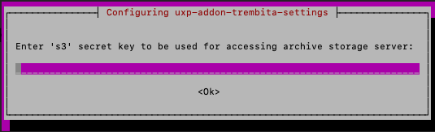

# Т2.0 ШБО інсталяція
---


# Крок 1. Підготовчі дії

| Вхідні порти (TCP) | Призначення | Область мережі |
| --- | --- | --- |
| 4000 | Доступ до вебінтерфейсу користувача | ПРИВАТНА |
| 2082 | Використовується для прослуховування запитів сервісів щодо інформації про статус (необхідно лише у випадку використання внутрішнього балансувальника навантаження, щоб  розподіляти запити між вузлами кластеру серверу безпеки | ПРИВАТНА |
| 80 | HTTP з’єднання від інформаційних систем | ПРИВАТНА |
| 443 | HTTPS з’єднання від інформаційних систем | ПРИВАТНА |
| 5500 | Обмін повідомленнями UXP між серверами безпеки | ВІДКРИТА |
|  |  |  |
| **Вихідні порти (TCP)** | **Призначення** |  |
| 80 | HTTP з’єднання до інформаційних систем; оновлення програмного забезпечення; глобальна конфігурація; інші додаткові сервіси | ВІДКРИТА |
| 443 | HTTPS з’єднання до інформаційних систем; other supplementary services | ВІДКРИТА |
| 514 | З’єднання Syslog із сервером журналювання | ПРИВАТНА |
| 9000 | З’єднання S3 із сервером архівування журналів повідомлень | ПРИВАТНА |
| 4400 | Сервісні запити до Конектора UXP (необхідно лише при використанні Конектора UXP) | ПРИВАТНА |
| 8080 | Віддалене налаштування серверу Zabbix (необхідно лише при використанні серверу Zabbix для локального моніторингу серверу безпеки | ПРИВАТНА |
| 10051 | Передача даних моніторингу на сервер Zabbix (необхідно лише при використанні серверу Zabbix для локального моніторингу серверу безпеки | ПРИВАТНА |
| 9200 | Передача даних операційного моніторингу на сервер Elasticsearch (RESTful API) (необхідно лише при використанні серверу Elasticsearch для локального моніторингу серверу безпеки | ПРИВАТНА |
| 5500 | Обмін повідомленнями між серверами безпеки | ВІДКРИТА |
| 4001 | Запити керування до сервера реєстрації | ВІДКРИТА |


# Крок 2. Встановлення UXP

## 2.1. Налаштування `HOSTNAME`

```bash
hostname -A
sudo hostnamectl set-hostname <your-hostname>
```

## 2.2. Додавання репозиторію UXP

```bash
sudo sed -i 's/^[A-Za-z0-9]/#&/' /etc/apt/sources.list
echo 'deb https://project-repo.trembita.gov.ua:8081/repository/tr-2-pre-final/ jammy main' | sudo tee -a /etc/apt/sources.list
```

## 2.3. Встановлення UXP Security Server

```bash
sudo apt update
```

```bash
sudo apt install uxp-securityserver-trembita
```

> ### **Під час встановлення:**
>
> * Натисніть `Y` для підтвердження
> * Введіть **логін/пароль** для входу до веб-інтерфейсу:
> * 
> * 
> * У наступному вікні натисніть **ʼʼNoʼʼ,** якщо MinIO не встановлено або не налаштовано. Ви зможете додати ці параметри після встановлення **ШБО** у файлі **local.ini**
> * 
> * Якщо MinIO встановлено, створені бакети та ключі, виберіть ʼʼ**Yesʼʼ** та додайте параметри MinIO:
> * Введіть IP-адресу **MinIO** з портом **9000**
> * 
> * Введіть шлях до папки, яку Ви налаштували для зберігання
> * 
> * Введіть acces key створений на **MinIO**
> * 
> * Введіть secret key створений на **MinIO**
> * 
> * Вкажіть шлях до сертифікату, який був згенерований на MinIO
> * 
> * Далі натисніть ОК
> * 
> * В наступному вікні натисніть ОК
> * В наступному теж натиснути ОК
> * 

# Крок 3. Контролер цілісності (AIDE)

Запустіть встановлення контролера цілісності :

```bash
sudo apt install uxp-integrity-securityserver
```

Поставте котролер цілісності на паузу :

```
sudo uxp-integrity pause
```

Додайте ip-адресу **Адмін станції** до списку дозволених :

```
sudo nano /etc/uxp/nginx/allowed_hosts.conf
```

Перевірте статус nginx командою :

```
sudo nginx -t
```

Якщо помилки не виявлені, виконайте наступну команду :

```
sudo service nginx restart
```

Далі оновіть контролер цілісності

```
sudo uxp-integrity update
```

Наступною командою подивіться чи всі сервіси **uxp** активні

```
sudo systemctl status uxp-*
```

# Крок 4. Підключення криптографічного пристрою

## 4.1. Підтримувані моделі

* Шифр-HSM
* Автор SecureToken-338
* ІІТ Гряда-301
* ІІТ Алмаз-1К

## 4.2. Встановлення драйверів

```bash
sudo apt install pcscd libccid pcsc-tools libpcsclite opensc
```

## 4.3. Налаштування ІІТ Гряда-301

```bash
sudo unzip -o -j NCMGryada301PKCS11Libs-Linux.zip -d /usr/share/uxp/lib/
```

```
sudo chown root:root /usr/share/uxp/lib/*.so
```

```
sudo chmod 644 /usr/share/uxp/lib/*.so
```

Створіть `/usr/share/uxp/lib/osplm.ini`:

```
[\SOFTWARE\Institute of Informational Technologies Key Medias\NCM Gryada-301]
[\SOFTWARE\...\Modules]
[\SOFTWARE\...\Modules\<serial-number>]
Order Number=0
SN=<serial-number>
Address=<device-address>
AddressMask=<address-mask>
```

```bash
sudo chown root:root /usr/share/uxp/lib/osplm.ini
```

```
sudo chmod 644 /usr/share/uxp/lib/osplm.ini
```

Перезапуск сервісів:

```bash
sudo systemctl restart uxp-securityserver-rest-api uxp-proxy
```

```
sudo uxp-integrity update
```

## 4.4. Додавання пристрою через веб-інтерфейс

1. Увійти до веб-інтерфейсу
2. Перейти у **Криптографічні пристрої**
3. Натиснути **Додати пристрій**
4. Вибрати модель і слот
5. Призначити токен учаснику

# Крок 5. Встановлення доповнень

## 5.1. Підтримка PKCS#11

```bash
sudo apt install uxp-addon-pkcs11
```

```bash
chmod o+r <library>
```

```bash
sudo su uxp -c 'pkcs11-tool -module <Library> -L'
```

# Крок 6. Ключі та сертифікати

## 6.1. Імпорт сертифікатів з пристрою

1. Перейти у **Ключі та сертифікати**
2. Авторизуватись на токені
3. **Імпорт сертифіката** → **З пристрою**

## 6.2. Генерація CSR

* Генерувати CSR для **підпису** (на токені пристрою)
* Генерувати CSR для **автентифікації** (програмний токен)

# Крок 7. Надсилання CSR

Передайте обидва CSR до УЦ або ЦСК, додавши:

* Key Usage:
  * `Key Agreement` — автентифікація
  * `Non Repudiation` — підпис
* Серійний номер пристрою, модель, слот
* Поля DN із веб-інтерфейсу

# Крок 8. Імпорт сертифікатів

# Через інтерфейс:

```bash
Ключі та сертифікати → Імпортувати → Зіставлення з ключами буде автоматичне
```

# Крок 9. Реєстрація сервера

1. Перейти у **Ключі та сертифікати**
2. Обрати сертифікат автентифікації
3. Натиснути **Зареєструвати**
4. Вказати DNS/IP сервера

---