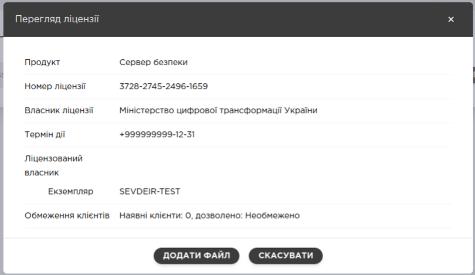
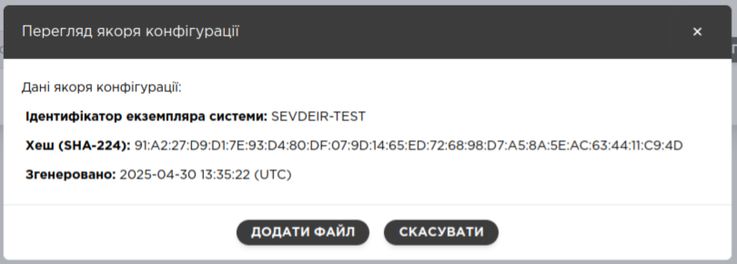

# Т2.0 ШБО Початкове налаштування
**Для авторизація в вебінтерфейсі керування на сервері ШБО відкрийте URL за адресою:**
https://**\<security-server\>**:4000/
Де **\<security-server\>** — приватна адреса вашого сервера безпеки.
Введіть: **ім’я** та **пароль** адміністратора, створеного під час встановлення сервера ШБО.

## Крок 1: Додавання ліцензії

Додайте на сервер безпеки ліцензію.

> Сервер безпеки потребує наявності чинної ліцензії, щоб мати змогу здійснювати обмін повідомленнями.

**Оберіть файл ліцензії**

Натисніть **переглянути**
Та **додати файл**

## Крок 2: Додавання якоря конфігурації

Додайте на сервер файл якоря глобальної конфігурації.

> Сервер безпеки буде використовувати якір конфігурації для періодичного завантаження інформації про екземпляр UXP, наприклад, список інших учасників UXP.

**Оберіть файл якоря конфігурації**

Натисніть **переглянути**
Та **додати файл**

## Крок 3: Налаштування власника сервера

Вкажіть **ідентифікатор UXP для організації, яка володіє цим сервером безпеки.**
Ви можете знайти ідентифікатор власника у списку вже зареєстрованих на екземплярі UXP учасників, або ввести ідентифікатор самостійно і здійснити реєстрацію учасника з допомогою вашого керівного органу згодом.

> Значення коду учасника має обмеження по дозволених символах [a-zA-Z0-9_-].

Після вибору натисніть **далі**

## Крок 4: Налаштування коду сервера

Призначте **код сервера безпеки**, щоб вирізняти даний сервер безпеки серед інших серверів безпеки цього самого власника. Код сервера має бути унікальним з-поміж усіх серверів безпеки, що належать даному власнику.

> Значення коду сервера безпеки має обмеження по дозволених символах [a-zA-Z0-9_-].

## Крок 5: Ініціалізація програмного токена

Сервер безпеки використовує криптографічні ключі і зберігає їх на **програмному токені**.

Ключі на програмному токені захищені через PIN. Оберіть PIN для токена і зберігайте його у безпечному місці. Якщо PIN буде забутий, ключі можуть стати неробочими.

## Крок 6: Вибір сервісу позначок часу

Оберіть сервіс позначок часу зі списку підтверджених вашим керівним органом сервісів позначок часу. Якщо потрібно використати більше одного сервісу позначок часу, їх можна буде додати згодом.

## Крок 7: Генерування ключів та CSR

Сервер безпеки має два головних сертифікати: **сертифікат підписання** та **сертифікат автентифікації**.

Обидва необхідні для обміну повідомленнями та реєстрації сервера безпеки у керівному органі.

> Майстер ініціалізації сервера безпеки **не підтримує зберігання ключа підпису власника сервера на криптографічному пристрої** (наприклад, апаратному модулі безпеки). Якщо вам потрібно використовувати зовнішній криптографічний пристрій, перейдіть до розділу **Налаштування сервера безпеки UXP для використання зовнішнього криптографічного пристрою**, з якого можна дізнатися як під’єднати пристрій до сервера безпеки, додати ключі та сертифікати і здійснити реєстрацію сервера.

### **Cертифікат підписання**

Згенеруйте запит про сертифікат підписання (CSR) щодо отримання **сертифіката підписання**. CSR файл завантажаться автоматично.

### **Cертифікат автентифікації**

Згенеруйте запит про сертифікат підписання (CSR) щодо отримання **сертифіката автентифікації**. CSR файл завантажаться автоматично.

## Крок 8: Запит про сертифікати

Надішліть CSR файли постачальнику сервісу сертифікації, якого ви обрали під час генерування CSR, щоб отримати сертифікати.

## Крок 9: Імпорт сертифікатів

Після отримання сертифікатів, імпортуйте обидва сертифікати на сервер безпеки. Сервер співставить сертифікати із раніше згенерованими ключами і CSR.

Натисніть **ІМПОРТ**

Після успішного імпорту буде надпис: **Імпортовано**

## Крок 10: Реєстрація сервера

Останнім кроком налаштування сервера безпеки є реєстрація сервера і його сертифіката автентифікації на екземплярі UXP.

1. ### Реєстрація сервера

   Вкажіть **відкрите DNS ім’я або IP адресу** сервера безпеки і надішліть запит на реєстрацію з сервера безпеки.

Після успішно надісланого запиту надпис: **Запит надіслано**

2. ### Надіслати сертифікат автентифікації

   Щоб завершити реєстрацію, ви також маєте будь-яким іншим способом надіслати сертифікат автентифікації вашому керівному органу. Дотримуйтесь інструкцій від вашого керівного органу щодо цього питання.

3. ### Завершення початкове налаштування.

Початкове налаштування завершено і вас буде перенаправлено **у панель адміністрування сервера безпеки**.

Перш ніж сервер зможе здійснювати обмін повідомленнями, керівний орган **має підтвердити його реєстрацію, але поки ви очікуєте на підтвердження, можете** продовжити налаштування з під’єднання сервісів до сервера безпеки.

> Статус реєстрації сертифіката автентифікації ви можете перевірити на сторінці **Ключі та сертифікати**.

# Реєстрація підсистеми

Підсистема представляє частину інформаційної системи учасника UXP. Для можливості **використовувати** чи **надавати** **сервіси UXP**, учасники UXP повинні вказувати частини своїх інформаційних систем як підсистеми.

## Крок 1: Додавання клієнта сервера безпеки

1. Перейдіть на сторінку **Клієнти сервера безпеки**.
2. Натисніть **Додати клієнта**. У вікні, що з’явиться, **введіть** вручну ідентифікатор клієнта або натисніть Обрати клієнта з глобального списку та знайдіть клієнта серед усіх учасників UXP та їх підсистем.

> Значення коду учасника та підсистеми обмежено таким набором символів [a-zA-Z0-9_-].

3. Після введення даних клієнта натисніть **Додати**.

Новий клієнт зберігається як клієнт сервера безпеки, але його ще не буде видно для інших учасників UXP. Щоб інші учасники UXP дізналися, що ця підсистема використовує сервер безпеки, вам потрібно зареєструвати клієнта.

## Крок 2: Реєстрація клієнта сервера безпеки

1. Перейдіть на сторінку **Клієнти сервера безпеки**.
2. Знайдіть клієнта, якого бажаєте зареєструвати (він повинен мати статус "Збережено") і натисніть іконку **Подробиці**.

3. На сторінці **Дані клієнта**, що відкриється, натисніть **Зареєструвати**

і підтвердьте дію натиснувши **Зареєструвати**.

Отримаєте повідомлення про запит.

{width=1180px}Статус клієнта зміниться на "Відбувається реєстрація".

## Крок 3: Реєстрація клієнта сервера безпеки в керівному органі UXP

Надішліть керівному органу UXP запит на реєстрацію клієнта відповідно до організаційної процедури на вашому екземплярі системи UXP. Ви маєте передати інформацію про власника сервера безпеки та його код, а також код підсистеми нового клієнта.

> Після того, як керівний орган UXP підтвердить реєстрацію клієнта, сервер безпеки змінює статус клієнта на "**Зареєстровано**" і процес реєстрації вважається завершеним.

### Статуси клієнта сервера безпеки

Сервер безпеки розрізняє такі можливі статуси клієнта:

| Статус | Опис |
| --- | --- |
|  | **Збережено** – інформацію про клієнта було додано на сервер безпеки, але ~~зв’язок між клієнтом та сервером безпеки~~ не зареєстровано в керівному органі UXP. |
|  | **Відбувається реєстрація** – було надіслано запит ~~до сервера реєстрації~~ на реєстрацію клієнта, але керівний орган UXP ще не погодив зв’язок між клієнтом та сервером безпеки. |
|  | **Зареєстровано** – керівний орган UXP погодив зв’язок між клієнтом і сервером безпеки. У цьому статусі клієнт може надавати і використовувати сервіси UXP. |

## Крок 2: Сервіси UXP

Щоб забезпечити для клієнта сервера доступність сервісів через інфраструктуру UXP, Менеджер сервісів повинен зареєструвати їх як сервіси UXP. Сервіс UXP може ґрунтуватися на роботі SOAP сервісу або REST API.

### SOAP сервіс

1. Перейдіть на сторінку **Клієнти сервера безпеки**, оберіть із таблиці клієнта і натисніть **іконку SOAP сервіси** у рядку з ним.
2. Натисніть **Додати WSDL**, введіть у вікні, що з’явиться, адресу WSDL і натисніть **Додати**.
   *Стандартно, сервер безпеки додає WSDL у вимкненому стані.*

Щоб переглянути список сервісів, що містяться у WSDL, розгорніть його, натиснувши символ "\>" на початку рядка з відповідним WSDL.

### REST API

1. Перейдіть на сторінку **Клієнти сервера безпеки**, оберіть із таблиці потрібного клієнта і натисніть **іконку REST API** у рядку з ним.
2. Натисніть **Додати REST API**.
3. Оберіть, чи бажаєте додати REST API через базову адресу URL, чи через URL з описом OpenAPI.
4. Введіть адресу URL та код сервісу і натисніть **Додати**.
   *Стандартно, REST API додається у вимкненому стані.*