# Інсталяція серверу аналізу транзакцій ELK

## 🔹 Призначення ELK: Операційний моніторинг

ШБО створює запис моніторингових даних для кожного запиту щодо обміну даними між ШБО. Ці записи кешуються в буфері операційного моніторингу (розміщеному в оперативній пам’яті) і потім передаються через агент моніторингу (PMA) для накопичення у базі даних. Успішно передані записи видаляються з буферу операційного моніторингу.

Для аналізу та візуалізації операційних даних, передайте їх з PMA до Elasticsearch. Ви можете встановити новий сервер Elasticsearch/Kibana або використати наявний. Переконайтесь, що його коректно налаштовано для використання з PMA.

---

## 🔧 Підготовка сервера

### 🔐 Порти доступу для вхідних з’єднань ELK

| Порт (TCP) | Призначення | Область мережі |
| ---------- | ----------- | -------------- |
| 5601       | вебінтерфейс Kibana | ПРИВАТНА |
| 9200       | необхідний для надсилання даних з PMA до Elasticsearch (REST API). Використовується для локального або централізованого моніторингу ШБО | ПРИВАТНА |

---

## 🔹 Підготовка

1. Закоментуйте всі активні репозиторії:

```bash
sudo sed -i 's/^[A-Za-z0-9]/#&/' /etc/apt/sources.list
```
2. Додайте GPG-ключ для репозиторію:

```bash
wget -O - https://project-repo.trembita.gov.ua:8081/public-keys/public.key.txt | sudo apt-key add -
```
3. Додайте репозиторій:

```bash
echo 'deb https://project-repo.trembita.gov.ua:8081/repository/t2-stack-1.22.7/ jammy main' | sudo tee -a /etc/apt/sources.list
```
4. Оновіть список пакетів:

```bash
sudo apt update
```
---

## 🔹 Встановлення ELK

1. Встановіть пакет аналітики моніторингу UXP (встановить пакети Elasticsearch, Kibana та конфігураційні файли):

```bash
sudo apt install uxp-monitor-analytics
```

2. Збережіть згенерований пароль на етапі установки:

```bash
--------------------------- Security autoconfiguration information ------------------------------

Authentication and authorization are enabled.
TLS for the transport and HTTP layers is enabled and configured.

The generated password for the elastic built-in superuser is : ******************
```

3. Переконайтесь, що конфігураційний файл Elasticsearch ```/etc/elasticsearch/elasticsearch.yml``` містить такі записи, додані пакетом ```uxp-monitor-analytics```:

```bash
cluster.name: uxp
node.name: ${HOSTNAME}
network.host: 0.0.0.0
search.max_buckets: 20000
```

4. Стандартно, сервер Kibana налаштовано на адресу ```localhost```, що означає неможливість підключення до нього віддалених машин. Щоб дозволити під’єднання від віддалених користувачів, скоригуйте файл ```/etc/kibana/kibana.yml```.

```bash
sudo nano /etc/kibana/kibana.yml
```

Розкоментуйте параметр ```server.host``` і змініть його значення з ```localhost``` на не-зациклену IP адресу:

```bash
server.host: 0.0.0.0
```

5. Після завершення виконання змін конфігурації, перезапустіть сервіси:

```bash
sudo systemctl restart elasticsearch kibana
```

6. Переконайтесь, що користувацький інтерфейс Kibana доступний через браузер за адресою:

```bash
http://\<server-address\>:5601
```

8. Згенеруйте реєстраційний токен для екземпляра Kibana за допомогою такої команди:

```bash
sudo /usr/share/elasticsearch/bin/elasticsearch-create-enrollment-token -s kibana
```

> 🔐 **Примітка:** Цей токен використовується лише при первинному налаштуванні Kibana і не потрібен для подальших входів.


9. У вебінтерфейсі Kibana вставте щойно згенерований токен з терміналу і натисніть ```Configure Elastic```.

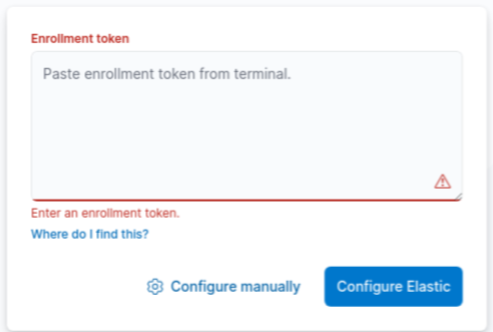

10. Отримайте код верифікації Kibana за допомогою такої команди:

```bash
sudo /usr/share/kibana/bin/kibana-verification-code
```

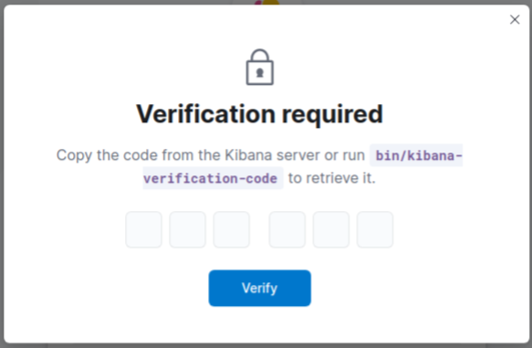

11. У вебінтерфейсі Kibana вставте щойно отриманий код верифікації з терміналу і натисніть ```Verify```.

12. У вебінтерфейсі Kibana авторизуйтесь як користувач ```elastic```, використовуючи раніше згенерований пароль.

> ℹ️  **Примітка:** Щоб змінити згенерований пароль для вбудованого супер-користувача elastic, запустіть таку команду:
>
> ```bash
> sudo /usr/share/elasticsearch/bin/elasticsearch-reset-password -u elastic -i
> ```

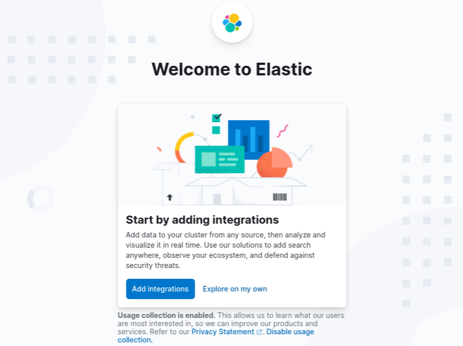

---

## 🔹 Шифрування трафіку між веббраузером та Kibana

Щоб налаштувати HTTPS з’єднання між веббраузером та Kibana, спершу отримайте чинний TLS сертифікат для серверу Kibana.

> ⚠️ **Примітка:** Ви можете використовувати TLS сертифікати від загальновідомих центрів сертифікації (CA), внутрішнього або приватного CA, або самопідписані сертифікати.

---
### ⚠️ Створення самопідписаного TLS сертифікату

Виконайте наступні команди: 

```bash
sudo /usr/share/elasticsearch/bin/elasticsearch-certutil cert \
--pem --self-signed --name kibana-server --dns <server-DNS-address> \
--ip <server-IP-address> --days 3650
```

-name — визначає назву запиту сертифікату, який буде згенеровано
-dns та --ip додатково можуть визначити, відповідно, DNS назви і IP адреси у вигляді розділеного комами списку, для альтернативних назв суб’єкта (SAN, Subject Alternative Name).

Стандартно, згенеровані файли ключа і сертифікату (*kibana-server.key* та *kibana-server.crt)* запаковано у файл ```/usr/share/elasticsearch/certificate-bundle.zip```

Ви можете розпакувати ці файли до каталогу ```./kibana-server``` за допомогою такої команди:

```bash
sudo unzip /usr/share/elasticsearch/certificate-bundle.zip
```

---

1. Для шифрування трафіку скопіюйте отримані файли TLS сертифікату і приватного ключа**, наприклад, ```kibana-server.crt``` та ```kibana-server.key```, у каталог ```/etc/kibana/``` на сервері Kibana.

> ⚠️ Якщо ви генерували сертифікати через ```elasticsearch-certutil```, перемістіть згенеровані файли за допомогою такої команди:
> ```bash
> sudo mv ./kibana-server/kibana-server.* /etc/kibana/
> ```

2. Задайте власника та права доступу для файлів:

Змінюємо власника:

```bash
sudo bash -c 'chown root:kibana /etc/kibana/kibana-server.*'
```

Змінюємо привілеї:

```bash
sudo bash -c 'chmod 640 /etc/kibana/kibana-server.*'
```

3. На сервері Kibana, відкрийте файл ```/etc/kibana/kibana.yml```

```bash
sudo nano /etc/kibana/kibana.yml
```

Додайте наступні рядки, щоб ввімкнути TLS для вхідних з’єднань та визначити шляхи розташування сертифікату серверу та незашифрованого приватного ключа:

```bash
server.ssl.enabled: true
server.ssl.certificate: /etc/kibana/kibana-server.crt
server.ssl.key: /etc/kibana/kibana-server.key
```

4. Перезавантажте Kibana за допомогою такої команди:

```bash
sudo systemctl restart kibana
```

> ℹ️ **Примітка:** Після завершення виконання цих змін, ви повинні завжди підключатися до Kibana через HTTPS ```https://\<server-address\>:5601```

---

## 🔹 З’єднання Elasticsearch із агентом моніторингу (PMA)

Для взаємодії з Elasticsearch, агент PMA потребує:

- імені користувача та пароля для автентифікації,
- відповідних привілеїв для читання та запису індексів операційного моніторингу.


### Створення користувача Elasticsearch для PMA

1. У Kibana перейдіть до:
```Management``` → ```Stack Management``` → ```Security``` → ```Roles``` та натиснувши ```Create role```.

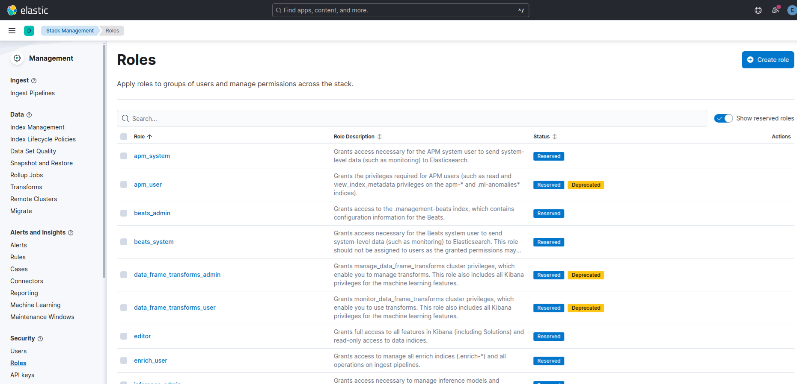


2. Налаштуйте:

- Role name: ```uxp_pma_client```
  
- Description: ```Grants privileges to UXP PMA```

- Cluster privileges: ```monitor```

- Index privileges:

   - Indices:  ```uxp-request\*```

   - Privileges: ```create_index```, ```manage```, ```read```, ```view_index_metadata```, ```write```

Натисніть ```Create role```.

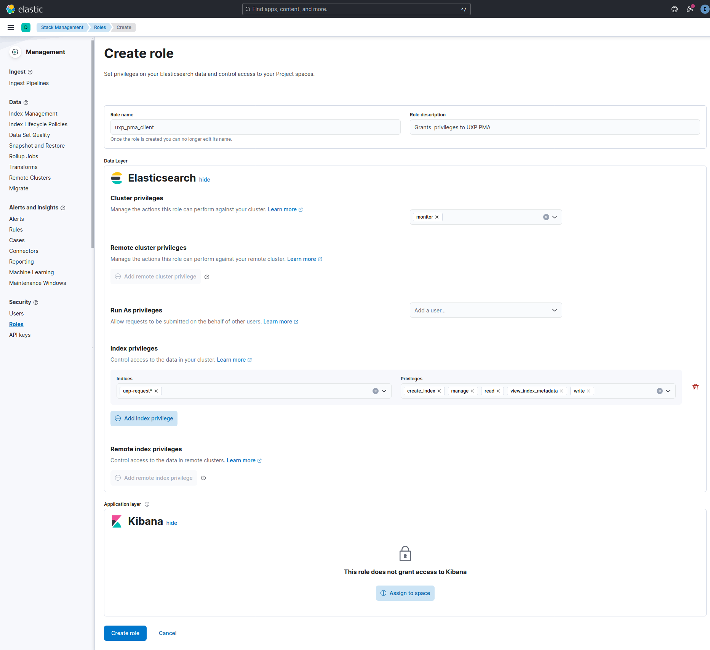

3. Далі перейдіть до:
```Management``` → ```Stack Management``` → ```Security``` → ```Users``` і натисніть ```Create user```

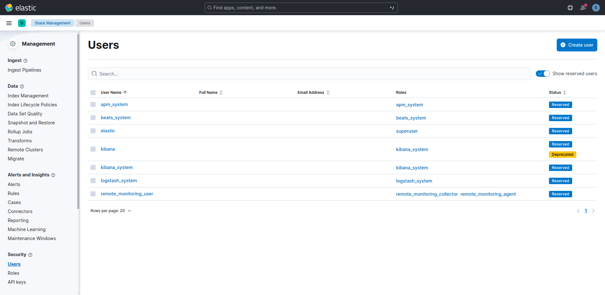

4. Вкажіть:

- Username: ```uxp_pma```

- Password: (встановіть надійний)

- Assigned roles: ```uxp_pma_client```

Натисніть ```Create user```.

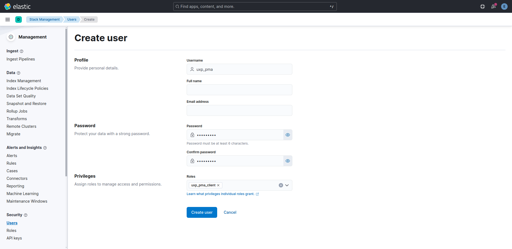

---

## 🔹 Налаштування агента моніторингу (PMA)

1. Для передачі статистики даних операційного моніторингу на сервер Elasticsearch, скопіюйте CA-сертифікат з серверу Elasticsearch на ШБО:

```bash
scp user@elasticsearch-server:/etc/elasticsearch/certs/http_ca.crt .
```

```bash
sudo mv http_ca.crt /etc/uxp/ssl/
```

2. Задайте власника та права доступу до сертифікату:

Змінюємо власника:

```bash
sudo chown root:uxp /etc/uxp/ssl/http_ca.crt
```

Змінюємо привілеї:

```bash
sudo chmod 640 /etc/uxp/ssl/http_ca.crt
```

3. Призупиніть контролер цілісності перед редагуванням:

```bash
sudo uxp-integrity pause
```

4. Відредагуйте конфігураційний файл PMA:

```bash
sudo nano /etc/uxp/monitor-agent.ini
```

Додайте секцію:

```bash
[elasticsearch]
address = <elasticsearch-ip>
port = 9200
scheme = https
ca-cert-file = /etc/uxp/ssl/http_ca.crt
username = uxp_pma
password = <your-password>
index = uxp-request-%{yyyy.MM.dd}
```

🔸 Пояснення ключових полів:

| Поле |	Опис |
| ---- | ---- |
| address | IP або DNS серверу Elasticsearch |
| port | Порт, зазвичай 9200 |
| scheme	| Протокол з'єднання: https |
| ca-cert-file |	Повний шлях до CA-сертифіката |
| username |	Користувач Elasticsearch (наприклад uxp_pma) |
| password	| Пароль користувача Elasticsearch |
| index	| Назва або шаблон індексу, наприклад uxp-request, uxp-%{yyyy.MM} | 

5. Перезапустіть агента моніторингу:

```bash
sudo reload-monitor-agent
```

6. Оновіть хеші цілісності:

```bash
sudo uxp-integrity update
```

> ℹ️ **Примітка:** Після цього агент PMA автоматично створить індекс uxp-request* у Elasticsearch при першій передачі даних.

> ℹ️ **Примітка:** Агент моніторингу використовує свій самопідписаний TLS сертифікат /etc/uxp/ssl/elasticsearch.crt для встановлення безпечного з’єднання із сервером Elasticsearch.

---

## 🔹 Налаштування Kibana

Створення Data View (Представлення даних)

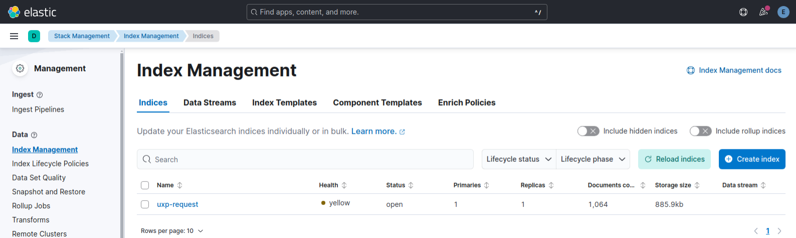

> ℹ️ **Примітка:** Примітка: Представлення даних (Data View) дозволяє Kibana відображати записи з Elasticsearch. Ви можете створити представлення для одного індексу, декількох або всіх індексів із даними моніторингу.

> ⚠️ Представлення даних можна створити лише для індексу, який вже існує в Elasticsearch.


1. Перейдіть у:
```Management``` → ```Stack Management``` → ```Kibana``` → ```Data Views```
та натисніть ```Create data view```.

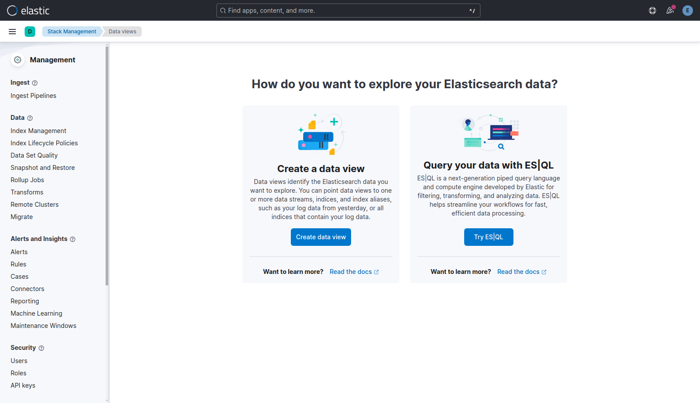

2. Введіть:

- Name: ```uxp-request```

- Index pattern: ```uxp-request*```

- Timestamp field: ```request_in_ts```

3. Натисніть ```Save data view to Kibana```.

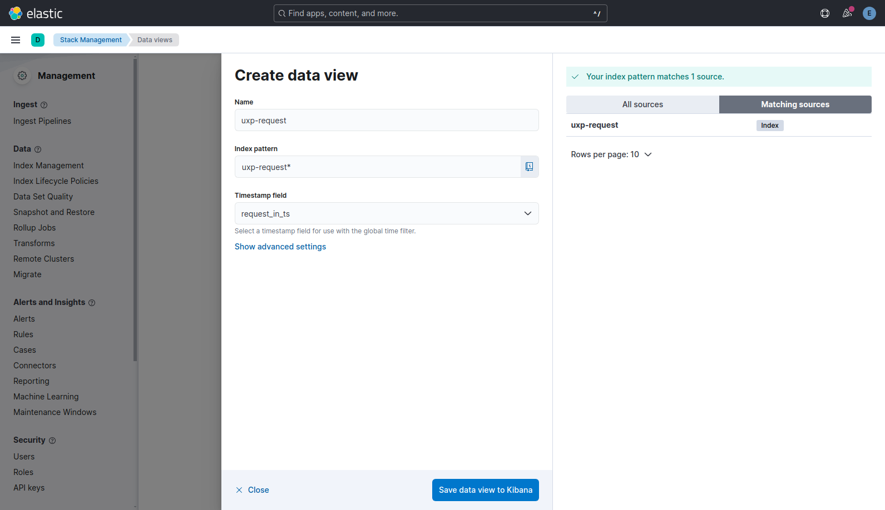

🔸 За потреби, у візуалізаціях застосовуйте фільтр, щоб уникнути дублювання записів з боку клієнта й сервісу:

```bash
security_server_type: Client
```

---

## 🔹 Імпорт інформаційної панелі

> ℹ️ **Примітка:** Ця інформаційна панель містить набір різних візуалізацій (теплова карта, графіки, числове відображення, статистичні таблиці тощо).

Пакет ```uxp-monitor-analytics``` містить приклад інформаційної панелі:

```bash
uxp-dashboard.ndjson (\[UXP\] Overview)
```

Файл знаходиться за шляхом:

```bash
/usr/share/doc/uxp-monitor-analytics/examples/kibana-8.x/dashboards/
```

1. Скопіюйте файл ```uxp-dashboard.ndjson``` з сервера Kibana на локальний комп’ютер, з якого відкривається вебінтерфейс Kibana.

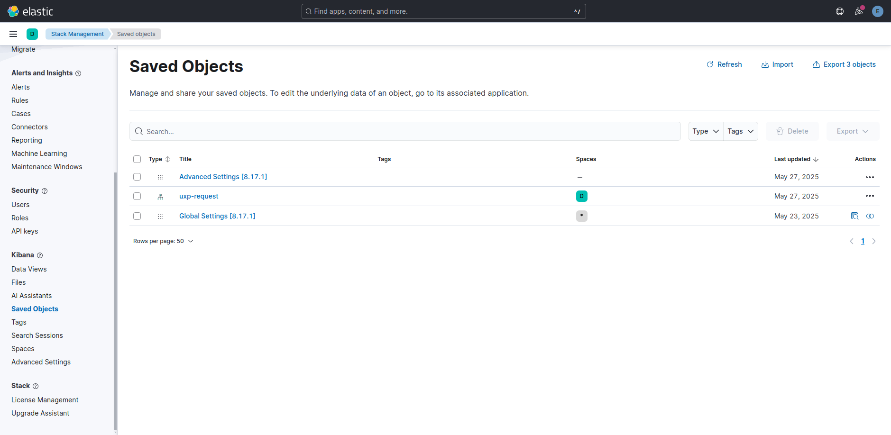

2. У Kibana перейдіть до ```Management``` → ```Stack Management``` → ```Kibana``` → ```Saved Objects``` та натисніть ```Import```.

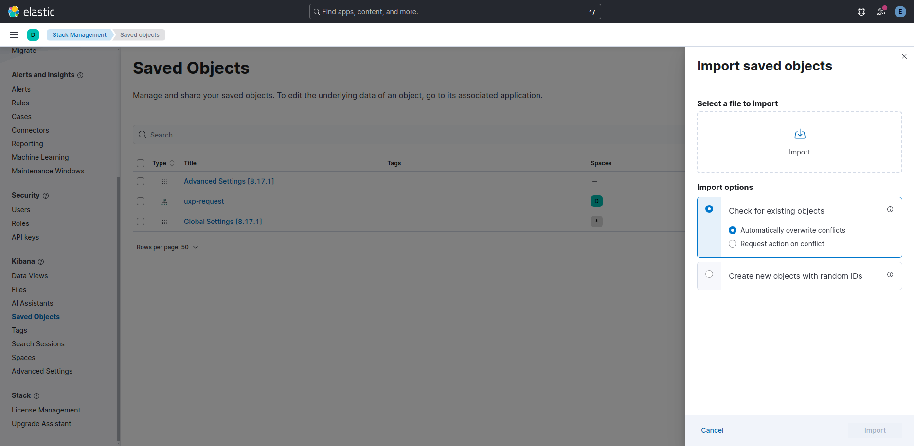

3. Завантажте файл ```uxp-dashboard.ndjson```

4. Натисніть ```Import```, а потім ```Done```

✅ Готово. Панель з’явиться в розділі ```Analytics``` → ```Dashboard```.
