# Т2.0 ELK інсталяція
**Операційний моніторинг**

Сервер безпеки створює запис моніторингових даних для кожного запиту щодо обміну даними з UXP. Ці записи кешуються в буфері операційного моніторингу (розміщеному в оперативній пам’яті) і потім передаються у доповнення PMA для накопичення у базі даних. Успішно передані записи видаляються з буферу операційного моніторингу.

Для аналізу та візуалізації операційних даних, передайте їх з PMA до Elasticsearch. Ви можете встановити новий сервер Elasticsearch/Kibana або використати наявний. Переконайтесь, що його коректно налаштовано для використання з PMA.

# **Підготовка:**

## **Встановити операційну систему**

Виконати встановлення операційної системи на основі дистрибутиву: Ubuntu Server 22.04 LTS

## **Необхідні для вхідних з’єднань Graylog порти**

| Порт (TCP) | Призначення | Область мережі |
| --- | --- | --- |
| 5601 | вебінтерфейс Kibana | ПРИВАТНА |
| 9200 | Використовується для пересилання даних операційного моніторингу на сервер Elasticsearch (RESTful API). Необхідно лише у випадку використання Elasticsearch для локального моніторингу серверу безпеки. | ПРИВАТНА |

---

# Крок 1: **Налаштування репозиторію**

1. Закоментувати репозиторії:

```bash
sudo sed -i 's/^[A-Za-z0-9]/#&/' /etc/apt/sources.list
```

2. Додати GPG-ключ для репозиторію:

```bash
wget -O - https://project-repo.trembita.gov.ua:8081/public-keys/public.key.txt | sudo apt-key add -
```

3. Додати репозиторій:

```bash
echo 'deb https://project-repo.trembita.gov.ua:8081/repository/tr-2-pre-final/ jammy main' | sudo tee -a /etc/apt/sources.list
```

4. Оновлюємо списки пакетів з репозиторіїв:

```bash
sudo apt update
```

# **Крок 2: Встановлення**

1. Встановіть пакет аналітики моніторингу UXP (встановить пакети elasticsearch та kibana також<span style="color:red;"> </span>конфігураційні файли):

```bash
sudo apt install uxp-monitor-analytics
```

2. Збережіть згенерований пароль на етапі установки.

```bash
--------------------------- Security autoconfiguration information ------------------------------

Authentication and authorization are enabled.
TLS for the transport and HTTP layers is enabled and configured.

The generated password for the elastic built-in superuser is : ******************
```

3. Переконайтесь, що конфігураційний файл Elasticsearch **/etc/elasticsearch/elasticsearch.yml** містить такі записи, додані пакетом uxp-monitor-analytics:

```bash
cluster.name: uxp
node.name: ${HOSTNAME}
network.host: 0.0.0.0
search.max_buckets: 20000
```

4. Стандартно, сервер Kibana налаштовано на адресу localhost, що означає неможливість підключення до нього віддалених машин. Щоб дозволити під’єднання від віддалених користувачів, скоригуйте файл /etc/kibana/kibana.yml.

```bash
sudo nano /etc/kibana/kibana.yml
```

Розкоментуйте параметр server.host і змініть його значення з localhost на не-зациклену IP адресу:

```bash
server.host: 0.0.0.0
```

5. Після завершення виконання змін конфігурації, перезапустіть сервіси:

```bash
sudo systemctl restart elasticsearch kibana
```

6. Переконайтесь, що користувацький інтерфейс Kibana за адресою:
   **http://\<server-address\>:5601/**
   доступний через браузер.
7. Згенеруйте реєстраційний токен для екземпляра Kibana за допомогою такої команди:

```bash
sudo /usr/share/elasticsearch/bin/elasticsearch-create-enrollment-token -s kibana
```

8. У вебінтерфейсі Kibana вставте щойно згенерований токен з терміналу і натисніть **Configure Elastic**.

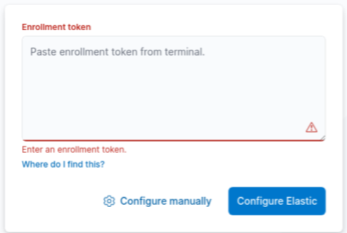

9. Отримайте код верифікації Kibana за допомогою такої команди:

```bash
sudo /usr/share/kibana/bin/kibana-verification-code
```
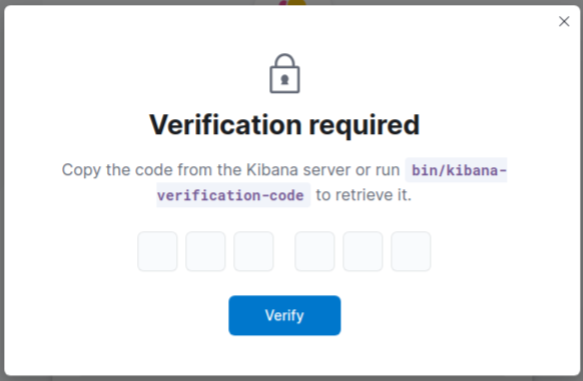

10. У вебінтерфейсі Kibana вставте щойно отриманий код верифікації з терміналу і натисніть Verify.

11. У вебінтерфейсі Kibana авторизуйтесь як користувач: **elastic**
    Використовуючи **раніше згенерований** пароль.

> Щоб змінити згенерований пароль для вбудованого супер-користувача elastic, запустіть таку команду:
>
> ```bash
> sudo /usr/share/elasticsearch/bin/elasticsearch-reset-password -u elastic -i
> ```


## Шифрування трафіку між веббраузером та Kibana

Щоб налаштувати HTTPS з’єднання між веббраузером та Kibana, спершу отримайте чинний TLS сертифікат для серверу Kibana.

> *Ви можете використовувати TLS сертифікати від загальновідомих центрів сертифікації (CA), внутрішнього або приватного CA, або самопідписані сертифікати.'*

> Створення самопідписаного TLS сертифікату за допомогою команди на зразок наступної:
>
> ```bash
> sudo /usr/share/elasticsearch/bin/elasticsearch-certutil cert \
> --pem --self-signed --name kibana-server --dns <server-DNS-address> \
> --ip <server-IP-address> --days 3650
> ```
>
> \-name — визначає назву запиту сертифікату, який буде згенеровано
> \-dns та --ip додатково можуть визначити, відповідно, DNS назви і IP адреси у вигляді розділеного комами списку, для альтернативних назв суб’єкта (SAN, Subject Alternative Name):
>
> Стандартно, згенеровані файли ключа і сертифікату (*kibana-server.key* та *kibana-server.crt)* запаковано у файл:
>
> /usr/share/elasticsearch/certificate-bundle.zip
> Ви можете видобути ці файли у каталог ./kibana-server за допомогою такої команди:
>
> ```bash
> sudo unzip /usr/share/elasticsearch/certificate-bundle.zip
> ```

1. **Скопіюйте отримані файли TLS сертифікату і приватного ключа**, наприклад, kibana-server.crt та kibana-server.key, у каталог /etc/kibana/ на сервері Kibana.
   Якщо ви генерували сертифікати через elasticsearch-certutil, перемістіть згенеровані файли за допомогою такої команди:

```bash
sudo mv ./kibana-server/kibana-server.* /etc/kibana/
```

2. Налаштуйте цим файлам коректного власника та привілеї
   Змінюємо власника

```bash
sudo bash -c 'chown root:kibana /etc/kibana/kibana-server.*'
```

та привілеї

```bash
sudo bash -c 'chmod 640 /etc/kibana/kibana-server.*'
```

3. На сервері Kibana, додайте у файл /etc/kibana/kibana.yml

```bash
sudo nano /etc/kibana/kibana.yml
```

такі рядки, щоб ввімкнути TLS для вхідних з’єднань та визначити шляхи розташування сертифікату серверу та незашифрованого приватного ключа:

```bash
server.ssl.enabled: true
server.ssl.certificate: /etc/kibana/kibana-server.crt
server.ssl.key: /etc/kibana/kibana-server.key
```

4. Перезавантажте Kibana за допомогою такої команди:

```bash
sudo systemctl restart kibana
```

Після завершення виконання цих змін, ви повинні завжди підключатися до Kibana через HTTPS.
Наприклад **https://\<server-address\>:5601/**

# **Крок 3:** З’єднання Elasticsearch із агентом моніторингу (PMA)

Для взаємодії з Elasticsearch, PMA потребує облікових даних автентифікації, зокрема, ім’я користувача та пароль і необхідні дозволи (включаючи доступ до даних операційного моніторингу та індексів статистики даних операційного моніторингу,

## Створення користувача Elasticsearch для агента моніторингу (PMA)

1. Створіть нову роль для користувача PMA, перейшовши у
   **Management** → **Stack Management** → **Security** → **Roles** та натиснувши **Create role**.

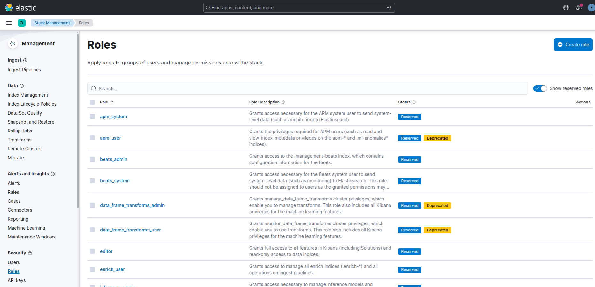{width=70%}

1. Введіть:
   назву ролі, наприклад: **uxp_pma_client**
   опис ролі, наприклад: **Grants privileges to UXP PMA**

2. У секції **Cluster privileges** розділу Elasticsearch, оберіть необхідний привілей:

   **monitor**

3. У секції **Index privileges** розділу Elasticsearch, введіть назву індексу для операційних даних моніторингу, наприклад:
   **uxp-request**\*
   та оберіть необхідні привілеї: **create_index, manage, read, view_index_metadata, write**.
   Далі, натисніть **Create role**.

   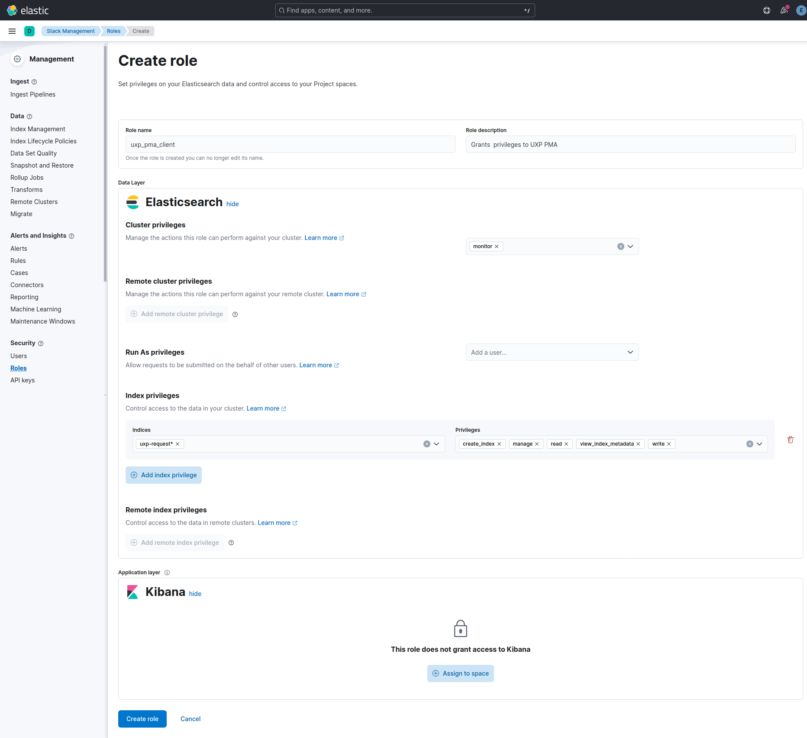

4. Створіть нового користувача, перейшовши у **Management** → **Stack Management** → **Security** → **Users** та натиснувши **Create user.**
   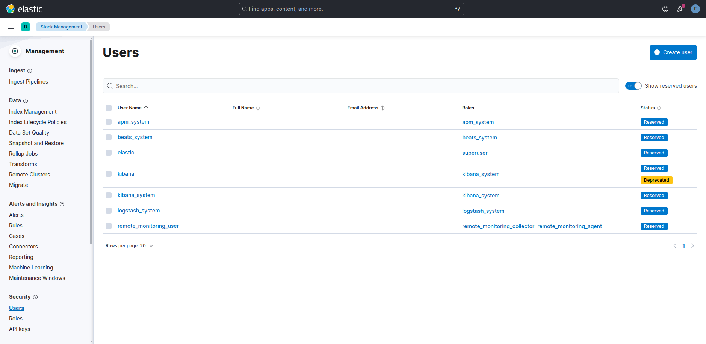

5. Введіть:
   \- ім’я, наприклад: **uxp_pma**
   \- Введіть пароль
   \- і оберіть раніше створену роль, наприклад: **uxp_pma_client**
   Далі, натисніть **Create user**.
   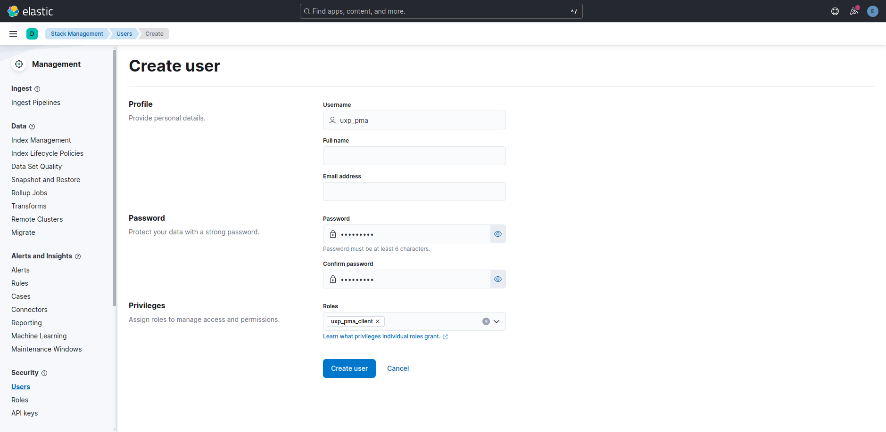

## Налаштування агента моніторингу (PMA)

На сервері безпеки, ввімкніть передачу статистики даних операційного моніторингу на цільовий сервер Elasticsearch:

1. Скопіюйте сертифікат CA /etc/elasticsearch/certs/http_ca.crt з серверу Elasticsearch у каталог /etc/uxp/ssl серверу безпеки.

> **Наприклад** скопіюємо за допомогою SCP
>
> 1. Скопіюйте сертифікат CA:
>
> ```bash
> sudo cp /etc/elasticsearch/certs/http_ca.crt .
> ```
>
> 2. Змінюємо власника:
>
> ```bash
> sudo chown $USER:$USER http_ca.crt
> ```
>
> 3. Передаємо сертифікат CA через SCP:
>
> ```bash
> scp user@192.168.0.30:~/http_ca.crt user@192.168.0.20:~
> ```
>
> **На ШБО** перемістимо в відповідний каталог:
>
> ```bash
> sudo mv http_ca.crt /etc/uxp/ssl/
> ```

2. Налаштуйте цьому файлу коректного власника та потрібні дозволи.
   Змінюємо власника:

```bash
sudo chown root:uxp /etc/uxp/ssl/http_ca.crt
```

та дозволи:

```bash
sudo chmod 640 /etc/uxp/ssl/http_ca.crt
```

3. Скоригуйте конфігураційний файл /etc/uxp/monitor-agent.ini

a. Перш ніж коригувати конфігураційний файл /etc/uxp/monitor-agent.ini, призупиніть роботу контролера цілісності на сервері безпеки за допомогою такої команди:

```bash
sudo uxp-integrity pause
```

b. І потім скоригуйте /etc/uxp/monitor-agent.ini

```bash
sudo nano /etc/uxp/monitor-agent.ini
```

додавши у нього розділ [elasticsearch] на зразок такого:

```bash
[elasticsearch]
address = 192.168.0.30
port = 9200
scheme = https
ca-cert-file = /etc/uxp/ssl/http_ca.crt
username = uxp_pma
password = *******
index = uxp-request
```


| Поле | Стандартне значення | Пояснення |
| --- | --- | --- |
| address |  | Назва хосту (що відгукується на IP адресу через DNS) або IP адреса серверу Elasticsearch. Обов’язкове. |
| port | 9200 | Порт, на якому сервер Elasticsearch прослуховує запити. |
| scheme | http | Схема з’єднання клієнта з Elasticsearch по HTTP. Можливі значення http або https. |
| ca-cert-file |  | Назва файлу (з повним шляхом) CA сертифікату Elasticsearch (у форматі PEM або DER). Обов’язкове у випадку використання схеми https. Агент моніторингу потребує цей CA сертифікат, щоб верифікувати TLS сертифікат вузла Elasticsearch під час TLS рукостискання. |
| username |  | Ім’я користувача Elasticsearch для базової автентифікації. Обов’язкове у випадку використання базової автентифікації.<br /><br />*Забезпечте наявність у налаштованого користувача Elasticsearch необхідних привілеїв на вказаний у конфігурації індекс.* |
| password |  | Пароль користувача Elasticsearch для базової автентифікації. Обов’язкове у випадку використання базової автентифікації. |
| index | uxp-request | Назва документа індексу. Додатково, може містити шаблон дати для розділення операційних даних на окремі індекси. Шаблони засновані на простій послідовності літер і символів обрамлених у фігурні дужки, перед якими стоїть знак відсотку (%{DATE_PATTERN}). Наприклад, uxp-%{yyyy.MM.dd}, uxp-%{M.y}-opdata, де y визначає рік, M визначає місяць, а d визначає день місяця. Більш детальну інформацію про синтаксис шаблону дати можна знайти у розділі "Шаблони для форматування і парсингу" документації по Java [DATE-TIME-FORMATTER]. |

c. Після оновлення конфігурації, перезавантажте агента моніторингу:

```bash
sudo reload-monitor-agent
```

4. Після завершення внесення змін, оновіть хеші з допомогою такої команди:

```bash
sudo uxp-integrity update
```

> Агент моніторингу використовує свій самопідписаний TLS сертифікат /etc/uxp/ssl/elasticsearch.crt для встановлення безпечного з’єднання із сервером Elasticsearch.

> Коли агент моніторингу вперше надішле дані моніторингу, він автоматично створить на сервері Elasticsearch налаштований індекс (наприклад, uxp-request).

# **Крок 4:** Налаштування Kibana для аналітики

Дані операційного моніторингу включають у себе записи з серверів безпеки як із боку клієнта, так і з боку сервісу, показуючи ту саму транзакцію виконану в системі. Якщо ви порахуєте записи в Kibana, дублікати теж будуть входити у загальне число. Ви можете уникнути дублювання, застосовуючи до записів фільтр, наприклад, з умовою включення лише отриманих з серверу безпеки клієнта, тобто, тих, що мають у полі security_server_type значення Client.

## Створення представлення даних для операційних даних

Представлення даних (Data view) є набором даних наявних в Elasticsearch, які ви бажаєте аналізувати в Kibana. Вони можуть представляти єдиний індекс, кілька індексів, або всі індекси, що містять ваші дані моніторингу.

> Створити представлення даних в Kibana для індексу, якого ще не існує в Elasticsearch, неможливо.

> **PMA створює свій налаштований індекс в Elasticsearch, коли вперше надсилає операційні дані.** Щоб переглянути список існуючих індексів, перейдіть в інтерфейсі Kibana у
> **Management** → **Stack Management** → **Data** → **Index Management**.

<span style="color:red;">*Створіть представлення даних для операційних даних, якщо необхідну інформацію було зібрано.*</span>

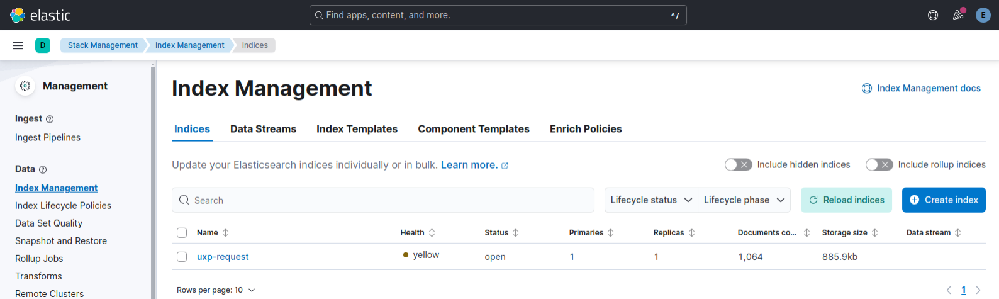

> Під час імпорту прикладу інформаційної панелі або візуалізації UXP, автоматично створюється представлення даних uxp-visualizations-index для шаблону індексу даних операційного моніторингу uxp-request\*, разом з полем часу request_in_ts і додатковими скриптовими полями, які необхідні для візуалізацій. Для дослідження даних операційного моніторингу, ви можете використовувати це представлення даних або створити цілком нове.

**Щоб створити представлення даних у вебінтерфейсі Kibana, виконайте наступні кроки:**

1\. Перейдіть у **Management** → **Stack Management** → **Kibana** → **Data Views** та натисніть

**Create data view**.

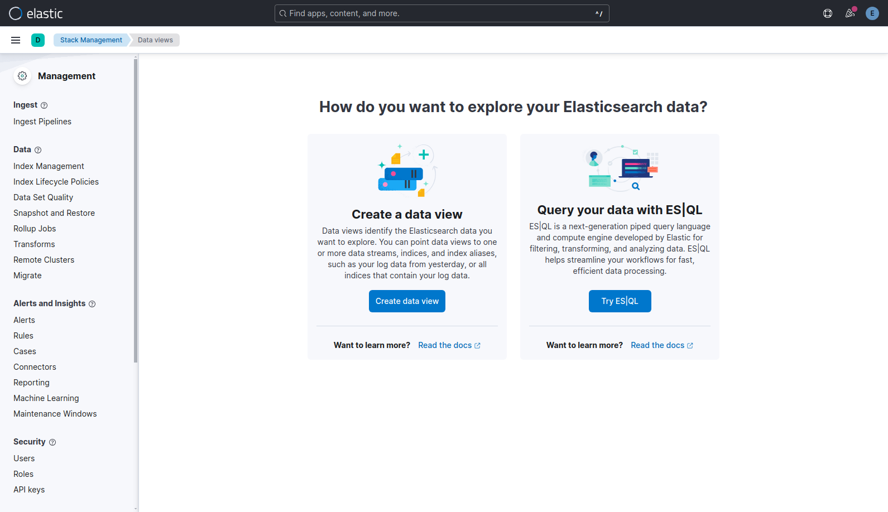

2\. Налаштуйте поля подібним чином:

a. **Name** - введіть назву представлення даних наприклад: **uxp-request**

b. **Index pattern** – введіть (стандартний індекс для операційних даних): **uxp-request**\*

c. **Timestamp field** – оберіть **request_in_ts**

3\. Натисніть **Save data view to Kibana**.

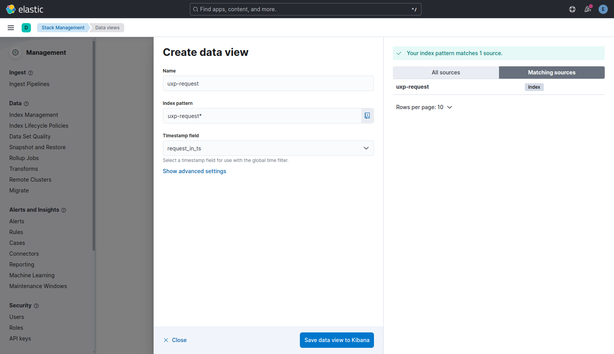

Для перегляду збережених операційних даних, перейдіть у **Analytics** → **Discover** та оберіть відповідне представлення даних із спадного списку поля Data view.

## Візуалізації

Пакет ***uxp-monitor-analytics*** пропонує приклад інформаційної панелі *uxp-dashboard.ndjson (\[UXP\] Overview)* - розташованого у каталозі:
***/usr/share/doc/uxp-monitor-analytics/examples/kibana 8.x/dashboards***
Ця інформаційна панель містить набір різних візуалізацій (теплова карта, графіки, числове відображення, статистичні таблиці тощо).

> Усі візуалізації у прикладі інформаційної панелі ґрунтуються виключно на даних операційного моніторингу та їх шаблоні індексу *uxp-request*\*.

> Усі візуалізації у прикладі інформаційної панелі включають записи як з боку серверів безпеки клієнта, так і з боку серверів безпеки сервісу. Щоб уникнути дублювання у підсумках, відфільтруйте записи за полем типу серверу безпеки (поле *security_server_type*).

Щоб імпортувати приклад інформаційної панелі до Kibana, виконайте наступні кроки:

1. Скопіюйте файл прикладу інформаційної панелі ***uxp-dashboard.ndjson*** з каталогу /usr/share/doc/uxp-monitor-analytics/examples/kibana-8.x/dashboards на сервері Kibana, на свій комп’ютер, де відкрито вебінтерфейс Kibana.

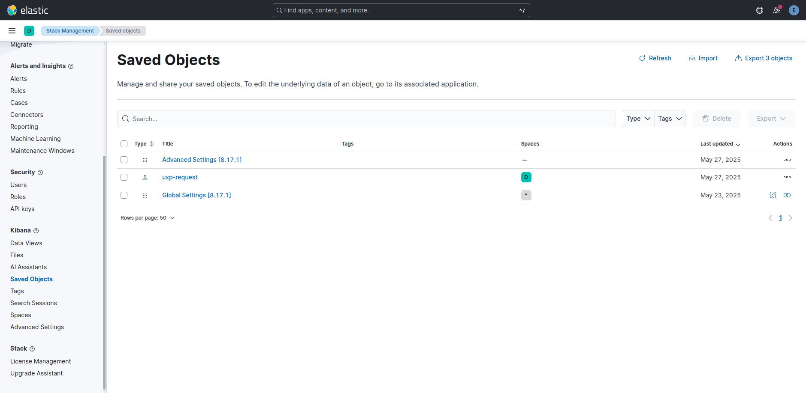

2. Перейдіть у **Management** → **Stack Management** → **Kibana** → **Saved Objects** та натисніть **Import**.

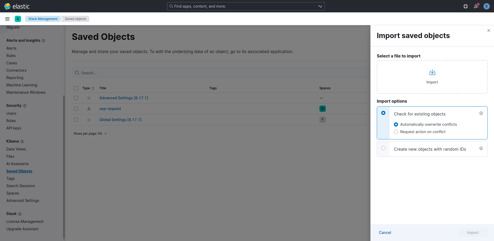

3. Оберіть файл інформаційної панелі для імпорту.
4. Далі, натисніть **Import**, а потім **Done**.
