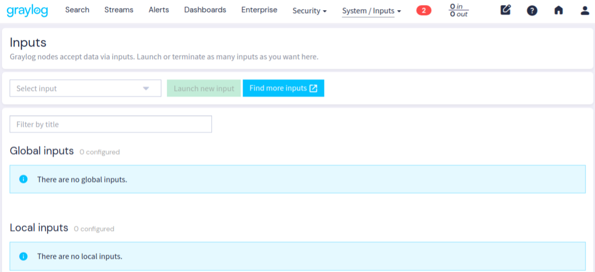
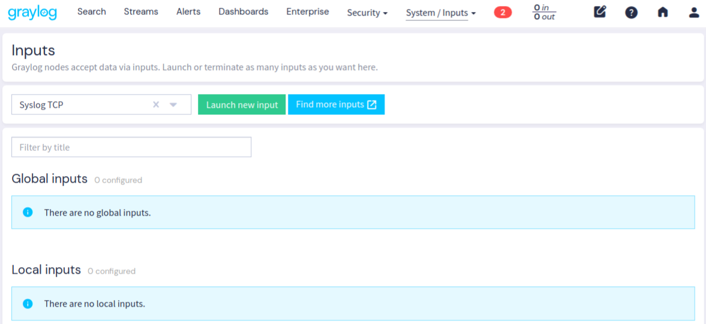
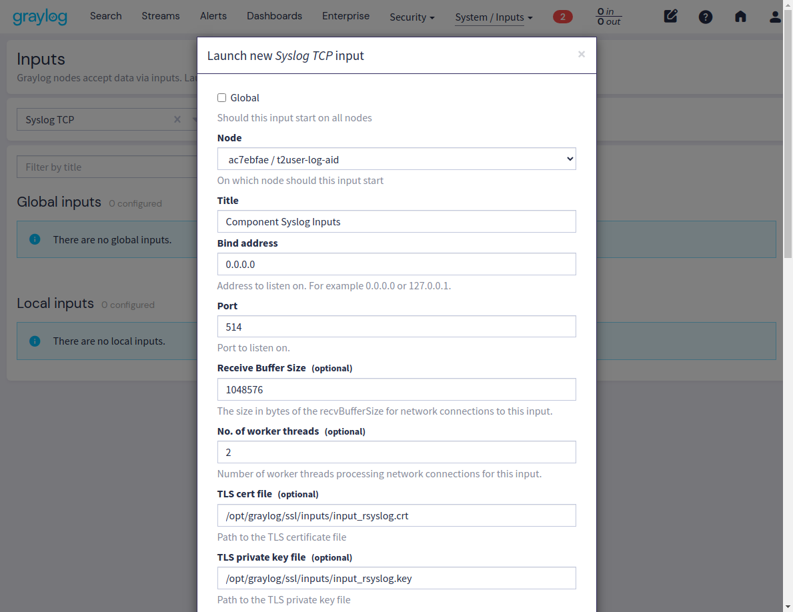
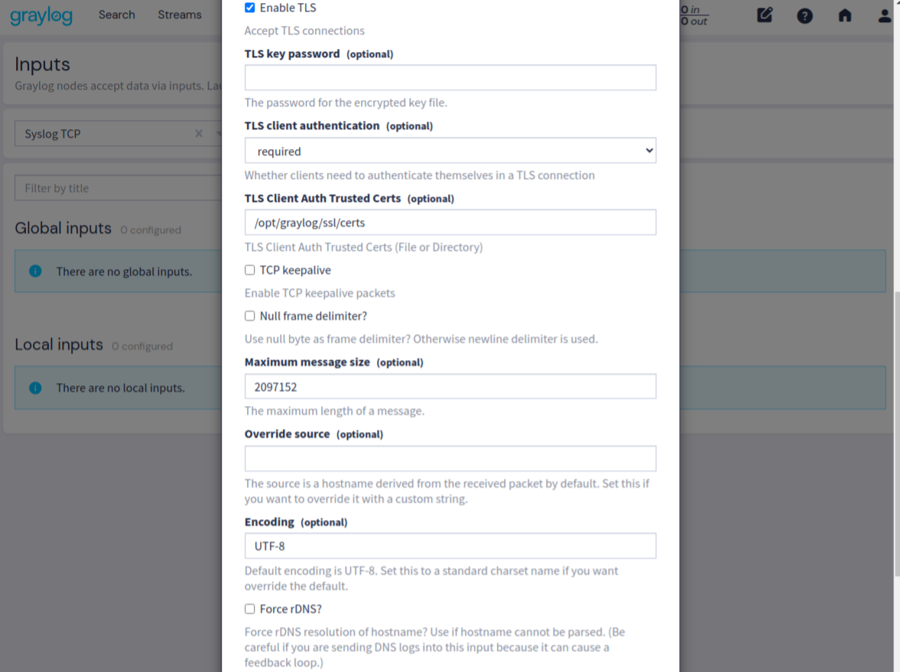
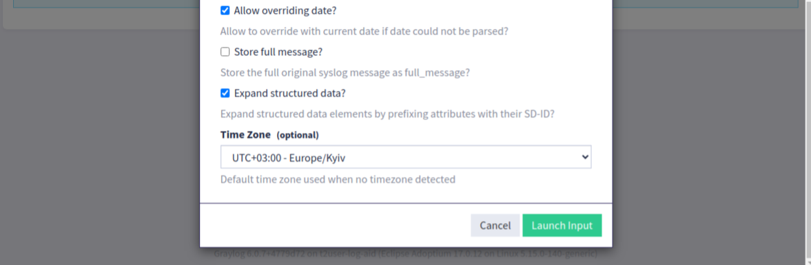

# Інсталяція та налаштування серверу аналізу журналів подій до ШБО (Graylog)

Graylog забезпечує ефективну консолідацію, пошук і аналіз великих обсягів журнальних даних.

Для централізованого зберігання журналів подій можна встановити новий сервер аналізу або використати вже існуючий сервер із увімкненою службою ```Rsyslog Server```.

Параметри підключення до сервера аналізу журналів подій налаштовуються на шлюзі безпечного обміну (ШБО).

---

## 🔧 Підготовка сервера

### 🔐 Порти доступу

| Порт (TCP) | Призначення | Область мережі |
| ---------- | ----------- | -------------- |
| 443        | вебінтерфейс Graylog | ПРИВАТНА |
| 514        | Прийом системних журналів (TCP з TLS) | ПРИВАТНА |

---

## 🔹 Підготовка

1. Закоментуйте всі активні репозиторії:

```bash
sudo sed -i 's/^[A-Za-z0-9]/#&/' /etc/apt/sources.list
```
2. Додайте GPG-ключ для репозиторію:

```bash
wget -O - https://project-repo.trembita.gov.ua:8081/public-keys/public.key.txt | sudo apt-key add -
```
3. Додайте репозиторій:

```bash
echo 'deb https://project-repo.trembita.gov.ua:8081/repository/tr-2-pre-final/ jammy main' | sudo tee -a /etc/apt/sources.list
```
4. Оновіть список пакетів:

```bash
sudo apt update
```
---

## 🔹 Встановлення MongoDB

Graylog використовує MongoDB для зберігання метаданих.

1. Встановіть MongoDB:

```bash
sudo apt install -y mongodb-org
```

2. Оновіть конфігурацію systemd:

```bash
sudo systemctl daemon-reload
```

3. Додайте MongoDB до автозавантаження та запустіть сервіс:

```bash
sudo systemctl enable --now mongod
```

4. Зафіксуйте встановлену версію MongoDB, щоб запобігти її автоматичному оновленню:

```bash
sudo apt-mark hold mongodb-org
```

---

## 🔹 Встановлення OpenSearch

1. Встановіть OpenSearch.

> ⚠️ **Увага:** Під час встановлення OpenSearch вимагає попереднього визначення змінної середовища ```OPENSEARCH_INITIAL_ADMIN_PASSWORD```.

Використайте команду для генерації пароля та встановлення пакета:

```bash
sudo OPENSEARCH_INITIAL_ADMIN_PASSWORD=$(tr -dc A-Z-a-z-0-9_@#%^-_=+ < /dev/urandom | head -c${1:-32}) \
apt -y install opensearch
```

2. Зафіксуйте встановлену версію OpenSearch, щоб запобігти її автоматичному оновленню при системних оновленнях:

```bash
sudo apt-mark hold opensearch
```

---

## 🔹 Налаштування OpenSearch

1. Відкрийте файл конфігурації:

```bash
sudo nano /etc/opensearch/opensearch.yml
```

Оновіть наступні параметри для мінімального запуску OpenSearch в небезпечному (незахищеному) режимі на одному вузлі:

```bash
path.data: /var/lib/opensearch
path.logs: /var/log/opensearch

cluster.name: graylog
node.name: ${HOSTNAME}
discovery.type: single-node
network.host: 127.0.0.1
action.auto_create_index: false
plugins.security.disabled: true
```

2. Відредагуйте налаштування JVM:

```bash
sudo nano /etc/opensearch/jvm.options
```

Змініть параметри памʼяті, встановивши ```Xms``` і ```Xmx``` на половину обсягу доступної оперативної памʼяті. Наприклад, для 4 ГБ RAM:

```bash
-Xms4g
-Xmx4g
```

3. Налаштуйте параметр ядра ```vm.max_map_count```:

Тимчасове встановлення (до перезавантаження):

```bash
sudo sysctl -w vm.max_map_count=262144
```

Постійне встановлення (зберігається після перезавантаження):

```bash
echo 'vm.max_map_count=262144' | sudo tee -a /etc/sysctl.conf
```

4. Оновіть конфігурацію systemd:

```bash
sudo systemctl daemon-reload
```

5. Увімкніть і запустіть службу OpenSearch:

```bash
sudo systemctl enable --now opensearch.service
```

---

## 🔹 Встановлення Graylog

1. Встановіть Graylog:

```bash
sudo apt install graylog-server
```

2. Зафіксуйте версію пакета, щоб запобігти його випадковому оновленню під час оновлення системи:

```bash
sudo apt-mark hold graylog-server
```

---

## 🔹 Налаштування Graylog

🔐 Генерування сертифікатів для безпечного з’єднання через HTTPS

1. Створіть каталог для сертифіката:

```bash
sudo mkdir -p /opt/graylog/ssl/site
```

2. Створіть конфігураційний файл для видачі самопідписаного сертифіката:

```bash
sudo nano /opt/graylog/ssl/site.conf
```

Вкажіть необхідні дані. Замініть значення ```<graylog-server-address>``` (двічі) та ```<graylog-server-ip>``` на актуальні.

> ⚠️ **Увага:** видаліть незаповнені поля.

```bash
[req]
distinguished_name = req_distinguished_name
x509_extensions = v3_req
prompt = no

# Details about the issuer of the certificate
[req_distinguished_name]
C = EE
ST = Some-State
L = Some-City
O = Organization
OU = Department
CN = <graylog-server-address>

[v3_req]
keyUsage = nonRepudiation, digitalSignature, keyEncipherment
extendedKeyUsage = serverAuth
subjectAltName = @alt_names

# IP addresses and DNS names the certificate should include
# Use IP.### for IP addresses and DNS.### for DNS names,
# with "###" being a consecutive number.

[alt_names]
IP.1 = <graylog-server-ip>
DNS.1 = <graylog-server-address>
```

3. Згенеруйте самопідписаний сертифікат:

```bash
sudo openssl req -x509 -newkey ec -pkeyopt ec_paramgen_curve:P-256 \
-config /opt/graylog/ssl/site.conf \
-keyout /opt/graylog/ssl/site/site.key \
-out /opt/graylog/ssl/site/site.crt \
-days 3650 -nodes
```

4. Надати права власності користувачу graylog:

```bash
sudo chown graylog:graylog /opt/graylog/ssl/site/site.*
```

---

## 🔹 Додавання сертифіката до довіреного сховища JVM

1. Створіть копію стандартного сховища сертифікатів (щоб уникнути втрати при оновленнях):

```bash
sudo cp /usr/share/graylog-server/jvm/lib/security/cacerts /opt/graylog/ssl/graylog.jks
```

2. Змініть власника сховища:

```bash
sudo chown graylog:graylog /opt/graylog/ssl/graylog.jks
```

3. Імпортуйте сертифікат у сховище:

```bash
sudo /usr/share/graylog-server/jvm/bin/keytool -importcert \
-keystore /opt/graylog/ssl/graylog.jks -storepass changeit \
-alias graylog-https -file /opt/graylog/ssl/site/site.crt
```

Підтвердьте імпорт, ввівши ```yes```, і натисніть ```Enter```.

4. Додайте шлях до сховища у параметри запуску Graylog:

```bash
sudo nano /etc/default/graylog-server
```

Додайте рядок нижче поточної змінної ```GRAYLOG_SERVER_JAVA_OPTS```:

```bash
GRAYLOG_SERVER_JAVA_OPTS="$GRAYLOG_SERVER_JAVA_OPTS -Djavax.net.ssl.trustStore=/opt/graylog/ssl/graylog.jks"
```

---

## 🔹 Генерація паролів для Graylog

1. Створіть значення для параметра ```password_secret```:

```bash
< /dev/urandom tr -dc A-Z-a-z-0-9 | head -c${1:-96};echo;
```

2. Згенеруйте ```root_password_sha2``` (SHA256-хеш пароля):

```bash
echo -n "Enter Password: " && head -1 </dev/stdin | tr -d '\n' | sha256sum | cut -d" " -f1
```

> ⚠️ **Увага:** Обидва ці значення необхідні для подальшого налаштування Graylog.

---

## 🔹 Коригування конфігураційного файлу Graylog

1. Відкрийте файл конфігурації:

```bash
sudo nano /etc/graylog/server/server.conf
```

Вкажіть значення для таких параметрів, підставивши актуальні дані:

- ```<generated password>``` — значення password_secret, згенероване раніше

- ```<hash of generated password>``` — SHA256-хеш пароля (root_password_sha2)

- ```<graylog-server-address>``` — публічне DNS-ім’я або IP-адреса сервера Graylog

```bash
password_secret = <generated password>
root_username = admin
root_password_sha2 = <hash of generated password>
root_timezone = Europe/Kyiv
http_bind_address = 0.0.0.0:443
http_publish_uri = https://<graylog-server-address>/
http_enable_tls = true
http_tls_cert_file = /opt/graylog/ssl/site/site.crt
http_tls_key_file = /opt/graylog/ssl/site/site.key
elasticsearch_hosts = http://127.0.0.1:9200
```

2. Оновіть конфігурацію systemd:

```bash
sudo systemctl daemon-reload
```

3. Увімкніть та запустіть службу Graylog:

```bash
sudo systemctl enable --now graylog-server.service
```

Після запуску вебінтерфейс Graylog буде доступний за адресою:

```bash
https://<graylog-server-address>/
```

Для входу використовуйте:

- Ім’я користувача: ```admin``` (значення параметра root_username)

- Пароль: відповідний до root_password_sha2 (який хешувався раніше)

---

## 🔹 Налаштування вхідних даних (Inputs) Graylog

🔐 Генерування сертифікатів для TLS-з’єднань

1. Створіть каталог для TLS-сертифікатів:

```bash
sudo mkdir -p /opt/graylog/ssl/inputs
```

2. Згенеруйте новий сертифікат і ключ:

```bash
sudo openssl req -x509 -config /opt/graylog/ssl/site.conf \
-newkey ec -pkeyopt ec_paramgen_curve:P-256 \
-keyout /opt/graylog/ssl/inputs/input_rsyslog.key \
-out /opt/graylog/ssl/inputs/input_rsyslog.crt \
-days 3650 -nodes
```

3. Надати права власності користувачу graylog:

```bash
sudo chown graylog:graylog /opt/graylog/ssl/inputs/input_rsyslog.*
```

4. Створіть каталог для зберігання довірених сертифікатів компонентів (для взаємної TLS-автентифікації):

```bash
sudo mkdir -p /opt/graylog/ssl/certs
```

---

## 🔹 Налаштування Syslog TCP Input через вебінтерфейс

1. Перейдіть у вебінтерфейсі Graylog до ```System``` → ```Inputs```



2. Натисніть ```Select input```, оберіть ```Syslog TCP```, і натисніть ```Launch new input```:



3. У вікні налаштувань заповніть поля:

- Title: довільна назва (наприклад ```Component Syslog Inputs```)

- Bind address: ```0.0.0.0```

- Port: ```514```

- Enable TLS: ```увімкнути```

- TLS cert file: ```/opt/graylog/ssl/inputs/input_rsyslog.crt```

- TLS private key file: ```/opt/graylog/ssl/inputs/input_rsyslog.key```

- TLS client authentication: ```required```

- TLS client auth trusted certs: ```/opt/graylog/ssl/certs```

- Expand structured data?: ```увімкнути``` (для розшифровки структурованих даних)

- Time zone: ```Europe/Kyiv```







Після збереження вхідні з’єднання через TLS будуть оброблятись Graylog-сервером. Наступний крок — налаштування rsyslog на стороні ШБО або клієнтського вузла.

---

## 🔹 Налаштування Rsyslog на сервері компонента

Для пересилання журналів подій з сервера компонента на сервер Graylog необхідно налаштувати взаємне TLS-з'єднання між ```rsyslog``` і ```Graylog```.

1. Імпортування сертифіката Graylog

Щоб забезпечити взаємну автентифікацію, скопіюйте сертифікат Graylog на сервер компонента.

На сервері Graylog сертифікат розташований за шляхом:

```bash
/opt/graylog/ssl/inputs/input_rsyslog.crt
```
Скопіюйте його на сервер компонента та збережіть за адресою:

```bash
/etc/uxp/ssl/graylog_remote.crt
```

⚠️ **Увага:** Приклад передачі сертифіката через scp:

На сервері Graylog:

```bash
sudo cp /opt/graylog/ssl/inputs/input_rsyslog.crt .
sudo chown $USER:$USER input_rsyslog.crt
```
Передача сертифіката:

```bash
scp user@192.168.0.30:~/input_rsyslog.crt user@192.168.0.20:~
```

На сервері компонента:

```bash
sudo mv input_rsyslog.crt /etc/uxp/ssl/graylog_remote.crt
```

2. Надання доступу до сертифіката для Rsyslog

```bash
sudo chown root:uxp /etc/uxp/ssl/graylog_remote.crt
```

3. Експорт сертифіката Rsyslog до Graylog

Сертифікат компонента, що використовується для TLS (наприклад: ```/etc/uxp/ssl/rsyslog_remote.crt```), необхідно передати адміністратору Graylog.

На сервері компонента:

```bash
sudo cp /etc/uxp/ssl/rsyslog_remote.crt .
sudo chown $USER:$USER rsyslog_remote.crt
scp rsyslog_remote.crt user@192.168.0.30:~
```

На сервері Graylog:

```bash
sudo mv ~/rsyslog_remote.crt /opt/graylog/ssl/certs/gate.crt
sudo chown root:root /opt/graylog/ssl/certs/gate.crt
sudo chmod 644 /opt/graylog/ssl/certs/gate.crt
```

---

## 🔹 Налаштування з'єднання до Graylog на сервері компонента

1. Призупиніть роботу контролера цілісності:

```bash
sudo uxp-integrity pause
```

2. Налаштуйте конфігурацію Rsyslog

Відредагуйте файл:

```bash
sudo nano /etc/rsyslog.d/45-uxp-graylog.conf.example
```

Замість ```\<graylog-server-address\>``` у параметрах ```target``` та ```StreamDriverPermittedPeers``` вкажіть фактичну адресу Graylog (IP або DNS), яка збігається з ```CN``` у сертифікаті сервера Graylog.

3. Активуйте конфігурацію:

Перейменуйте ```.conf.example``` у ```.conf```, щоб файл став активним:

```bash
sudo mv /etc/rsyslog.d/45-uxp-graylog.conf.example /etc/rsyslog.d/45-uxp-graylog.conf
```

4. Перезапустіть службу Rsyslog:

```bash
sudo systemctl restart rsyslog
```

5. Оновіть статус контролера цілісності:

```bash
sudo uxp-integrity update
```

✅ Готово. Сервер компонента надсилає журнали подій до Graylog через захищене TLS-з'єднання.
