# Інсталяція та налаштування серверу моніторингу за працездатністю Zabbix

Інформація щодо поточного статусу ШБО. Наприклад, споживання пам’яті, завантаженість CPU, версії пакетів, тощо.

---

## 🔧 Підготовка сервера

### 🔐 Порти доступу

| Порт (TCP) | Призначення | Область мережі |
| ---------- | ----------- | -------------- |
| 8080       | Віддалене налаштування сервера Zabbix. Необхідний лише у разі використання Zabbix для локального моніторингу ШБО за допомогою вбудованого в UXP конфігуратора | ПРИВАТНА |
| 10051      | Передача моніторингових даних на сервер Zabbix. Необхідний лише у разі використання Zabbix для локального моніторингу ШБО | ПРИВАТНА |

---

## 🔹 Підготовка

1. Закоментуйте всі активні репозиторії:

```bash
sudo sed -i 's/^[A-Za-z0-9]/#&/' /etc/apt/sources.list
```
2. Додайте GPG-ключ для репозиторію:

```bash
wget -O - https://project-repo.trembita.gov.ua:8081/public-keys/public.key.txt | sudo apt-key add -
```
3. Додайте репозиторій:

```bash
echo 'deb https://project-repo.trembita.gov.ua:8081/repository/tr-2-pre-final/ jammy main' | sudo tee -a /etc/apt/sources.list
```
4. Оновіть список пакетів:

```bash
sudo apt update
```
---

## 🔹 Встановлення Zabbix

1. Згенеруйте локаль en_US.UTF-8:

```bash
sudo locale-gen en_US.UTF-8
```

2. Оновіть системні параметри локалі:

```bash
sudo update-locale
```

3. Встановіть необхідні пакети:

```bash
sudo apt install postgresql zabbix-server-pgsql zabbix-frontend-php \
php8.1-pgsql zabbix-nginx-conf apache2-bin- zabbix-sql-scripts zabbix-agent
```

4. Створіть користувача бази даних для Zabbix:

```bash
sudo -i -u postgres createuser --pwprompt zabbix
```

> 🔐 **Увага:** Введіть і запам’ятайте пароль, який вводите для користувача ```zabbix```.

5. Створіть базу даних і призначте власником користувача ```zabbix```:

```bash
sudo -i -u postgres createdb -O zabbix zabbix
```

6. Імпортуйте початкову схему бази:

```bash
zcat /usr/share/zabbix-sql-scripts/postgresql/server.sql.gz | \
sudo -u zabbix psql zabbix
```

7. Вкажіть пароль бази в конфігурації Zabbix:

```bash
sudo nano /etc/zabbix/zabbix_server.conf
```

Знайдіть і розкоментуйте параметр ```DBPassword```, підставивши раніше встановлений пароль:

```bash
DBPassword=my-password
```

8. Налаштуйте конфігурацію Nginx:

```bash
sudo nano /etc/zabbix/nginx.conf
```

Розкоментуйте та змініть параметри ```listen``` і ```server_name```:

```bash
listen 8080;
server_name my-zabbix-server-name;
```

> 🔧 **Порада:** Якщо ви змінили порт на 80 або 8080, видаліть символічне посилання на стандартну конфігурацію Nginx:

```bash
sudo rm -f /etc/nginx/sites-enabled/default
```

9. Увімкніть служби в автозапуск:

```bash
sudo systemctl enable zabbix-server zabbix-agent nginx php8.1-fpm
```

10. Перезапустіть служби:

```bash
sudo systemctl restart zabbix-server zabbix-agent nginx php8.1-fpm
```
---

## 🔹 Завершення налаштування через вебінтерфейс

1. Відкрийте в браузері:

```bash
http://<your-zabbix-server>:8080/
```

2. Пройдіть стандартні кроки встановлення:

- ```Welcome``` → натисніть ```Next step```

  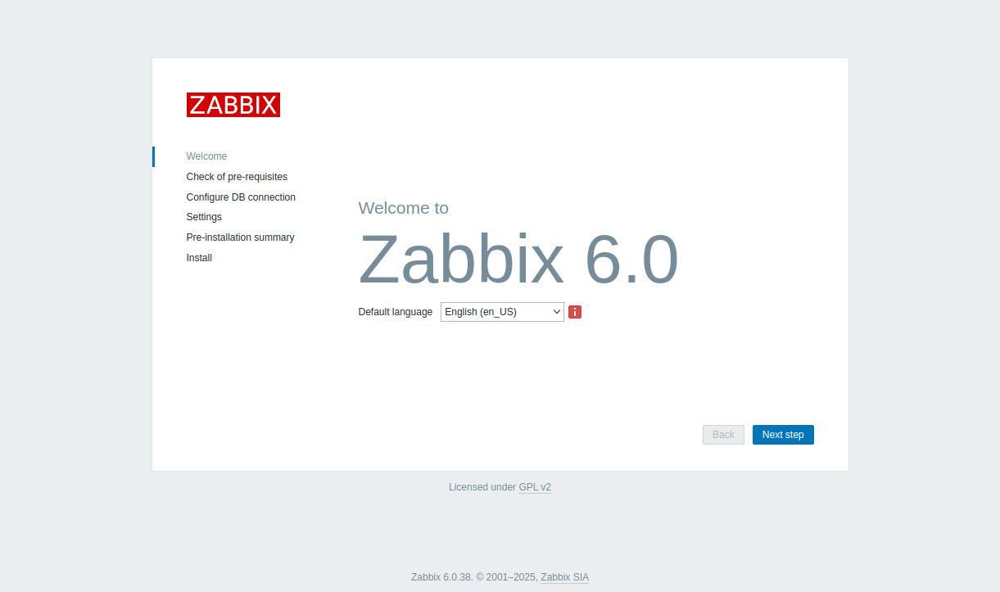

- ```Check of pre-requisites``` → ```Next step```

  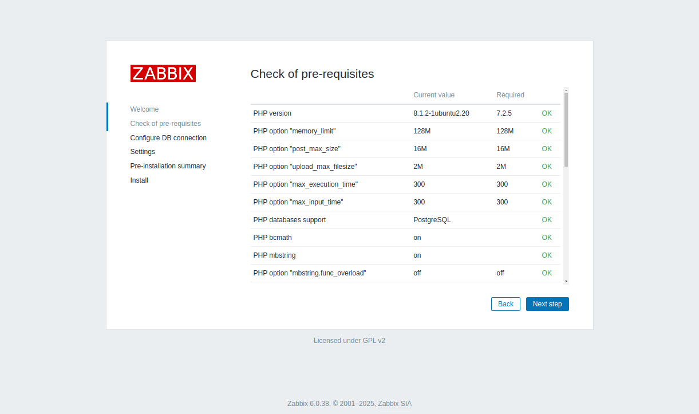

- ```Configure DB connection``` → вкажіть пароль користувача zabbix, оберіть тип БД PostgreSQL, натисніть ```Next step```

  

- ```Settings``` → виберіть часовий пояс, натисніть ```Next step```

  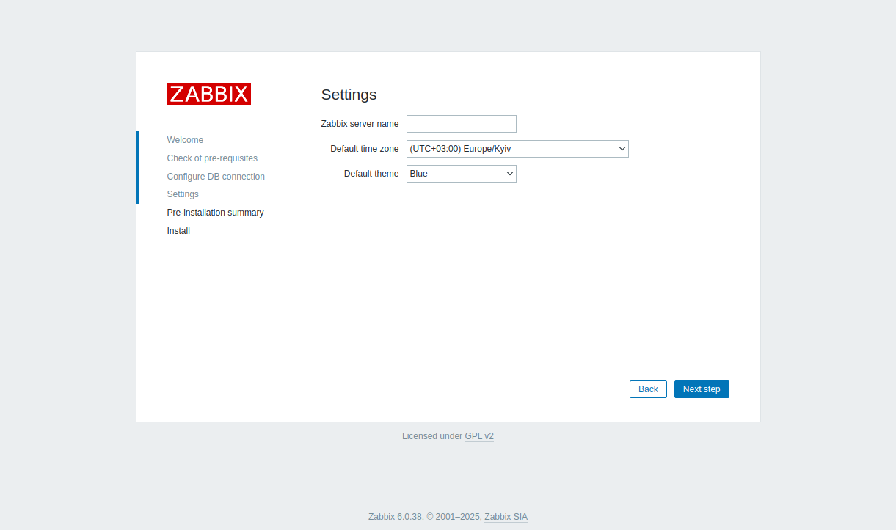

- ```Pre-installation summary``` → ```Next step```

  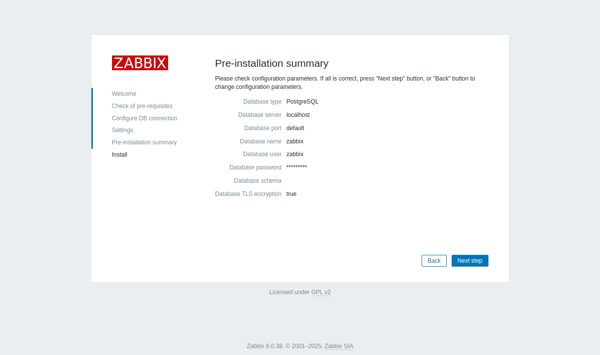

- ```Install``` → ```натисніть Finish```

  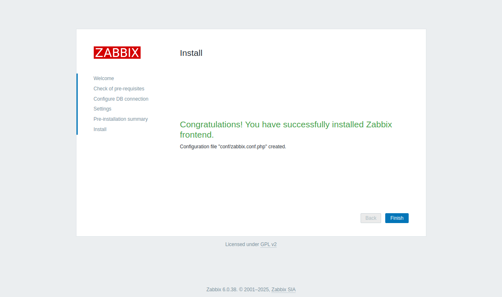

---

## 🔹 Зміна пароля адміністратора Zabbix

1. Увійдіть до вебінтерфейсу Zabbix зі стандартними обліковими даними:

- Ім’я користувача: ```Admin```

- Пароль: ```zabbix```

2. У меню ```Administration``` перейдіть до ```Users```, оберіть користувача ```Admin```.

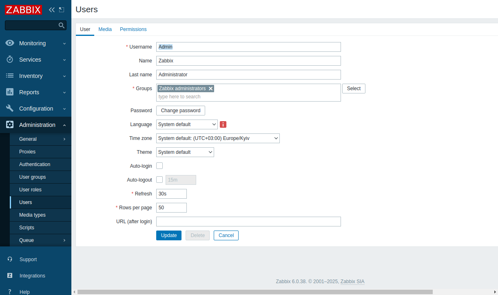

2. Натисніть ```Change password```, введіть новий безпечний пароль.

3. Натисніть ```Update```, щоб зберегти зміни.

✅ Zabbix Server успішно встановлено. Тепер можна перейти до налаштування взаємодії з агентом моніторингу (PMA).

---

## 🔹 Підключення Zabbix до агента моніторингу (PMA)

🔸 Налаштування monitor-agent.ini на сервері безпеки

1. Призупиніть роботу контролера цілісності:

```bash
sudo uxp-integrity pause
```

2. Відредагуйте файл конфігурації агента моніторингу:

```bash
sudo nano /etc/uxp/monitor-agent.ini
```

Додайте розділ типу:

```bash
[zabbix-1]
address = 192.168.0.20
```

| Поле | Стандартне значення | Пояснення |
| --- | --- | --- |
| address |  | IP або DNS-адреса серверу Zabbix (має відповідати дійсному значенню) |

3. Застосуйте зміни, перезавантаживши агент моніторингу:

```bash
sudo reload-monitor-agent
```

4. Оновіть хеші конфігурації:

```bash
sudo uxp-integrity update
```

---

## 🔹 Налаштування серверу Zabbix через вбудований конфігуратор UXP

Агент PMA підтримує автоматичне налаштування серверу Zabbix через API. Під час цього:

- Створюється група хостів (наприклад, uxp-security-servers);

- Додається хост серверу безпеки;

- Імпортується шаблон UXP Security Server by PMA із каталогу ```/usr/share/uxp/templates/zabbix```.


1. Створіть групу хостів серверів безпеки, перейшовши у **Configuration** → **Host groups** та натиснувши **Create host group**.

a. Введіть назву групи, наприклад: **uxp-security-servers**

b. Далі, натисніть **Add**.

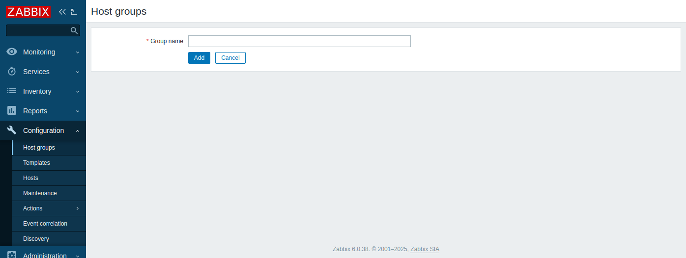

1. Створіть групу користувачів, перейшовши у **Administration** → **User groups** та натиснувши **Create user group**.

a. Введіть назву групи, наприклад: **UXP PMAs**

b. Оберіть Disabled для опції **Frontend access**.


c. На вкладці **Permissions**, оберіть попередньо створену групу для хосту серверу безпеки: **uxp-security-servers**
Оберіть для неї права доступу **Read-write**.

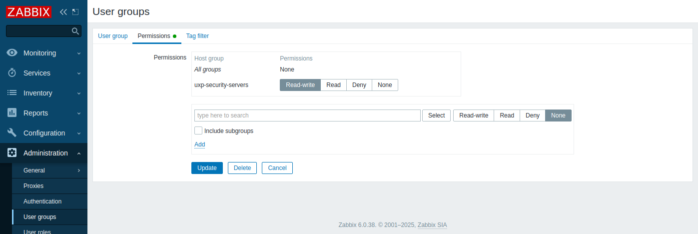

d. Далі, натисніть **Add**.

2. Створіть користувача, перейшовши у **Administration** → **Users** та натиснувши **Create user**.

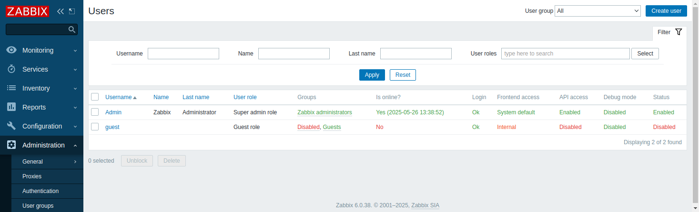

a. Введіть ім’я користувача, наприклад: **uxp-pma**

b. Оберіть попередньо створену групу для опції **Groups**.

c. Введіть бажаний пароль.

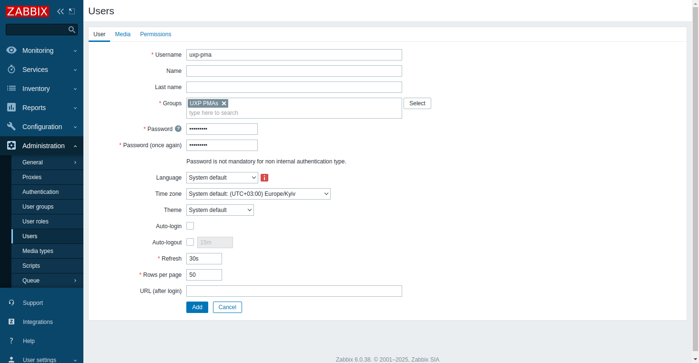

d. На вкладці **Permissions**, для опції Role оберіть **Admin role**.

e. Далі, натисніть **Add**.

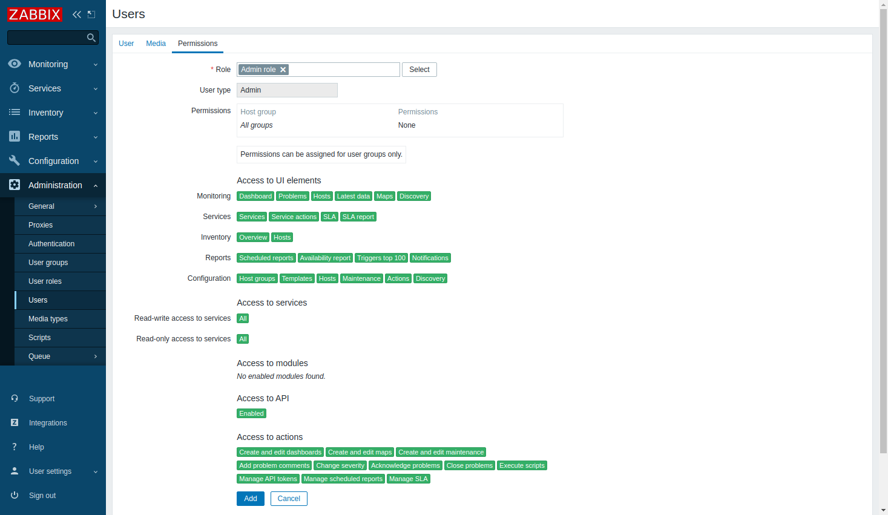

### Налаштуйте Zabbix на сервері безпеки

1. Перш ніж коригувати конфігураційний файл /etc/uxp/monitor-agent.ini, призупиніть роботу контролера цілісності на сервері безпеки:

```bash
sudo uxp-integrity pause
```

2. Скоригуйте конфігураційний файл /etc/uxp/monitor-agent.ini на сервері безпеки

```bash
sudo nano /etc/uxp/monitor-agent.ini
```

додавши у нього розділ:

```bash
[zabbix-1]
; ...
enable_configurator = true
conf_api_path = /api_jsonrpc.php
conf_api_port = 8080
username = uxp-pma
password = ********
host_group = uxp-security-servers
```

| Поле | Стандартне значення | Пояснення |
| --- | --- | --- |
| username |  | Ім’я користувача Zabbix. Тип користувача має бути Super admin або Admin з правами Read-write для налаштовуваних серверів безпеки та групи хостів Templates/Applications. |
| password |  | Пароль користувача Zabbix. |
| host_group |  | Назва групи хостів, яку агент моніторингу має налаштувати для включення у неї серверу безпеки. |

3. Після оновлення конфігурації, перезавантажте конфігурацію PMA:

```bash
sudo reload-monitor-agent
```

4. Після завершення внесення змін, оновіть хеші:

```bash
sudo uxp-integrity update
```
