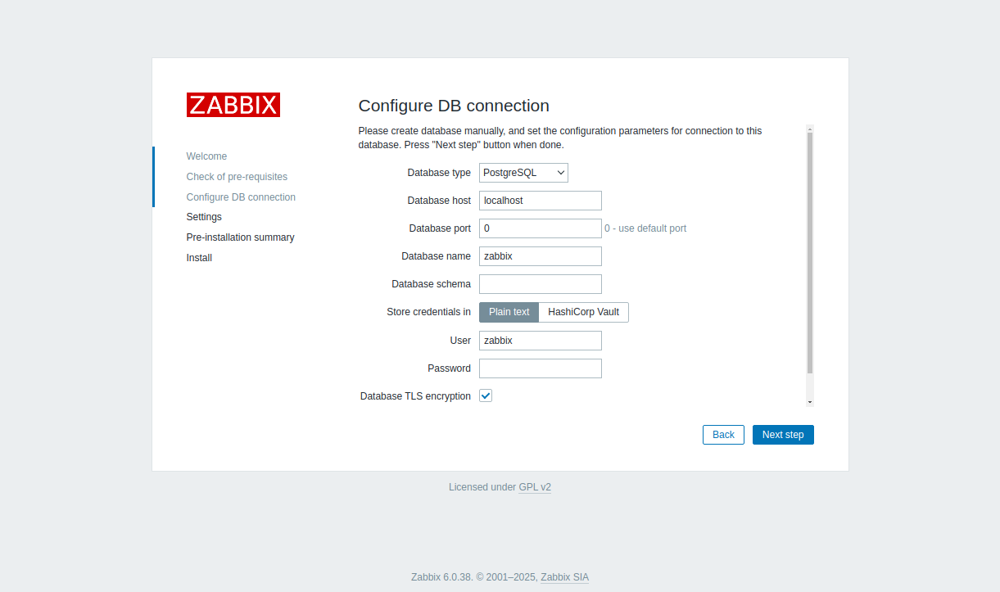
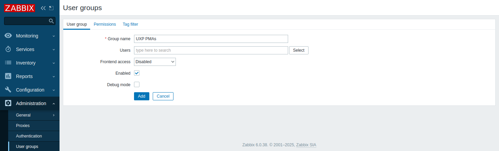

# Т2.0 Zabbix інсталяція
**Дані моніторингу середовища**

Інформація щодо поточного статусу серверу безпеки. Наприклад, споживання пам’яті, завантаженість CPU, версії пакетів, тощо.

## **Підготовка:**

### **Встановити операційну систему**

Виконати встановлення операційної системи на основі дистрибутиву: Ubuntu Server 22.04 LTS

### **Необхідні для вхідних з’єднань Zabbix порти**

| Порт (TCP) | Призначення | Область мережі |
| --- | --- | --- |
| 8080 | Використовується для віддаленого налаштування серверуZabbix. Необхідно лише у випадку використання Zabbix для локального моніторингу серверу безпеки за допомогою вбудованого в UXP конфігуратора Zabbix. | ПРИВАТНА |
| 10051 | Використовується для пересилання моніторингових даних на сервер Zabbix server. Необхідно лише у випадку використання Zabbix для локального моніторингу серверу безпеки. | ПРИВАТНА |

---

## **Крок 1:** Налаштування репозиторію

1. Закоментувати репозиторії:

```bash
sudo sed -i 's/^[A-Za-z0-9]/#&/' /etc/apt/sources.list
```

2. Додати GPG-ключ для репозиторію:

```bash
wget -O - https://project-repo.trembita.gov.ua:8081/public-keys/public.key.txt | sudo apt-key add -
```

3. Додати репозиторій:

```bash
echo 'deb https://project-repo.trembita.gov.ua:8081/repository/tr-2-pre-final/ jammy main' | sudo tee -a /etc/apt/sources.list
```

4. Оновлюємо списки пакетів з репозиторіїв:

```bash
sudo apt update
```

## **Крок 2:** Встановлення серверу Zabbix

1. Встановіть локалізацію en_US.UTF-8:

```bash
sudo locale-gen en_US.UTF-8
```

2. Оновити системні налаштування локалі:

```bash
sudo update-locale
```

3. Встановіть:

```bash
sudo apt install postgresql zabbix-server-pgsql zabbix-frontend-php \
php8.1-pgsql zabbix-nginx-conf apache2-bin- zabbix-sql-scripts zabbix-agent
```

4. Створіть користувача бази даних для Zabbix (**введіть пароль і запам’ятайте його**):

```bash
sudo -i -u postgres createuser --pwprompt zabbix
```

5. Створіть базу даних для сервера Zabbix і призначте власником користувача zabbix:

```bash
sudo -i -u postgres createdb -O zabbix zabbix
```

6. Імпортуйте початкову схему та дані у базу даних:

```bash
zcat /usr/share/zabbix-sql-scripts/postgresql/server.sql.gz | \
sudo -u zabbix psql zabbix
```

7. Скоригуйте конфігурацію бази даних серверу Zabbix:

```bash
sudo nano /etc/zabbix/zabbix_server.conf
```

Розкоментуйте параметр **DBPassword** і додайте у нього пароль, який перед цим створили:

```bash
DBPassword=my-password
```

8. Скоригуйте файл конфігурації Nginx:

```bash
sudo nano /etc/zabbix/nginx.conf
```

Розкоментуйте параметри listen та server_name і змініть їх значення відповідно до своїх потреб:

```bash
listen 8080;
server_name my-zabbix-server-name;
```

> <span style="color:red;">**Необов’язково:**</span><span style="color:red;"></span> Видаліть символічне посилання на стандартну конфігурацію Nginx, оскільки файл конфігурації Zabbix Nginx розташований у іншому місці. NB! Ця дія є обов’язковою, якщо на попередньому кроці ви налаштували параметру listen значення 80:
>
> ```bash
> sudo rm -f /etc/nginx/sites-enabled/default
> ```

9. Додаємо служби до автозапуску:

```bash
sudo systemctl enable zabbix-server zabbix-agent nginx php8.1-fpm
```

10. Перезапускаємо служби для застосування змін:

```bash
sudo systemctl restart zabbix-server zabbix-agent nginx php8.1-fpm
```

### Завершення налаштування вебресурсу Zabbix за допомогою вебінтерфейсу Zabbix

1. Відкрийте у браузері сторінку встановлення Zabbix і і додайте правильний номер порту, якщо ви замінили в конфігурації Nginx 8080 на щось інше, ***http://\<your-zabbix-server\>:8080/***.
2. На сторінці Welcome, натисніть **Next step**.


3. На сторінці Check of pre-requisites, натисніть **Next step**.


4. На сторінці Configure DB connection, перевірте, щоб тип бази даних був PostgreSQL, **введіть пароль користувача бази даних zabbix** і натисніть **Next step**.



5. На сторінці Settings, оберіть правильний часовий пояс і натисніть **Next step**.


6. На сторінці Pre-installation summary, натисніть Next step.


7. На сторінці Install, натисніть **Finish** для завершення встановлення.


### Зміна стандартного паролю до вебінтерфейсу Zabbix за допомогою користувацького інтерфейсу Zabbix

1. Авторизуйтесь у вебінтерфейсі Zabbix, використовуючи стандартні параметри: ім’я користувача **Admin** і пароль **zabbix**.
2. У меню **Administration** оберіть **Users** і натисніть на користувачі **Admin**.


3. Натисніть **Change password** і введіть новий безпечний пароль.
4. Натисніть **Update** для застосування змін.

Встановлення серверу Zabbix завершено. Перейдіть у розділ З’єднання Zabbix із агентом моніторингу (PMA) для ознайомлення з інструкціями щодо налаштування PMA для з’єднання з сервером Zabbix.

## **Крок 3:** З’єднання Zabbix із агентом моніторингу (PMA)

Щоб дозволити передачу моніторингових даних до серверу Zabbix, скоригуйте конфігураційний файл **/etc/uxp/monitor-agent.ini** на сервері безпеки, додавши у нього розділ на зразок такого:

1. Перш ніж коригувати конфігураційний файл /etc/uxp/monitor-agent.ini, призупиніть роботу контролера цілісності на сервері безпеки за допомогою такої команди:

```bash
sudo uxp-integrity pause
```

2. Відкриваємо файл

```bash
sudo nano /etc/uxp/monitor-agent.ini
```

Розділ [zabbix-\<suffix\>] визначає станцію моніторингу Zabbix, де назва розділу має відповідний префікс – zabbix, а \<suffix\> має бути певним унікальним рядком з-поміж інших розділів Zabbix.

```bash
[zabbix-1]
address = 192.168.0.20
```

| Поле | Стандартне значення | Пояснення |
| --- | --- | --- |
| address |  | Назва хосту (що відгукується на IP адресу через DNS) або IP адреса серверу Zabbix. |

3. Зміни у файлі конфігурації /etc/uxp/monitor-agent.ini почнуть діяти після перезавантаження конфігурації агента моніторингу:

```bash
sudo reload-monitor-agent
```

4. Після завершення внесення змін, оновіть хеші з допомогою такої команди:

```bash
sudo uxp-integrity update
```

### Налаштування через вбудований конфігуратор UXP для Zabbix

PMA має функцію налаштування серверу безпеки сервері Zabbix з допомогою Zabbix API. Під час цього процесу, PMA створює на сервері Zabbix групу хостів і додає у неї хост серверу безпеки, на якому він працює. Крім того, PMA імпортує на сервер Zabbix шаблон UXP Security Server by PMA, що є шаблоном серверу безпеки для Zabbix 6.0 (розташований у каталозі /usr/share/uxp/templates/zabbix), і пов’язує його з щойно доданим хостом.

1. Створіть групу хостів серверів безпеки, перейшовши у **Configuration** → **Host groups** та натиснувши **Create host group**.

a. Введіть назву групи, наприклад: **uxp-security-servers**

b. Далі, натисніть **Add**.


1. Створіть групу користувачів, перейшовши у **Administration** → **User groups** та натиснувши **Create user group**.

a. Введіть назву групи, наприклад: **UXP PMAs**

b. Оберіть Disabled для опції **Frontend access**.



c. На вкладці **Permissions**, оберіть попередньо створену групу для хосту серверу безпеки: **uxp-security-servers**
Оберіть для неї права доступу **Read-write**.


d. Далі, натисніть **Add**.

2. Створіть користувача, перейшовши у **Administration** → **Users** та натиснувши **Create user**.


a. Введіть ім’я користувача, наприклад: **uxp-pma**

b. Оберіть попередньо створену групу для опції **Groups**.

c. Введіть бажаний пароль.


d. На вкладці **Permissions**, для опції Role оберіть **Admin role**.

e. Далі, натисніть **Add**.


### Налаштуйте Zabbix на сервері безпеки

1. Перш ніж коригувати конфігураційний файл /etc/uxp/monitor-agent.ini, призупиніть роботу контролера цілісності на сервері безпеки:

```bash
sudo uxp-integrity pause
```

2. Скоригуйте конфігураційний файл /etc/uxp/monitor-agent.ini на сервері безпеки

```bash
sudo nano /etc/uxp/monitor-agent.ini
```

додавши у нього розділ:

```bash
[zabbix-1]
; ...
enable_configurator = true
conf_api_path = /api_jsonrpc.php
conf_api_port = 8080
username = uxp-pma
password = ********
host_group = uxp-security-servers
```

| Поле | Стандартне значення | Пояснення |
| --- | --- | --- |
| username |  | Ім’я користувача Zabbix. Тип користувача має бути Super admin або Admin з правами Read-write для налаштовуваних серверів безпеки та групи хостів Templates/Applications. |
| password |  | Пароль користувача Zabbix. |
| host_group |  | Назва групи хостів, яку агент моніторингу має налаштувати для включення у неї серверу безпеки. |

3. Після оновлення конфігурації, перезавантажте конфігурацію PMA:

```bash
sudo reload-monitor-agent
```

4. Після завершення внесення змін, оновіть хеші:

```bash
sudo uxp-integrity update
```