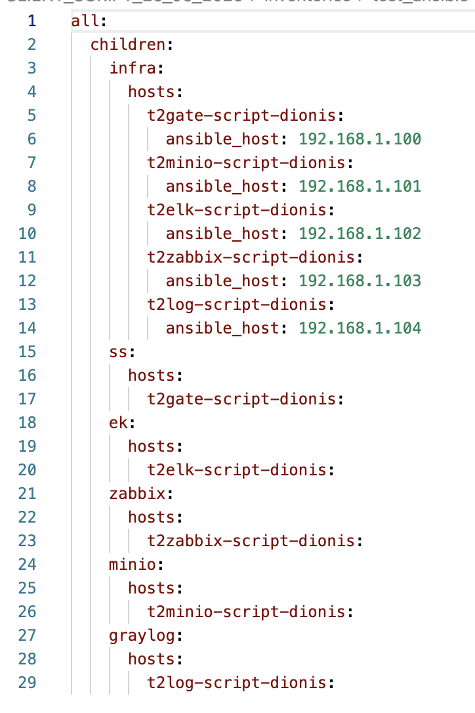

# 📦 Інсталяція компонентів через Ansible-playbook

Цей розділ описує, як встановити інфраструктурні компоненти системи Трембіта 2.0 за допомогою автоматизованих сценаріїв на базі **Ansible**.

> ⚠️ **Увага!** Перед початком інсталяції переконайтесь, що виконано попередні кроки, які описані в [README](README.md) цієї директорії.

> ## 📌 Примітка
>Інсталяція може виконуватись як **окремо для кожного компонента**, так і **одразу для всіх** (через об’єднаний сценарій або послідовне виконання playbook-файлів).

## 🔧 Компоненти, які встановлюються

- **UXP Security Server (ШБО)**
- **MinIO**
- **ELK**
- **Graylog**
- **Zabbix**
- **MonHub**

---

## 📁 Структура директорії

| Файл / Директорія                          | Призначення                                      |
|-------------------------------------------|--------------------------------------------------|
| `ansible.cfg`                             | Конфігурація Ansible                             |
| `inventories/test_ansible/infra.yaml`     | Список серверів (IP, hostname)                   |
| `group_vars/all.yaml`                     | Змінні: паролі, користувачі тощо                 |
| `*_install.yaml`                          | Плейбуки для встановлення окремих компонентів    |

--- 

## ⚙️ Вимоги

- ОС: **Ubuntu Server 22.04**
- Встановлений **Ansible 2.12+**
  > **Наприклад**, для встановлення Ansible можна скористатися такою командою:  
  >```bash
  >sudo apt update && sudo apt install -y ansible
  >```
  
- SSH-доступ по ключу до цільових серверів
- Доступ до Інтернету з цільових серверів

## 🚀 Кроки встановлення

1. **Клонувати репозиторій**  
   ```bash
   git clone https://github.com/Trembita-installation/t2.0-client-deployment.git
   ```
2. **Перейти до файлу infra_yaml ( /t2.0-client-deployment.git/inventories/exemple/infra_yaml ) через редактор або консоль**
3. **Вписати внутрішні ip та hostname відповідних серверів та зберегти зміни**

   

   

5. **Перейти до файлу all.yaml ( /t2.0-client-deployment.git/inventories/exemple/all.yaml ) та вписати логіни і паролі для подальших доступів до вебінтерфейсів та інших компонентів**


* **Можна змінювати імена юзерів скрізь, окрім юзера для** **SS**
  


2. **Далі через консоль перейти до дирикторії з скриптом**
   ```bash
   cd t2.0-client-deployment/
   ```

3. **Перевірити доступність серверів**
   ```bash
   ansible -i inventories/test_ansible/infra.yaml all -m ping
   ```

4. **Підготувати систему (оновлення пакетів, налаштування репозиторіїв)**
   ```bash
   ansible-playbook -i inventories/test_ansible/infra.yaml repa.yaml
   ```

5. **Встановити окремі компоненти:**

   - **Elasticsearch + Kibana**
     ```bash
     ansible-playbook -i inventories/test_ansible/infra.yaml ss_install.yaml
     ```

   - **MinIO**
     ```bash
     ansible-playbook -i inventories/test_ansible/infra.yaml minio_install.yaml
     ```

   - **Graylog**
     ```bash
     ansible-playbook -i inventories/test_ansible/infra.yaml graylog_install.yaml
     ```

   - **Zabbix**
     ```bash
     ansible-playbook -i inventories/test_ansible/infra.yaml zabbix_install.yaml
     ```

   - **UXP Security Server (ШБО)**
     ```bash
     ansible-playbook -i inventories/test_ansible/infra.yaml ek_install.yaml
     ```
---


