# Початкове налаштування ШБО 

Для авторизації в вебінтерфейсі керування на сервері ШБО відкрийте URL за адресою:

```bash
https://<security-server>:4000
```

Де ```<security-server>``` — приватна адреса вашого ШБО.

Введіть: ```ім’я``` та ```пароль``` адміністратора, створеного під час встановлення сервера ШБО.

---

## 🔹 Додавання ліцензії

Додайте на ШБО ліцензію. Оберіть файл ліцензії.

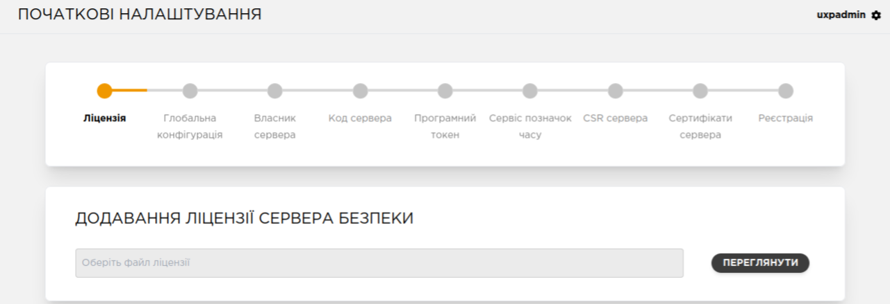

Натисніть ```Переглянути``` та ```Додати файл```.

---

## 🔹 Додавання якоря конфігурації

Додайте на ШБО файл якоря глобальної конфігурації.

> ℹ️ **Примітка:** Якір використовується для періодичного завантаження конфігурації, зокрема списку учасників UXP.

Оберіть файл якоря конфігурації.

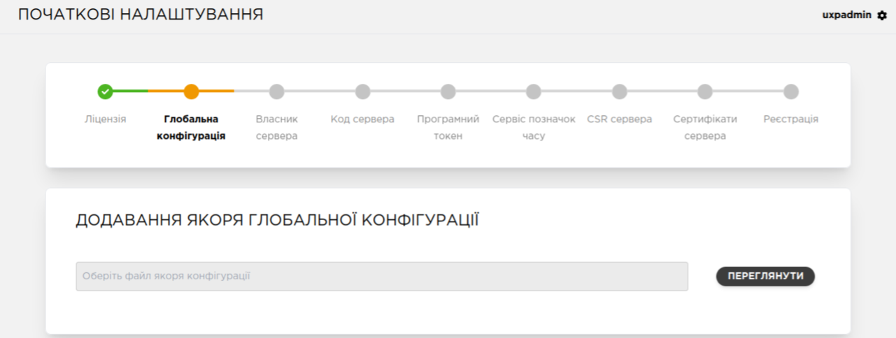

Натисніть ```Переглянути``` та ```Додати файл```.


---

## 🔹 Налаштування власника ШБО

Вкажіть ідентифікатор UXP організації-власника ШБО. Його можна обрати зі списку або ввести вручну.

> ℹ️ **Примітка:** Дозволені символи: [a-zA-Z0-9_-]

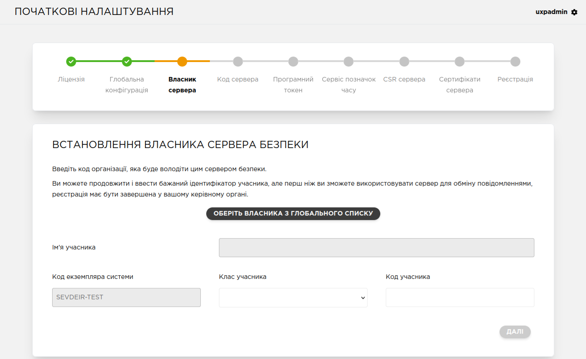

Натисніть ```Далі```.


---

## 🔹 Налаштування коду ШБО

Введіть унікальний ШБО серед серверів своєї організації.

> ℹ️ **Примітка:** Дозволені символи: [A-Z0-9_-]


> **⚠️** Код ШБО повинен бути представлений у форматі: <br>
> ```MemberCode_SS_Env_Number_FreeSymbols```, де: <br>
> ```MemberCode``` — код ЄДРПОУ Учасника системи "Трембіта"; <br>
> ```Env``` — код середовища (```P``` — промислове, ```T``` — тестове); <br>
> ```Number``` — порядковий номер ШБО (окремо для кожного середовища); <br>
> ```FreeSymbols``` — необов’язкові символи для внутрішніх позначень, напр. ЦОД або назва ІС. <br>

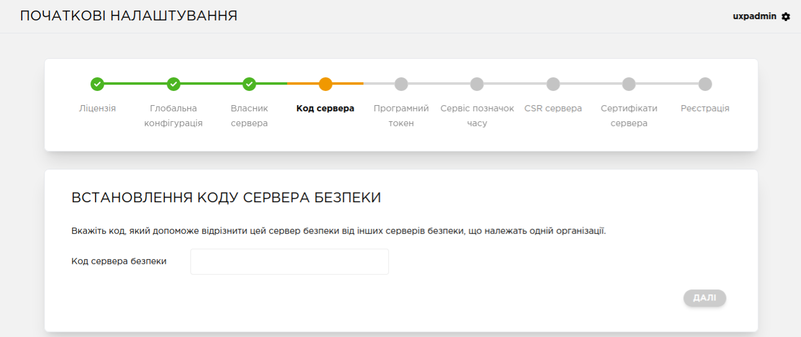

---

## 🔹 Ініціалізація програмного токена

ШБО використовує криптографічні ключі, збережені на ```програмному токені```, захищеному ```PIN-кодом```.

> **⚠️** Якщо PIN буде забутий, ШБО підлягає перевстановленню.

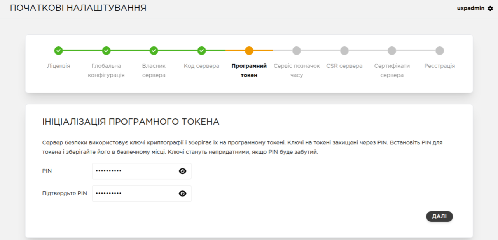

---

## 🔹 Вибір сервісу позначок часу (TSP/TSA)

Оберіть сервіс із переліку. Можна буде додати додаткові сервіси пізніше.


---

## 🔹 Генерування ключів та CSR-запитів


Згенеруйте два ключі та відповідні CSR-запити:

- Сертифікат автентифікації (реєструється через заявку);
- Сертифікат підписання (реєструється автоматично).

> ℹ️ **Примітка:** Для налаштування апаратних пристроїв з ШБО - дивитись інструкцію [Підключення криптографічного пристрою](05-uxp-ss-install.md#aparatni-tokeny)


> ℹ️ **Примітка:** На цьому кроці можна ```Пропустити``` генерацію ключів та CSR-запитів і перейти до вебінтерфейсу ШБО

---

### **Cертифікат автентифікації**

Згенеруйте CSR-запит для сертифіката автентифікації. CSR-запит завантажаться автоматично.

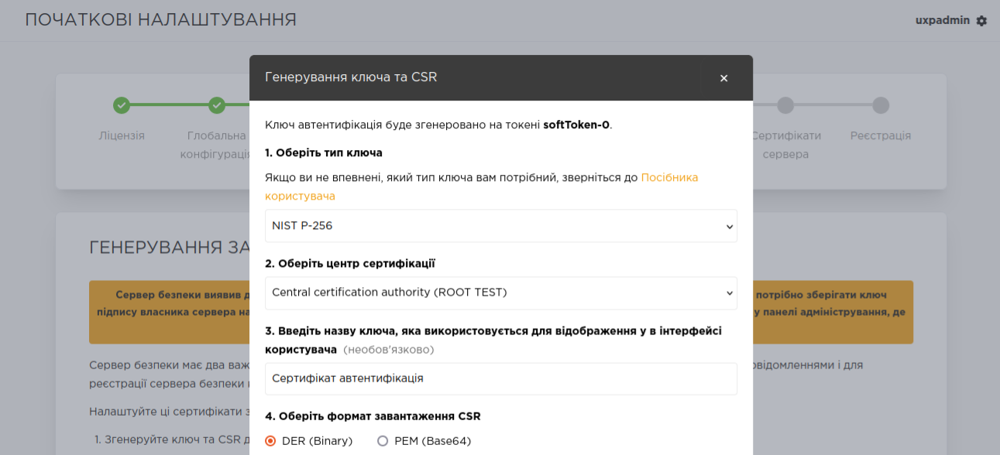

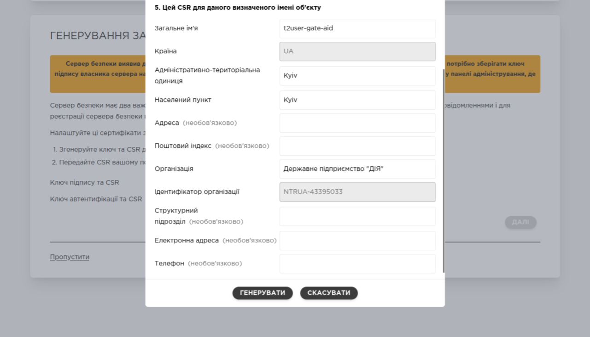

---
### **Cертифікат підписання**

Якщо буде використовуватись файловий ключ - згенеруйте CSR-запит для сертифікату сертифіката підписання. CSR-запит завантажаться автоматично.

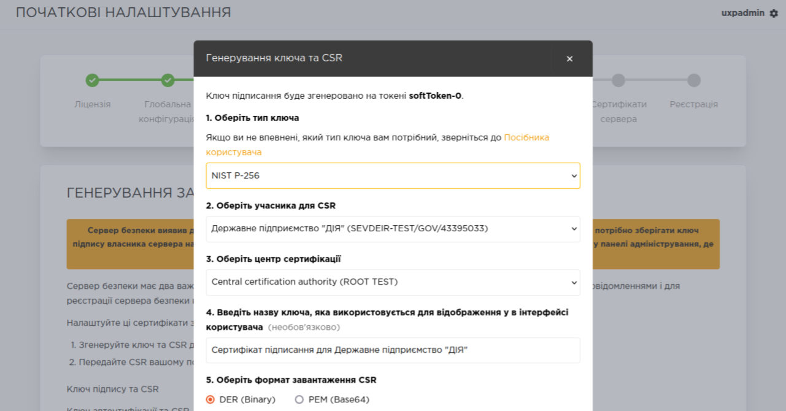

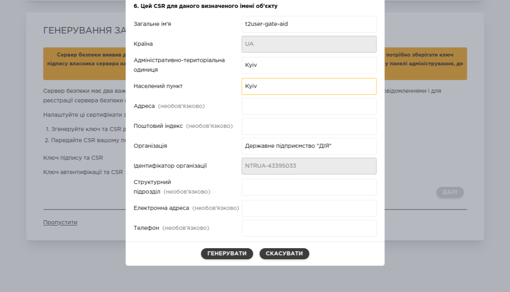

---

## 🔹 Запит на отримання сертифікатів

Згенеровані та завантажені CSR-файли треба передати до КНЕДП для отримання сертифікатів.

Підтримувані КНЕДП:

**🟢 ДІЯ** <br>
**🟢 ІДД ДПС** <br>

---

## 🔹 Імпорт сертифікатів

Після отримання сертифікатів, імпортуйте обидва сертифікати на ШБО. ШБО співставить сертифікати із раніше згенерованими ключами і CSR-запитами.


Натисніть **```ІМПОРТ```**

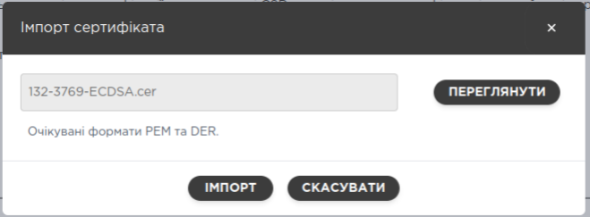

Після успішного імпорту буде статус: ```🟢 Імпортовано```

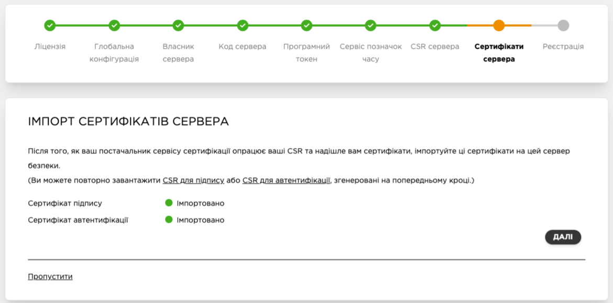

---

## 🔹 Реєстрація ШБО

1. Реєстрація ШБО в інтерфейсі

Вкажіть **```відкрите DNS ім’я```** або **```IP адресу```** ШБО і надішліть запит на реєстрацію.

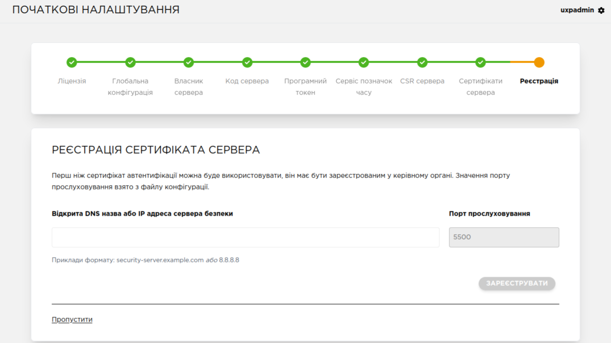

Після успішно надісланого запиту надпис: **```Запит надіслано```**

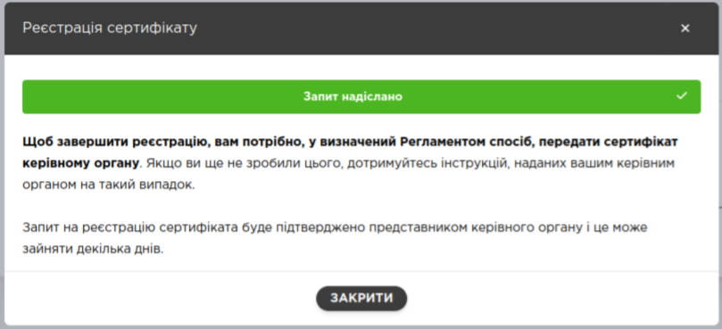


2. Заявка на реєстрацію ШБО

Щоб завершити реєстрацію, ви повинні надіслати відповідну заявку з сертифікатом автентифікації Адміністратору системи "Трембіта".

3. Завершення початкових налаштувань

Після завершення налаштувань, буде перенаправлено в **```Панель адміністрування ШБО```**.

> ℹ️ **Примітка:** Статус реєстрації сертифіката автентифікації ви можете перевірити на сторінці **```Ключі та сертифікати```**

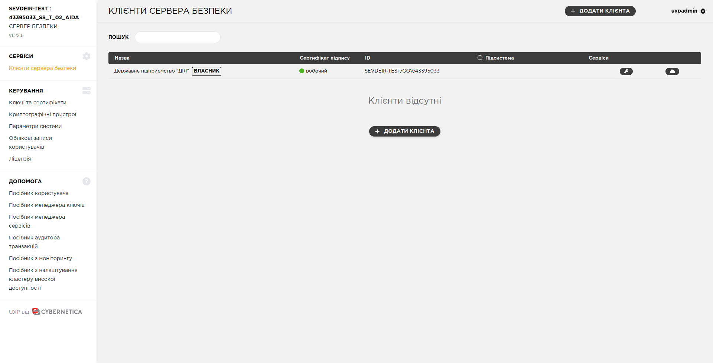

---
<span id="subsystem-registry"></span>

## 🔹 Реєстрація підсистеми

1. Додавання клієнта сервера безпеки

Перейдіть на сторінку **```Клієнти сервера безпеки```**.

Натисніть **```Додати клієнта```**. У вікні, що з’явиться, введіть ідентифікатор клієнта або натисніть **```Обрати клієнта з глобального списку```** та знайдіть клієнта та відповідну підсистему (використовується при налаштуванні кластеру з 2 та більше ШБО).

> ℹ️ **Примітка:** Дозволені символи: [a-zA-Z0-9_-]

Після введення даних клієнта натисніть **```Додати```**.

Новий клієнт зберігається як клієнт ШБО, але його ще не буде видно для інших учасників системи "Трембіта". Щоб інші учасники дізналися, що цю підсистему можна використовувати для обмінів - вам потрібно зареєструвати її.

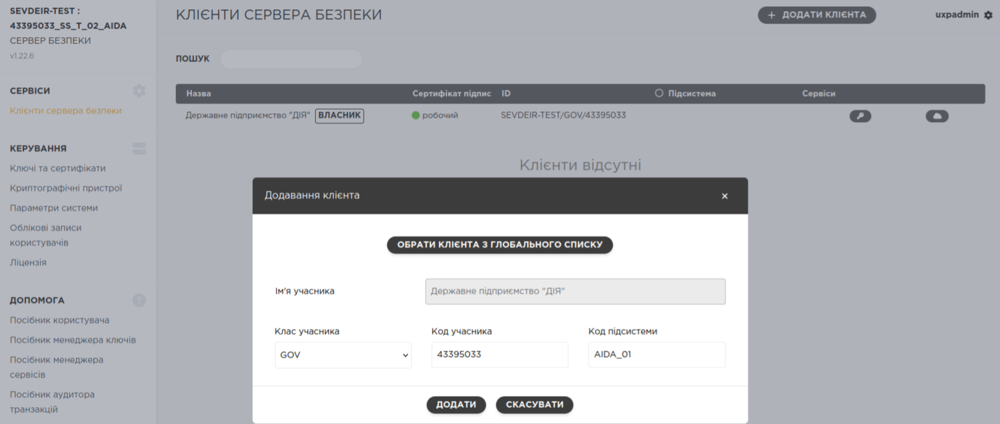

2. Реєстрація клієнта сервера безпеки
   
Знайдіть клієнта, якого бажаєте зареєструвати (він повинен мати статус "Збережено") і натисніть іконку **```Подробиці```**.

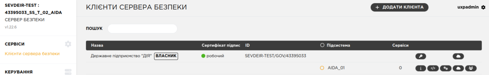

На сторінці **```Дані клієнта```**, що відкриється, натисніть **```Зареєструвати```**.

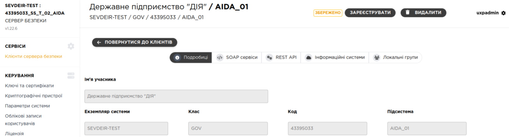

Натисніть **```Зареєструвати```**.

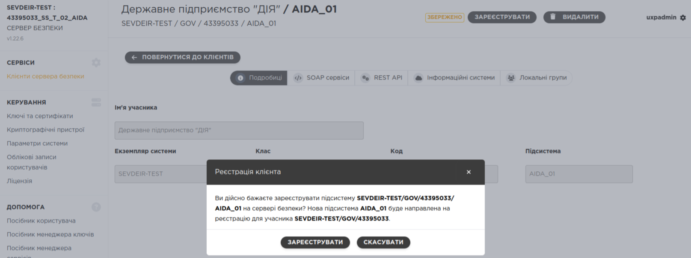

Отримаєте повідомлення про запит.

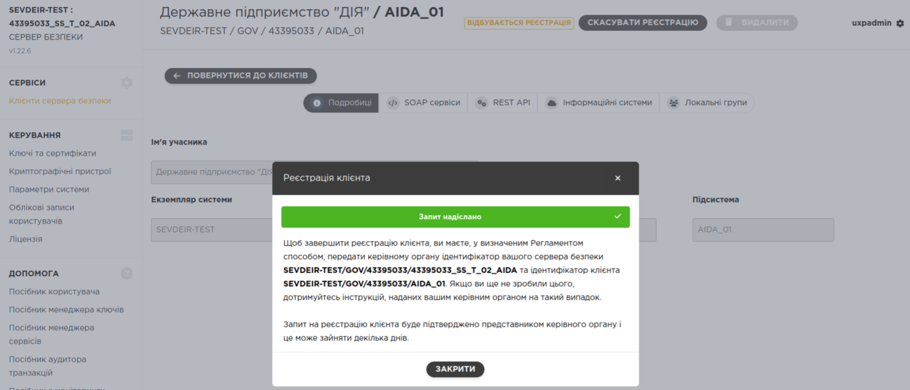{width=1180px}Статус клієнта зміниться на "Відбувається реєстрація".

Щоб завершити реєстрацію клієнта, ви повинні надіслати відповідну заявку Адміністратору системи "Трембіта".

3. Статус клієнта сервера безпеки (ШБО)

| Статус | Опис |
| --- | --- |
|  | **Збережено** – інформацію про клієнта було додано на ШБО |
|  | **Відбувається реєстрація** – було надіслано запит на реєстрацію клієнта |
|  | **Зареєстровано** – клієнт може починати обмінюватись інформацією |

> Після успішної реєстрації клієнта, ШБО змінює статус клієнта на "**Зареєстровано**" і процес реєстрації вважається завершеним.

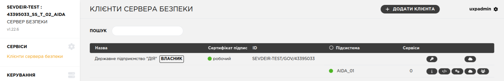

---
