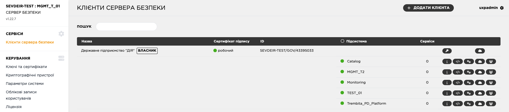
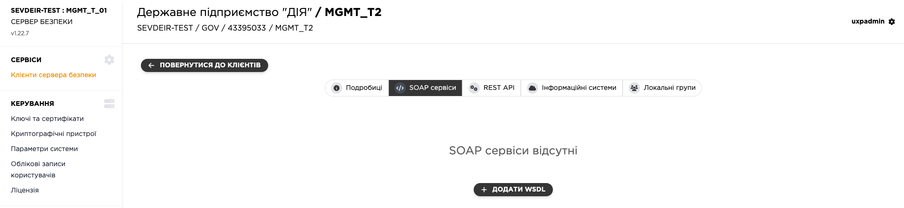
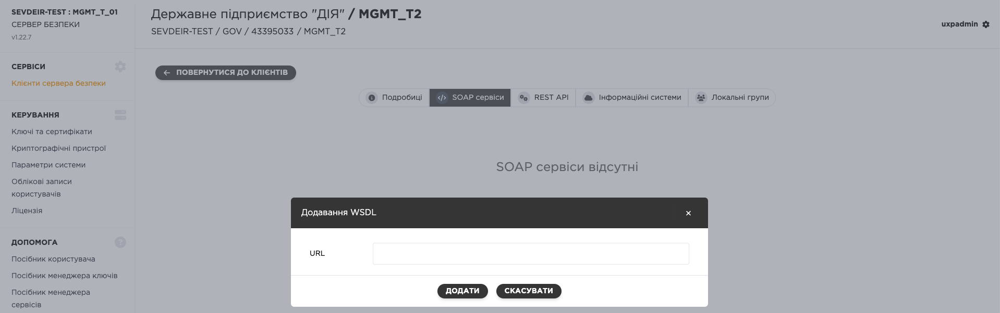
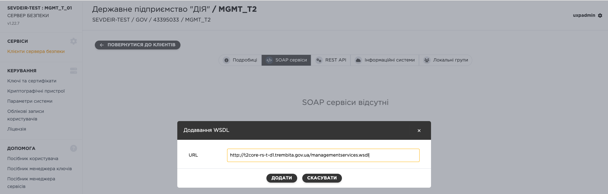
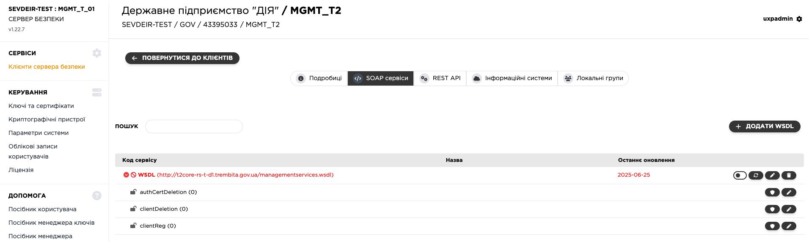
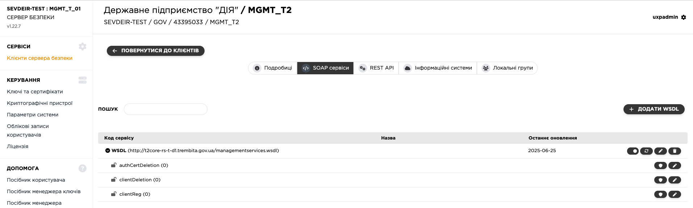
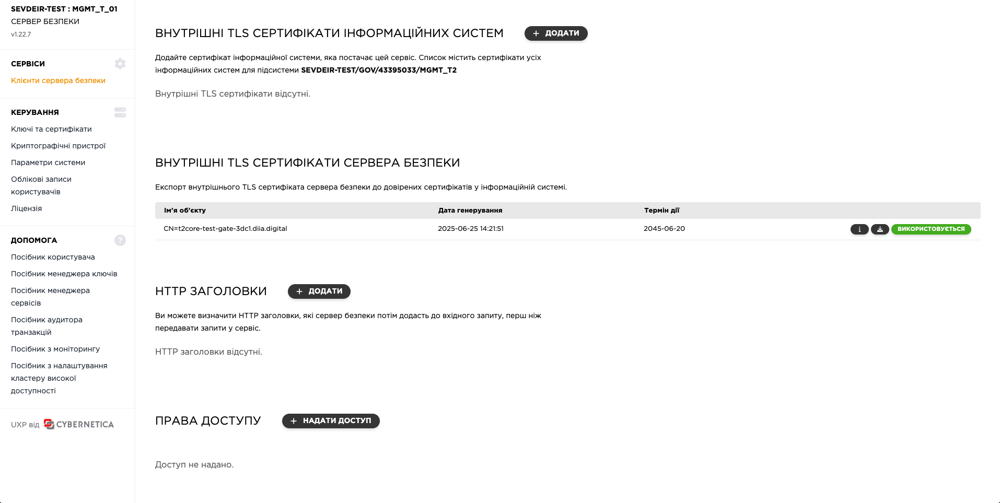
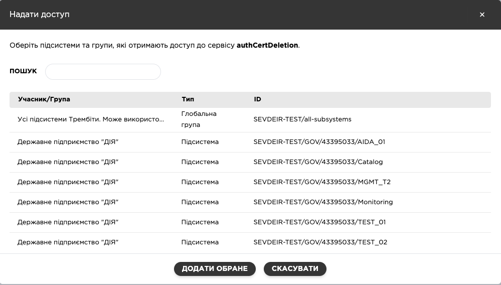

# Керування сервісами на ШБО

Перед публікацією вебсервісу на ШБО необхідно попередньо зареєструвати підсистему відповідно до інструкції:  
🔗 [Реєстрація підсистеми](02-uxp-ss-settings.md#subsystem-registry)

---

## Підтримувані типи сервісів

🟢 SOAP-сервіси  
🟢 REST API

---

## 🔹 Публікація SOAP-сервісів

Для публікації SOAP-сервісу на ШБО використовується WSDL-файл. Після його додавання, система автоматично зчитує код сервісу, адресу, параметри вхідних/вихідних повідомлень тощо, і відображає їх у таблиці сервісів.

### 📥 Додавання WSDL

1. У меню **«Сервіси»** перейдіть до розділу **«Клієнти сервера безпеки»**.

2. Оберіть зареєстровану підсистему → вкладка **«Сервіси SOAP»**.

3. Натисніть **«Додати WSDL»**.

4. У вікні, що відкриється, введіть WSDL-адресу → натисніть **«OK»**.

> ⚠️ **Увага:** Новий WSDL додається у вимкненому стані (червоним текстом).

---

### ✅ Увімкнення WSDL

1. У вкладці **«Сервіси SOAP»** оберіть потрібну підсистему.

2. Виберіть WSDL (червоний запис) → увімкніть його **перемикачем** з правого боку рядка.

---

### ✏️ Налаштування параметрів окремих сервісів

Після додання WSDL-файлу до підсистеми, для кожного сервісу (методу), описаного у ньому, потрібно вручну **вказати фактичну URL-адресу**, на яку сервер безпеки буде надсилати запити.

1. Перейдіть на вкладку **«SOAP сервіси»**.
2. Натисніть на символ `>` поруч із WSDL, щоб розгорнути список сервісів.
3. Виберіть потрібний метод (наприклад, `authCertDeletion`).

4. Натисніть іконку ✏️ **«Редагування»**.

5. У полі **«URL адреса сервісу»** вкажіть повну адресу виклику.
6. За потреби оберіть тип з’єднання (`HTTP`, `HTTPS`, `HTTPS NOAUTH`) та змініть тайм-аут очікування відповіді.
7. Натисніть **«ЗБЕРЕГТИ»**.

> ⚠️ **Увага:** Якщо у WSDL описано кілька методів, змініть адресу **для кожного з них окремо**, або скористайтесь прапорцем **«Застосувати до всіх»**, якщо однакова адреса використовується для кількох.

---

### 🔐 Надання прав доступу до SOAP-сервісу

Щоб інші учасники електронної взаємодії могли викликати ваш вебсервіс, адміністратор вебсервісів повинен надати їм права доступу.

1. Оберіть відповідний сервіс → натисніть іконку 🛡️ **«Права доступу»**.

2. Натисніть **«Надати доступ»**.

3. Знайдіть відповідний об'єкт (наприклад за ЄДРПОУ).

4. Додайте вибраний об'єкт → натисніть **«Додати обране»**.

> 🔐 **Увага:** Доступ до сервісу має бути наданий **окремо для кожної підсистеми**, яка буде його викликати.

> ⚠️ **Увага:** Без надання прав доступу запити до сервісу повертатимуть помилку авторизації.

---

### ⛔ Відключення WSDL

1. У вкладці **«Сервіси SOAP»** оберіть WSDL → натисніть **«Відключити»**.
2. У діалоговому вікні вкажіть причину (можна залишити "Вийшов з ладу") → натисніть **«OK»**.

---

### ✏️ Зміна адреси WSDL

1. Перейдіть до вкладки **«Сервіси SOAP»** → оберіть WSDL.
2. Натисніть **«Редагувати»** → змініть адресу → **«OK»**.

> ⚠️ **Увага:** При зміні адреси WSDL оновлюється автоматично.

---

### 🗑️ Видалення WSDL

1. Перейдіть у **«Сервіси SOAP»**, оберіть WSDL → натисніть **«Видалити»**.
2. Підтвердьте дію у спливаючому вікні.

> ⚠️ **Увага:** Разом із WSDL буде видалено всі пов'язані сервіси й права доступу.

---

## 🔹 Публікація REST-сервісів

Публікація REST-сервісів полягає у додаванні **базової відносної адреси виклику** сервісу на ШБО.

#### Кроки для додавання REST-сервісу:

1. У меню **«Сервіси»** перейдіть до розділу **«Клієнти сервера безпеки»**.
2.  Оберіть зареєстровану підсистему → вкладка **«REST APIs»**.
3. Натиснути кнопку **«Додати REST API»**.
4. Заповнити форму з параметрами:

   - **Базовий URL** – статична частина шляху до сервісу (наприклад, `/api/res`), яка приховується від клієнта.

      > ⚠️ **Приклад:** клієнт звертається за `/services/v1`, а ШБО передає запит на `/api/res/services/v1`.

   - **Код сервісу** – унікальний ідентифікатор (латиниця, цифри), використовується як `serviceCode`.
   - **Версія сервісу** – довільна версія (наприклад, `v1`), використовується як `serviceVersion`.

6. Натиснути кнопку **«ОК»**.

> ⚠️ **Увага:** Щойно доданий REST-сервіс буде **у вимкненому стані**.

---

### ⚙️ Активація REST-сервісу

1. У вкладці **REST APIs** знайти ваш сервіс (він буде позначений червоним кольором).
2. Натиснути кнопку **«Увімкнути»**.

---

### 🔐 Надання прав доступу до REST-сервісу

Щоб інші учасники електронної взаємодії могли викликати ваш вебсервіс, адміністратор вебсервісів повинен надати їм права доступу.

1. Оберіть відповідний сервіс → натисніть іконку 🛡️ **«Права доступу»**.
2. Натисніть **«Надати доступ»**.
3. Знайдіть відповідний об'єкт (наприклад за ЄДРПОУ).
4. Додайте вибраний об'єкт → натисніть **«Додати обране»**.

> 🔐 **Увага:** Доступ до сервісу має бути наданий **окремо для кожної підсистеми**, яка буде його викликати.

> ⚠️ **Увага:** Без надання прав доступу запити до сервісу повертатимуть помилку авторизації.

---

### 🔌 Відключення REST-сервісу

Якщо потрібно тимчасово вимкнути сервіс:

1. Перейти до **REST APIs** для потрібної підсистеми.
2. Натиснути **«Відключити»** біля обраного сервісу.
3. Вказати повідомлення для клієнтів, які звертаються до сервісу.
4. Натиснути **«ОК»**.

---

### 🗑️ Видалення REST-сервісу

1. Відкрити підсистему → вкладка **REST APIs**.
2. Обрати сервіс → натиснути **«Видалити»**.
3. Підтвердити видалення.

---
